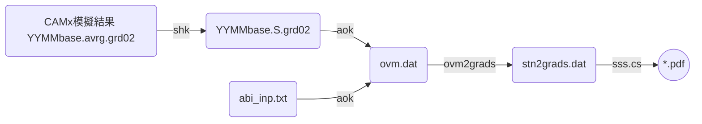

## 背景
- [AvrgvsHourlyObs.f(aok)][aok]這支程式讀取CAMx模擬結果([壓縮][shk]過後之地面濃度)、測站當月或指定時間範圍的測值，進行逐時之比較、同時也進行模式之性能評估[abi_camx.f][abi]，以及後續的製圖作業。
- CAMx模式後處理整體流程如[下圖][pp_LR]所示。
  - aok之前一步驟為[shk][shk]
  - 下一步驟為[ovm2gr.cs][ovm2gr]

### CAMx模式後處理整體流程



## aok作業流程圖

```mermaid
graph LR
    A(YYMMbase.S.grd02)
    B(abi_inp.txt)
    C(ovm.dat)
    D('abi_'//root//'.txt')
    E(sta_list.txt)
    F(/st1/data/epa/'//myr//'/HS'//YR//IMO//AD(IM)//'.'//A3)
    A -- aok --> C
    B -- aok --> C
    E -- aok --> C
    F -- aok --> C
    B -- abi_camx --> D
    C -- abi_camx --> D
```

[pp_LR]: <https://github.com/sinotec2/FAQ/blob/main/_posts/2022-07-20-aok.md#CAMx模式後處理整體流程> "CAMx模式後處理整體流程"
[aok]: <https://github.com/sinotec2/Focus-on-Air-Quality/blob/main/CAMx/PostProcess/AvrgvsHourlyObs.f> "Github:AvrgvsHourlyObs.f"
[shk]: <https://sinotec2.github.io/FAQ/2022/07/19/shk.html> "CAMx模擬結果之壓縮"
[abi]: <https://github.com/sinotec2/Focus-on-Air-Quality/blob/main/CAMx/PostProcess/abi_camx.f> "GitHub：abi_camx.f"
[ovm2gr]: <https://github.com/sinotec2/Focus-on-Air-Quality/blob/main/CAMx/PostProcess/ovm2grads.f> "ovm2grads.f"