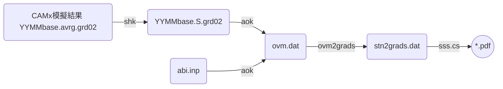

## 背景
- [AvrgvsHourlyObs.f][aok]這支程式讀取CAMx模擬結果([壓縮][shk]過後之地面濃度)、測站當月或指定時間範圍的測值，進行逐時之比較、同時也進行模式之性能評估[abi_camx.f][abi]，以及後續的製圖作業。
- 模式整體後處理流程如下圖所示。

[aok]: <https://github.com/sinotec2/Focus-on-Air-Quality/blob/main/CAMx/PostProcess/AvrgvsHourlyObs.f> "Github:AvrgvsHourlyObs.f"
[shk]: <https://sinotec2.github.io/FAQ/2022/07/19/shk.html> "CAMx模擬結果之壓縮"
[abi]: <https://github.com/sinotec2/Focus-on-Air-Quality/blob/main/CAMx/PostProcess/abi_camx.f> "GitHub：abi_camx.f"