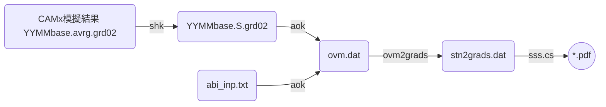
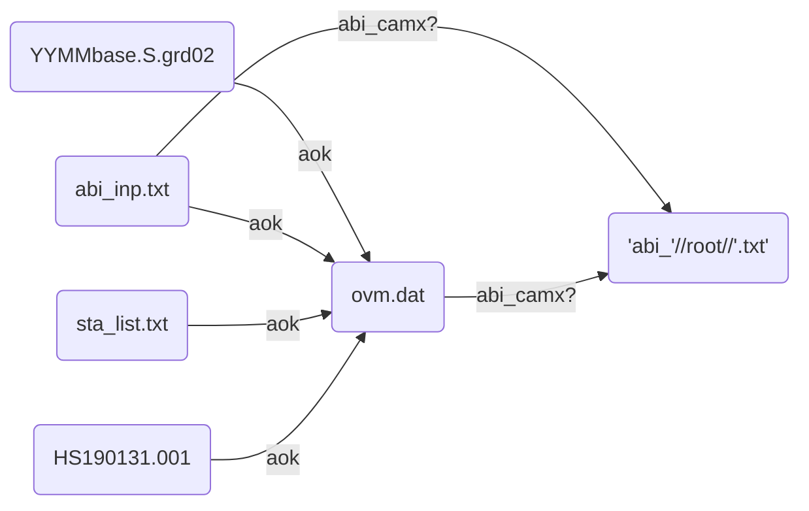

## 背景
- [AvrgvsHourlyObs.f(aok)][aok]這支程式讀取CAMx模擬結果([壓縮][shk]過後之地面濃度)、測站當月或指定時間範圍的測值，進行逐時之比較、同時也進行模式之性能評估[abi_camx?.f][abi]系列程式，以及後續的製圖作業。
- CAMx模式後處理整體流程如[下圖][pp_LR]所示。
  - aok之前一步驟為[shk][shk]
  - 下一步驟為[ovm2gr.cs][ovm2gr]

### [CAMx模式後處理整體流程][pp_LR]



## aok+abi_camx?之執行
### [aok+abi_camx?作業流程圖][aok_LR]


- abi_camx?.f雖然是獨立的系列程式，但與aok有上下游的連帶關係，設計在aok程式末以call system()方式呼叫，一個動作一併執行。

### 程式INPUT
- 引數：(無)
- abi_inp.txt
  - 控制aok的文字檔
  - 第1行為CAMx壓縮後的檔案名稱
    - 命名方式為YYMMROOT.S.grd0N
    - YYMM為4碼年月
    - ROOT為CAMx.in中的輸出檔案群組名稱(如圖中base)
    - N為CAMx巢狀網格層數(範例N=2)
  - 第2行為指定比對起迄的時間點
    - 格式：%y%m%d%H共8碼，中間空1格
    - LST，非UTC
  - 第3行為指定測站之位置點(for abi_camxS使用)  
  - 範例

```bash
#kuang@master /nas1/camxruns/2016_v7/outputs/con12
#$ cat abi_inp.txt
1612baseEC.S.grd01
16113020 16123120  !▒p▒ɰ϶▒▒▒0~23
-65.898   -98.950
```
- sta_list.txt
  - 測站名稱與LCP座標(原點在臺灣中心點，單位為公尺)
  - 範例

```bash
#kuang@master /nas1/camxruns/2016_v7/outputs/con12
#$ head sta_list.txt
ID      NAME    LBTX    LBTY    I/O   NOTE1         NOTE2
1       ▒▒     71323   160778 1
2       ▒▒▒     62555   154275 1
3       ▒U▒▒     65794   166367 1     ▒I▒▒▒
4       ▒s▒▒     51222   144779 1
...
69      ▒ˤs    -32153    14691 1
70      ▒éM     49120   148973 0     ▒▒q
71      ▒_▒▒    -68537  -107225 0     ▒▒q
```  
- 環保署測站空品數據檔案
  - 位置：`/st1/data/epa/'//myr//'/HS'//YR//IMO//AD(IM)//'.'//A3`
  - myr為4碼西元年代
  - A3為測站序號

### 程式OUTPUT
- ovm程式結果：ovm.dat
  - 為每一測站、逐時的實測值(左半部)與模擬值(右半部)的大表，欄位除了測站名稱、日期時間之外，即為各污染項目。
  - 相同內容另有csv檔案格式之輸出：檔名為ovm_YYMMROOT.csv
  - 類似結果包括
    - 日均值的比對：`'ovd_'//nam0(3)(1:icha)//'.csv'`
    - 測站全月平均值之日夜24小時變化`'avg_'//nam0(3)(1:icha)//'.csv`
- abi_camx?執行結果
  - abi_camx.f：`'abi_'//root(1:icha)//'.txt'`逐時比對之性能評估報告
  - abi_camxD.f：`'abi_'//root(1:icha)//'_d.txt'`逐日比對之性能評估報告
  - abi_camxS.f：`'abi_'//root(1:icha)//'_s.txt'`以特定測站為中心距離反比加權的性能評估
- 範例

```bash
$ head abi_1612baseEC.txt
STA NAME  MB_O3  OB_O3  GE_O3 OB_PMT GE_PMT OB_PMf GE_PMf OB_NO2 GE_NO2 OB_HC  GE_HC   OB_SO2 GE_SO2
  1 ▒▒ -0.08* -0.11*  0.13*  0.37*  0.68*  0.34*  0.80* -0.13*  0.45* -0.08*  0.45* -0.12*  0.50*
  2 ▒▒▒  0.00* -0.06*  0.14* -0.14*  0.39* -0.28*  0.42* -0.52   0.56*   NaN    NaN  -0.36*  0.61*
  3 ▒U▒▒  0.00* -0.14*  0.14* -0.57   0.67* -0.35*  0.61* -0.30*  0.54*   NaN    NaN  -0.50   0.66*
  4 ▒s▒▒  0.00* -0.16   0.17*  0.85   1.10*  0.05*  0.52* -0.16*  0.49*   NaN    NaN  -0.22*  0.54*
  5 ▒g▒▒  0.00* -0.17   0.19*  0.58   0.82*  1.23   1.42*  0.22*  0.52*  1.24   1.32  -0.03*  0.56*
...
 66 ▒V▒s  0.00* -0.10*  0.13* -0.15*  0.39*  3.52   3.71  -0.15*  0.53*   NaN    NaN  -0.58   0.61*
 69 ▒ˤs  0.00* -0.18   0.23* -0.33*  0.44* -0.34*  0.52* -0.30*  0.37*   NaN    NaN  -0.61   0.61*
101 all  -0.08* -0.20   0.23* -0.09*  0.57*  0.11*  0.77* -0.13*  0.48*  0.03*  0.55* -0.29*  0.54*
Attainment MB_O3 OB_O3  GE_O3 OB_PMT GE_PMT OB_PMf GE_PMf OB_NO2 GE_NO2 OB_HC  GE_HC  OB_SO2  GE_SO2
   76.0% 100.0%  41.4%  84.5%  70.7%  98.3%  70.7%  96.6%  82.8% 100.0%  77.8%  88.9%  65.5%  94.8%
```

### 全年執行
- 複製舊的abi_inp.txt：`for m in {01..12};do cp /nas1/camxruns/2016_v7/outputs/con$m/abi_inp.txt /nas1/camxruns/2019/outputs/con$m;done`
  - 使用sed指令將16年改成19年：`sed -i 's/16/19/g' con??/abi_inp.txt`
  - 注意2月有潤月的問題，2月的最末日及3月的第一天需修改
- 逐月下到月份目錄、執行aok： `for m in {01..12};do cd con$m;aok;cd ..;done`


[pp_LR]: <https://github.com/sinotec2/FAQ/blob/main/_posts/2022-07-20-aok.md#CAMx模式後處理整體流程> "CAMx模式後處理整體流程"
[aok_LR]: <https://github.com/sinotec2/FAQ/blob/main/_posts/2022-07-20-aok.md#aok作業流程圖> "aok作業流程圖"
[aok]: <https://github.com/sinotec2/Focus-on-Air-Quality/blob/main/CAMx/PostProcess/AvrgvsHourlyObs.f> "Github:AvrgvsHourlyObs.f"
[shk]: <https://sinotec2.github.io/FAQ/2022/07/19/shk.html> "CAMx模擬結果之壓縮"
[abi]: <https://github.com/sinotec2/Focus-on-Air-Quality/blob/main/CAMx/PostProcess/abi_camx.f> "GitHub：abi_camx.f"
[ovm2gr]: <https://github.com/sinotec2/Focus-on-Air-Quality/blob/main/CAMx/PostProcess/ovm2grads.f> "ovm2grads.f"