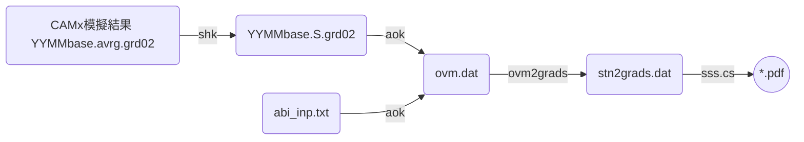

## 背景
- [AvrgvsHourlyObs.f(aok)][aok]這支程式讀取CAMx模擬結果([壓縮][shk]過後之地面濃度)、測站當月或指定時間範圍的測值，進行逐時之比較、同時也進行模式之性能評估[abi_camx.f][abi]，以及後續的製圖作業。
- CAMx模式後處理整體流程如[下圖][pp_LR]所示。
  - aok之前一步驟為[shk][shk]
  - 下一步驟為[ovm2gr.cs][ovm2gr]

### CAMx模式後處理整體流程



## aok作業流程圖

```mermaid
graph LR
    A(YYMMbase.S.grd02)
    B(abi_inp.txt)
    C(ovm.dat)
    D('abi_'//root//'.txt')
    E(sta_list.txt)
    F(/st1/data/epa/'//myr//'/HS'//YR//IMO//AD(IM)//'.'//A3)
    A -- aok --> C
    B -- aok --> C
    E -- aok --> C
    F -- aok --> C
    B -- abi_camx --> D
    C -- abi_camx --> D
```
### 程式IO
- abi_inp.txt
  - 控制aok的文字檔
  - 第1行為CAMx壓縮後的檔案名稱
    - 命名方式為YYMMROOT.S.grd0N
    - YYMM為4碼年月
    - ROOT為CAMx.in中的輸出檔案群組名稱
    - N為CAMx巢狀網格層數
  - 第2行為指定比對起迄的時間點
    - 格式：%y%m%d%H共8碼，中間空1格
    - LST，非UTC
  - 第3行為指定非屬既有測站之位置點(此版aok未作用)  
  - 範例

```bash
#kuang@master /nas1/camxruns/2016_v7/outputs/con12
#$ cat abi_inp.txt
1612baseEC.S.grd01
16113020 16123120  !▒p▒ɰ϶▒▒▒0~23
-65.898   -98.950
```
- sta_list.txt
  - 測站名稱與LCP座標(原點在臺灣中心點，單位為公尺)
  - 範例

```bash
#kuang@master /nas1/camxruns/2016_v7/outputs/con12
#$ head sta_list.txt
ID      NAME    LBTX    LBTY    I/O   NOTE1         NOTE2
1       ▒▒     71323   160778 1
2       ▒▒▒     62555   154275 1
3       ▒U▒▒     65794   166367 1     ▒I▒▒▒
4       ▒s▒▒     51222   144779 1
...
69      ▒ˤs    -32153    14691 1
70      ▒éM     49120   148973 0     ▒▒q
71      ▒_▒▒    -68537  -107225 0     ▒▒q
```  


[pp_LR]: <https://github.com/sinotec2/FAQ/blob/main/_posts/2022-07-20-aok.md#CAMx模式後處理整體流程> "CAMx模式後處理整體流程"
[aok]: <https://github.com/sinotec2/Focus-on-Air-Quality/blob/main/CAMx/PostProcess/AvrgvsHourlyObs.f> "Github:AvrgvsHourlyObs.f"
[shk]: <https://sinotec2.github.io/FAQ/2022/07/19/shk.html> "CAMx模擬結果之壓縮"
[abi]: <https://github.com/sinotec2/Focus-on-Air-Quality/blob/main/CAMx/PostProcess/abi_camx.f> "GitHub：abi_camx.f"
[ovm2gr]: <https://github.com/sinotec2/Focus-on-Air-Quality/blob/main/CAMx/PostProcess/ovm2grads.f> "ovm2grads.f"