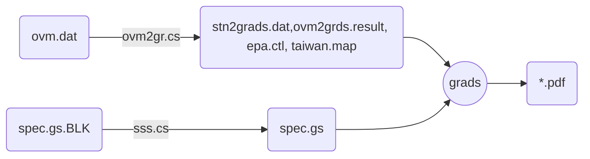

## 背景
- 測站模擬比較之時序圖是個簡單的XY-plot，用excel就可以輕鬆產出。何以會變得複雜，主要是因為污染物、空品站、月份等維度所造成。
- 環保署公版模式提供有[python版本][postTS]的後製工具，此處介紹GrADS版本的作業方式。
- 公版的[後製工具][postTS]可以產生個別測站項目之圖檔，
然而對撰寫模擬報告的作者而言，產生個別比較檔案還算容易，困難的是如將一個個的圖檔整併在頁面上，排列整齊、充分使用版面、還能保持各圖仍有一定的清晰度。這也是ovm2grads的工作重點。
- ovm2grads的整體工作如[下圖]()所示
### ovm2grads作業流程

[postTS]: <https://sinotec2.github.io/Focus-on-Air-Quality/GridModels/TWNEPA_RecommCMAQ/post_process/Air_plot_tool/#air_plotsimobspy> "Focus-on-Air-Quality -> CMAQ模式 -> 環保署建議公版模式-> 後製工具 -> 空品繪圖工具(Air_plot_tool) -> air_plotsimobspy"