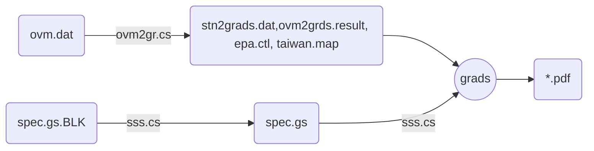
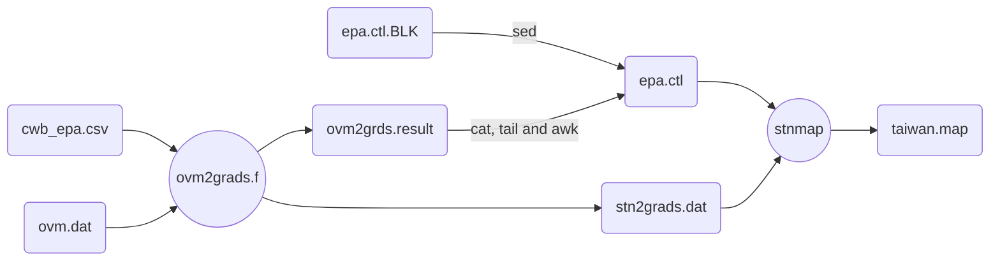
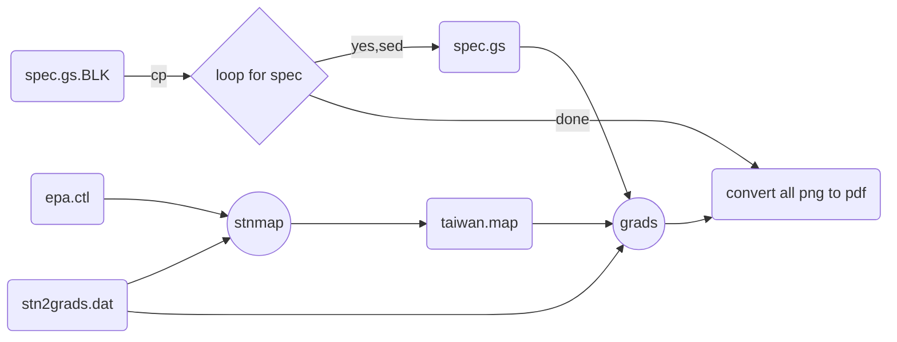

## 背景
- 測站模擬比較之時序圖是個簡單的XY-plot，用excel就可以輕鬆產出。何以會變得複雜，主要是因為污染物、空品站、月份等維度所造成。
- 環保署公版模式提供有[python版本][postTS]的後製工具，此處介紹GrADS版本的作業方式。
- 公版的[後製工具][postTS]可以產生個別測站項目之圖檔，
然而對撰寫模擬報告的作者而言，產生個別比較檔案還算容易，困難的是如將一個個的圖檔整併在頁面上，排列整齊、充分使用版面、還能保持各圖仍有一定的清晰度。這也是ovm2grads的工作重點。
- ovm2grads的整體工作如[下圖](https://github.com/sinotec2/FAQ/blob/main/_posts/2022-07-21-ovm2grads.md#ovm2grads作業流程)所示。CAMx的後處理詳[流程圖](https://github.com/sinotec2/FAQ/blob/main/_posts/2022-07-20-aok.md#CAMx模式後處理整體流程)
- 其他CAMx後處理整體之作業方式可以參考早期版本的[github wiki說明](https://github.com/sinotec2/camxruns/wiki/GrADS圖檔之製作)，此處著重[時序圖](https://github.com/sinotec2/camxruns/wiki/GrADS圖檔之製作#時序圖ovm2grads-jobs)的製作與示範。

### ovm2grads作業流程


- [ovm.dat][ovm.dat]為[aok][aok](for CAMx)或[wsite][wsite](for CMAQ)的執行成果，為一個龐大的對照表格，格式為文字檔，必須先轉成GrADS可以讀取的二進位檔stn2grads.dat([little endian](https://github.com/sinotec2/camxruns/wiki/CAMx(UAM)的檔案格式#端序尾序的差異))。
- ovm2grds系列程式有2支，先寫的[stn2grads.f][1]適用在氣象數據的比對，而[ovm2grads.f][2]則適用在空氣品質的比較。

## ovm2gr.cs作業流程



## sss.cs流程




## [ovm2grads.f][2]程式說明

### 程式設計 
- GrADS平面資料檔與點狀資料檔的格式有很大的差異。主要在於存取的方式，
  - 平面資料檔為直接存取，一筆記錄的大小(recl長度)即為二維矩陣的大小：

```fortran
      OPEN(12,file='...',action='write',form='unformatted',access='direct',    
     & recl=NOXG*NOYG,status='unknown')    
```
- 點狀數據則為循序存取：

```fortran
      open(21,file='stn2grads.dat',form='unformatted',    
     &status='unknown' ,access='stream')    
```

- 此外在資料內容上也有很大的差異:

```fortran
      nlev=1    
      nflag=1    
      Atime=0    
      itime=0    
      ifreq=3    
      DO it=1,ntime,ifreq    
      DO JS=1,NST    
      if(lstn(js).eq.0)cycle    
      write(stn,'(I3.3,A4)')isq(JS)!,A4(JS)    
      !if(it.eq.1)print*,stn    
      write(21)stn,y(JS),x(JS),Atime,nlev,nflag,((var(i,j,js,it),i=1,2),j=1,8)    
      ENDDO ! LOOP FOR STATION    
      write(21)stn,0.0,0.0,0.0,0,0    
      itime=itime+1    
      ENDDO !LOOP FOR DAY    
99    print*,itime, ifreq
```

- 第三，端序的設定
  - 雖然GrADS可以在.ctl檔案內指定二進位檔是大端序檔案(byteswapped)，或是小端序檔案(內設)，
  - 平面資料檔avrg2grads即在程式中將byteswapped寫入.ctl檔案，不必特別轉換。
  - 然而在處理測站測值資料檔過程中，因必須使用[stmap][stmap]程式處理測站座標，因此資料檔必須以小端序方式儲存，ovm2grads程式不可以用ifort -convert big_endian編譯。

[postTS]: <https://sinotec2.github.io/Focus-on-Air-Quality/GridModels/TWNEPA_RecommCMAQ/post_process/Air_plot_tool/#air_plotsimobspy> "Focus-on-Air-Quality -> CMAQ模式 -> 環保署建議公版模式-> 後製工具 -> 空品繪圖工具(Air_plot_tool) -> air_plotsimobspy"
[ovm.dat]: <https://sinotec2.github.io/FAQ/2022/07/20/aok.html#ovm.dat> "ovm程式結果"
[aok]: <https://sinotec2.github.io/FAQ/2022/07/20/aok.html> "CAMx模擬結果之比對(aok)"
[wsite]: <https://sinotec2.github.io/Focus-on-Air-Quality/GridModels/POST/5IncProc/> "從COMBINE結果中讀取測站位置之濃度值(wsite)"
[1]: <https://github.com/sinotec2/camxruns/blob/master/stn2grads.f> "stn2grads.f source code"
[2]: <https://github.com/sinotec2/camxruns/blob/master/ovm2grads.f> "ovm2grads.f source code"
[stmap]: <http://cola.gmu.edu/grads/gadoc/gradutilstnmap.html> "stnmap 是一個實用的GrADS外部程序，它為測站數據檔寫出對照表(hash table)和/或鏈接列表信息，使 GrADS 可以更有效地讀取數據。產生測站數據檔(.dat)並創建隨附的數據描述符文件(.ctl檔)後，您必須先執行 stnmap 程序，然後才能使用GrADS查看.dat中的數據。"