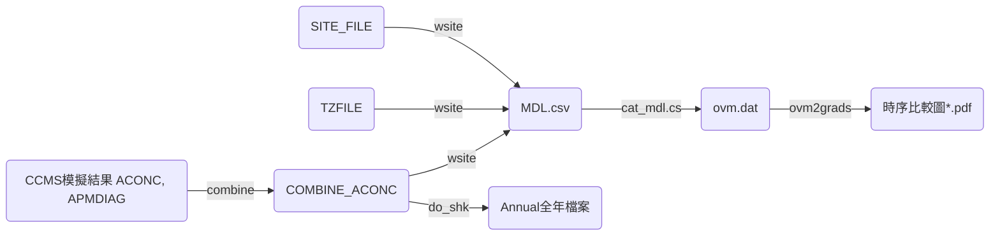

## 背景

- wsite是CMAQ系統中的後處理程式之一，作為測站比對的重要程序之一，整體流程參考[CMAQ後處理程序圖][cmaq_pp]。
- 類似的程式功能在CAMx模式為aok(average vs observatoin, see[[2022-07-20-aok]])

#### CMAQ後處理程序圖


- COMBINE_ACONC為[combine][0]之結果
- [TZFILE][1]為測站之時區資訊
- [SITE_FILE][2]為測站之座標經緯度
- [do_shk][3]為shk的CMAQ版本，只讀取COMBINE_ACONC其中的9個項目，以便進行情境間模擬結果的差異分析
- [ovm2grads][4]CMAQ與CAMx共用的繪圖軟體，執行grads繪製時間序列比較圖

## wsite之執行
- 使用C shell之腳本。參考[範例](https://github.com/sinotec2/Focus-on-Air-Quality/blob/main/GridModels/POST/run_wsiteMM_DM.csh)，重要設定詳表。

環境變數|內容|範例|說明
-|-|-|-
SITE_FILE|測站位置檔案|[SITE_FILE][2]|各欄依序為代碼、經緯度
DELIMITER|SITE_FILE中的分隔碼|','|
USECOLROW|是否輸入網格位置|Y or N|網格位置用於指定非測站之特定位置之輸出
TZFILE|時區檔案|[TZFILE][1]|時區以及所含蓋的測站位置。似以位置做為對照依據。
USELOCAL|是否轉成當地時間|Y or N|因空品數據檔案均為當地時間，因此需轉換(需提供TZFILE)
TIME_SHIFT|是否有時間偏移|0|如使用TZFILE則不需提供偏移量
PRTHEAD|是否印出表頭|Y or N|因CMAQ輸出的時間批次為逐日，如需跨日之整併，沒有表頭則可以直接連接檔案即可
SPECIES_1 \~ _8|需輸出的空品項目|NO2, O3 ...|與COMBINE_ACONC檔案能提供的項目有關。
日期及目錄|將形成輸入/輸出檔案之路徑名稱||如為全月之處理需注意批次及日期之計算

## 處理結果範例
- 表頭與單位：
  - `#siteid,column,row,longitude,latitude,date,Time,NO2,O3,PM10,PM25_NO3,PM25_SO4,PM25_TOT,SO2,VOC`
  - `#,,,degrees,degrees,YYYY-MM-DD,hh:mm:ss,ppbV,ppbV,ug m-3,ug m-3,ug m-3,ug m-3,ppbV,ppbC`

```bash
#kuang@master /nas1/cmaqruns/2019base/data/output_CCTM_v53_gcc_1912/POST
#$ head MDL_v53_gcc_1912_run8_20191213_TWN_3X3_11.csv
1,67,123,121.76000,25.12917,2019-12-13,08:00:00,1.02723,51.3184,7.50019,0.175134,1.56280,2.76559,0.555427,32.3832
1,67,123,121.76000,25.12917,2019-12-13,09:00:00,0.944120,52.7666,8.92861,0.228861,1.86836,3.33290,0.564609,37.7919
1,67,123,121.76000,25.12917,2019-12-13,10:00:00,1.11623,55.1634,8.94946,0.257773,1.92936,3.44453,0.607844,41.4572
1,67,123,121.76000,25.12917,2019-12-13,11:00:00,1.19753,56.7742,8.90800,0.286768,1.93465,3.47001,0.641612,43.4753
1,67,123,121.76000,25.12917,2019-12-13,12:00:00,1.13410,57.4378,9.25995,0.305955,2.08238,3.69498,0.637530,40.1752
1,67,123,121.76000,25.12917,2019-12-13,13:00:00,1.05987,57.2061,10.0519,0.325520,2.20966,3.92011,0.616549,35.6871
1,67,123,121.76000,25.12917,2019-12-13,14:00:00,0.894151,57.7293,11.5595,0.337469,2.51903,4.42539,0.515709,35.2418
1,67,123,121.76000,25.12917,2019-12-13,15:00:00,0.858102,58.2104,12.9172,0.335769,2.85085,4.94081,0.432728,34.8016
1,67,123,121.76000,25.12917,2019-12-13,16:00:00,1.68719,56.7345,13.6983,0.562962,2.85162,5.29834,0.598501,45.2929
1,67,123,121.76000,25.12917,2019-12-13,17:00:00,3.65371,52.5795,14.6611,0.946677,2.68778,5.71838,1.02006,62.0621
```

[cmaq_pp]: <https://github.com/sinotec2/FAQ/blob/main/_posts/2022-07-21-wsite.md#cmaq後處理程序圖> "CMAQ後處理程序圖"
[0]: <https://sinotec2.github.io/Focus-on-Air-Quality/GridModels/POST/run_combMM_R_DM/> "CMAQ綜合空品項目之計算(combine)"
[1]: <https://github.com/sinotec2/Focus-on-Air-Quality/blob/main/GridModels/POST/tz.csv> "測站時區清單檔案"
[2]: <https://github.com/sinotec2/Focus-on-Air-Quality/blob/main/GridModels/POST/sites.txt> "測站編號(代碼)及座標"
[3]: <https://sinotec2.github.io/FAQ/2022/07/19/shk.html#do_shk> "將全年的combine結果一次提取"
[4]: <> ""
