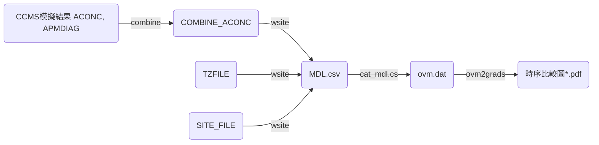

## 背景
- wsite是CMAQ系統中的後處理程式之一，作為測站比對的重要程序之一，整體流程參考[CMAQ後處理程序圖][cmaq_pp]。

#### CMAQ後處理程序圖

- [TZFILE][1]為測站之時區資訊
- [SITE_FILE][2]為測站之座標經緯度

## wsite之執行
- 使用C shell之腳本。參考[範例](https://github.com/sinotec2/Focus-on-Air-Quality/blob/main/GridModels/POST/run_wsiteMM_DM.csh)，重要設定詳表。

環境變數|內容|範例|說明
-|-|-|-
SITE_FILE|測站位置檔案|[SITE_FILE][2]|各欄依序為代碼、經緯度
DELIMITER|SITE_FILE中的分隔碼|','|
USECOLROW|是否輸入網格位置|Y or N|網格位置用於指定非測站之特定位置之輸出
USELOCAL|是否轉成當地時間|Y or N|因空品數據檔案均為當地時間，因此需轉換(需提供TZFILE)
TIME_SHIFT|是否有時間偏移|0|如使用TZFILE則不需提供偏移量
PRTHEAD|是否印出表頭|Y or N|因CMAQ輸出的時間批次為逐日，如需跨日之整併，沒有表頭則可以直接連接檔案即可
SPECIES_1 \~ _8|需輸出的空品項目|NO2, O3 ...|與COMBINE_ACONC檔案能提供的項目有關。
日期及目錄|將形成輸入/輸出檔案之路徑名稱||如為全月之處理需注意批次及日期之計算

[cmaq_pp]: <https://github.com/sinotec2/FAQ/blob/main/_posts/2022-07-21-wsite.md#cmaq後處理程序圖> "CMAQ後處理程序圖"
[1]: <https://github.com/sinotec2/Focus-on-Air-Quality/blob/main/GridModels/POST/tz.csv> "測站時區清單檔案"
[2]: <https://github.com/sinotec2/Focus-on-Air-Quality/blob/main/GridModels/POST/sites.txt> "測站編號(代碼)及座標"
