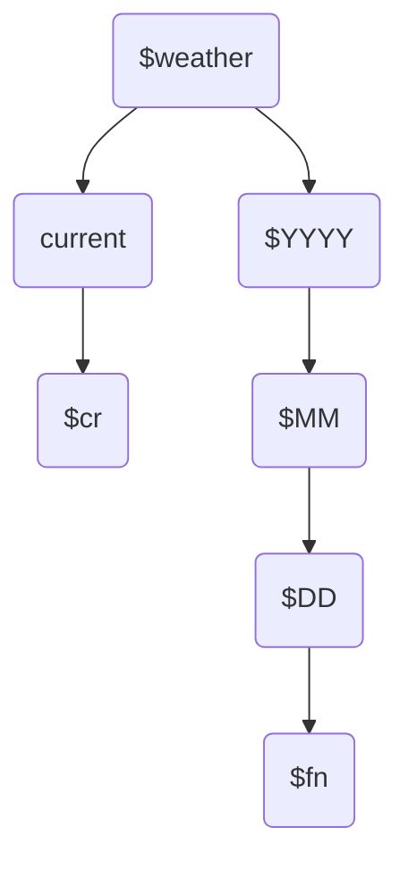

## 背景
- [GFS][GFS]是美國國家氣象局運行的全球氣象數值預報模式，每6小時更新預報，每次預報未來180小時(7天半)範圍。提供逐3小時結果。模式結果公開的時間較實際時間晚4小時。
- 在此時間框架下，此處任務需定期下載、處理、並放置在[earth][ens]套件指定的位置，以利使用者透過網路讀取檢視。

## 批次執行腳本
### 程式IO
- 引數：無。程式會呼叫工作站系統時間
- GFS數據項目，對照關係如下表
  - 地面：MSLP、temp、
  - 10m：uv
  - 1000mb：uv、temp(計算air_density用)、O3MR

項目|GFS變數名稱|[earth][ens]變數($item)|高度|說明
-|:-:|:-:|:-:|-
風|UGRD, VGRD|wind|10m, 1000mb|[GFS][GFS]並沒有2維的u10、v10，因此地面風需指定其高度為10m。同一時間的U、V需同批下載，儲存在同一json檔案內，先指定U、再指定V。
平均海面氣壓|PRMSL|mean_sea_level _pressure|(不適用)|與地面氣壓不同，[GFS][GFS]之PRMSL為2維變數，不能指定高度
氣溫|TMP|temp|地面, 1000mb|[GFS][GFS]沒有精確指定地面氣溫的高度(如wrf的T2)，指定為surface_level即可
臭氧|O3MR|(ozone)|1000mb|[earth][ens]原始套件**沒有臭氧**，需[修改](https://sinotec2.github.io/FAQ/2022/08/03/wind_ozone.html#earth系統新增臭氧之讀取繪圖功能)。[GFS][GFS]提供的是定壓層模擬結果，濃度較[CAMS][CAMS]為低，後者雖也是定壓層，但圖層放在地面。
空氣密度|(無)|air_density|1000mb|密度是計算粒狀物的重要變數，[GFS][GFS]輸出有這項，但**不提供**perl程式下載，以[earth_dens.py][earth_dens.py]程式另行計算。[earth][ens]提供了定壓層的展示，但目前仍未試成功。

### 對應json檔
  - 命名邏輯
    - 日期目錄
    - `fn=$時間-$item-$levTyp-$level-$mdl-$res.json`

順序|代碼|意義|範例|說明
-|-|-|-|-
1|時間|小時或當下|${HH}00($fn)或current($cr)|標示檔案的小時。此檔名會與url網址列時間一致
2|item|變數名稱|wind、mean_sea_level_pressure、temp、air_density、ozone等等|小寫。[earth][ens]只認檔名不認json header之內容。wind需2筆json，其餘1筆
3|levTyp|指定高度的類型|surfae或isobaric|指向html中的Sfc或等壓面高度
4|level|哪一層高度|如為地面此值即為level，如為等壓面其單位為百帕(如1000hPa)|如為2維數據(MSLP)第3及4項皆無(Null)。
5|mdl|模式名稱|[earth][ens]只提供gfs|如需其他模式，需修改[js程式](https://sinotec2.github.io/FAQ/2022/07/26/CWBwrf_3Km2NWC.html#filepath-function)。
6|res|模式解析度|[earth][ens]沒有內設，只與檔名有關。網格系統計算乃讀取json檔頭有關[網格設定內容](https://sinotec2.github.io/FAQ/2022/07/26/CWBwrf_3Km2NWC.html#grid-definition)。|如需其他解析度，也需修改[js程式](https://sinotec2.github.io/FAQ/2022/07/26/CWBwrf_3Km2NWC.html#filepath-function)。
      

### 檔案目錄架構 
- [earth][ens]套件$weather的目錄架構如下圖所示
  - `weather=./earth/public/data/weather`
  - 時間目錄
    - 按照年、月、日(UTC)分別建立目錄
    - 其下則為當天所有氣象(與臭氧)檔案，命名方式如前述`$fn`
  - 當下目錄($weather/current)
    - 按照工作站系統時間判定，解析度為3小時
    - 連結到前述時間目錄及檔案
    - 命名邏輯
      - `cr=current-$item-$levTyp-$level-$mdl-$res.json`



### [earth_gfs.cs][earth_gfs.cs]腳本內容

```bash
- 
```
## [earth_dens.py][earth_dens.py]空氣密度與臭氧單位之計算
- 

[GFS]: <https://en.wikipedia.org/wiki/Global_Forecast_System> "全球預報系統 (GFS) 是一個全球數值天氣預報系統，包含由美國國家氣象局 (NWS) 運行的全球尺度氣象數值預報模式和變分分析。"
[ens]: <https://earth.nullschool.net/> "earth, a visualization of global weather conditions, forecast by supercomputers, updated every three hours"
[earth_gfs.cs]: <https://github.com/sinotec2/Focus-on-Air-Quality/blob/main/wind_models/GFS/earth_gfs_cs> "GFS數據自動下載轉換腳本"
[earth_dens.py]: <https://github.com/sinotec2/Focus-on-Air-Quality/blob/main/wind_models/GFS/earth_dens.py> "由GFS數據計算空氣密度與臭氧"