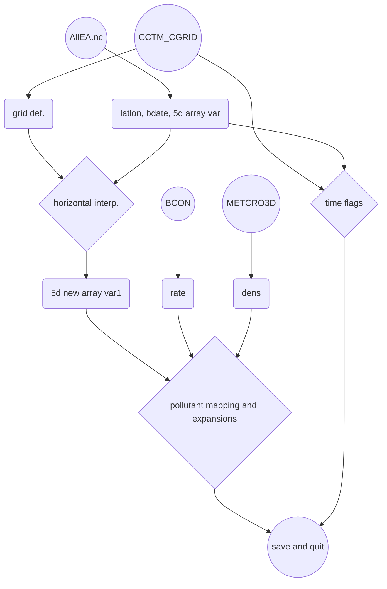

## 背景
- 歐洲[中期天氣預報中心][ecmwf]再分析空品數據寫成USEPA的m3nc格式，已經在[EAC4檔案轉成5階m3.nc][grb2D1m3]完成。然而該項作業仍然有待改進：
  1. 因為下載全月數據，再進行轉檔(增加網格與時間的解析度)，結果檔案會非常大。而此處僅需要初始小時的數據，且在自動化與作業流程中，似乎不允許如此耗時、耗費硬碟空間的作法。
  1. 數值預報數據檔與再分析數據檔的差異如下表，必須更新
  1. 有關空間之內插：調整成按照目標檔的座標定義。而不在python程式內重新定義，以避免發生錯誤。
  1. 有關時間的校準
    - 空氣密度也是mcip結果，但時間似乎並不重要，取時間平均
    - 只有初始時刻，無需進行時間內插，此部分刪除

### [ecmwf][ecmwf]數值預報數據檔與再分析數據檔的差異

項目|預報|再分析|說明
-|-|-|-
臭氧等5項氣狀物編號|前綴MASSMR_P40_L105_GLL0_A|前綴VAR_192_210與後綴P0_L105_GLL0|略有不同，詳下述對照關係。
時間標籤|存在屬性|為一特定的變數|需重作
層數|137層|60層|CMAQ目標檔案舊版為40層，新版為24層

- 除了前述差異與更新之外，[grb2icon.py][grb2icon.py]大多參考[grb2D1m3][grb2D1m3]的作法。以下著重介紹IO及前後處理。

- 數值預報數據檔部分更動氣狀物編號對照關係

```json
"MASSMR_P40_L105_GLL0_A0":"ozone",
"MASSMR_P40_L105_GLL0_A4":"carbon_monoxide",
"MASSMR_P40_L105_GLL0_A5":"nitrogen_dioxide",
"MASSMR_P40_L105_GLL0_A8":"sulphur_dioxide",
"MASSMR_P40_L105_GLL0_A11":"nitrogen_monoxide",
```
- 這些污染物舊版的對照關係

```json
"VAR_192_210_203_P0_L105_GLL0":"ozone",
"VAR_192_210_123_P0_L105_GLL0":"carbon_monoxide",
"VAR_192_210_121_P0_L105_GLL0":"nitrogen_dioxide",
"VAR_192_210_122_P0_L105_GLL0":"sulphur_dioxide",
"VAR_192_217_27_P0_L105_GLL0":"nitrogen_monoxide",
```

## 預報檔時間的切割與橫向合併
### grib2或netCDF的選擇
- 小型檔案、循序處理的情況下，使用pygrib直接處理grib2檔案似乎有其簡捷的好處。但由於此處的grib2檔案為41個小時、27種物質的預報檔，下載就必須拆分成3批進行，使用pygrib的速度遠遠無法比netCDF4階層讀取來的有效。
- 使用ncl_convert2nc轉換檔案並不會花費太多時間，且方便切割(取初始時間)。雖然磁碟機空間會佔2份，但在每天作業中可以覆蓋過去，不需存檔。

### 時間切割
- 分別將前述3個批次下載結果轉換成nc檔
  - 3個批次的定義為3組污染項目(如下述對照關係中的1 ~9、10 ~18、19 ~ 27)  
- 再以ncks進行時間維度的切割。

```bash
for grb in allEA_1.grib  allEA_2.grib  allEA_3.grib;do
ncl_convert2nc $grb
done
for nc in allEA_1.nc  allEA_2.nc  allEA_3.nc;do
ncks -d forecast_time0,0 $nc ${nc}_0
done
```
- specname.json: ID與grab.name的對照關係

```json
{"1": "Ozone mass mixing ratio (full chemistry scheme)", 
"2": "Sulphur dioxide mass mixing ratio", 
"3": "Propane", 
"4": "Nitrogen monoxide mass mixing ratio", 
"5": "Nitrogen dioxide mass mixing ratio", 
"6": "Isoprene", 
"7": "Formaldehyde", 
"8": "Ethane", 
"9": "Carbon monoxide mass mixing ratio", 
"10": "Hydrophilic Black Carbon Aerosol Mixing Ratio", 
"11": "Dust Aerosol (0.9 - 20 um) Mixing Ratio", 
"12": "Dust Aerosol (0.55 - 0.9 um) Mixing Ratio", 
"13": "Dust Aerosol (0.03 - 0.55 um) Mixing Ratio", 
"14": "Paraffins", 
"15": "Organic nitrates", 
"16": "Olefins", 
"17": "Nitrate", 
"18": "Ammonium", 
"19": "Sulphate Aerosol Mixing Ratio", 
"20": "Sea Salt Aerosol (5 - 20 um) Mixing Ratio", 
"21": "Sea Salt Aerosol (0.5 - 5 um) Mixing Ratio", 
"22": "Sea Salt Aerosol (0.03 - 0.5 um) Mixing Ratio", 
"23": "Peroxyacetyl nitrate", 
"24": "Nitric acid", 
"25": "Hydrophobic Organic Matter Aerosol Mixing Ratio", 
"26": "Hydrophobic Black Carbon Aerosol Mixing Ratio", 
"27": "Hydrophilic Organic Matter Aerosol Mixing Ratio"}
```

### 污染項目間之橫向合併(merge.cs)
- 一個檔案有9個變數，多了變數($var)的迴圈，因為grep的結果var有很多筆，參照舊版[merge.cs](https://sinotec2.github.io/Focus-on-Air-Quality/AQana/GAQuality/ECMWF/EC_ReAna/#橫向合併)修改應用，同樣也是ncks -v再ncks -A疊加在$fn的後面。
- 三個nc檔案持續在變數維度方向進行疊加

```bash
#kuang@master /nas1/ecmwf/CAMS/CAMS_global_atmospheric_composition_forecasts/2022
#$ cat merge.cs
fn=AllEA.nc
for i in 1 2 3;do
  nc=allEA_${i}.nc_0
  var=$(ncdump -h $nc|grep float|grep 0_L|awkk 2|cut -d'(' -f1)
  for v in $(echo $var);do
    c=$(grep $v G*json|cut -d: -f2|cut -c2-|rev|cut -c3-|rev)
    ncks -O -v $v --mk_rec_dmn initial_time0_hours $nc tmp.nc
    ncks -A tmp.nc $fn
    echo $c
  done
done
```

## [grb2icon.py][grb2icon.py]程式IO
- AllEA.nc：前述橫向合併之結果
- BCON_v53_1912_run5_regrid_20191201_TWN_3X3：取粒狀物IJK比例(rate)之模版
- METCRO3D_2208_run8.nc：讀取空氣密度進行粒狀物的單位轉換
- CCTM_CGRID_v53_gcc_2208_run7_20220810_CWBWRF_45k_11.nc：CMAQ初始檔模版及輸出

## [grb2icon.py][grb2icon.py]流程



## 結果檢討
- 確認項目：y軸的方向、Z軸的方向。grib檔案是由北向南、由上到下，經np.flip()結果必須要符合地理位置特性。


|  |
|:--:|
| <b>CAMS數值預報結果轉成CMAQ CWBWRF_45k網格之初始檔(精確時間為 2022/8/11 pm8:00LST)。圖為地面臭氧濃度。單位ppm</b>|  

- CAMS預報檔的解析度是0.4度，約為44km，與此處之45km相差無幾。然而發現內插結果濃度較低。
- 特定項目如硝酸鹽，濃度又更低。可能與CAMS為12時的預報，大陸地區為晚上，硝酸鹽沒有產生項，因而濃度會較低，可由硝酸濃度在印度上方有換日線瞭解太陽對光化學污染的效應。

|  |  |
|:--:|:--:|
| <b>地面氣狀硝酸濃度。單位log-ppm</b>|  <b>地面硝酸鹽(i-mode)單位log-&mu;g/m<sup>3</sup></b>| 
|  |  |
| <b>地面硝酸鹽(j-mode)單位log-&mu;g/m<sup>3</sup></b>|  <b>地面硝酸鹽(k-mode)單位log-&mu;g/m<sup>3</sup></b>| 

- 有關時間的校準：CWB每6小時更新，但CMAQ並不能由任意時間起始。是否意味CMAQ只能每天執行預報一次。值得進一步確認。
- 初始場的下載似乎可以獨立出來，一次下載單一時間27個物種，直接進行ncl_convert2nc，可以減少橫向整併的時間。


[ecmwf]: <https://zh.wikipedia.org/zh-tw/歐洲中期天氣預報中心> "歐洲中期天氣預報中心，創立於1975年，是一個國際組織，位於英格蘭雷丁。"
[grb2icon.py]: <https://github.com/sinotec2/Focus-on-Air-Quality/blob/main/AQana/GAQuality/ECMWF/grb2icon.py> "CAMS預報數據寫成CMAQ初始檔之內插與對照程式"
[grb2D1m3]: <https://sinotec2.github.io/Focus-on-Air-Quality/AQana/GAQuality/ECMWF/grb2D1m3/> "歐洲中期預報中心再分析檔案轉成USEPA m3nc 檔"
