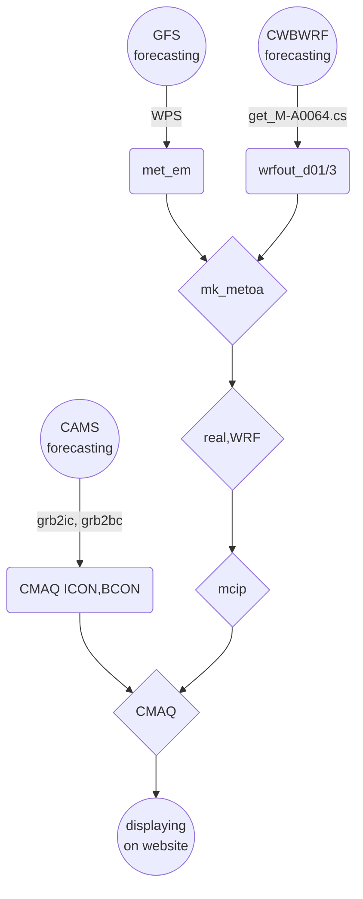

## 背景
- 以光化學網格模式進行高解析度空氣品質數值預報、對空品不良狀況的預告以及應變措施有重要的參考價值。確定性([deterministic][dtm])模式主要的特點與好處包括：
  - 基本的背景空氣品質預報
  - 區分境外與本土排放的貢獻
  - 區分背景與特定污染源的貢獻
  - 區分人為污染或天候因素
  - 緊急排放、或是假設性排放之投入與增量分析
- 背景預報的功能過去大多依靠統計模式、類型預報、類神經網路、機器學習等等模式系統，邏輯系統與因果關係模式較少，主要限制與解決對策列表如下：

### 高解析度空氣品質數值預報的限制與對策

項目|限制|對策|說明
-|-|-|-
大氣動力模式預報|現有GFS雖有3小時解析度但網格僅為1度 CWBWRF雖有3公里解析度但高度僅11層且項目不足 均未達解析度與完整性需求|就空品模擬範圍重新以WRF [FDDA][FDDA]進行模擬|除了風之外，大氣垂直穩定度、雲量及輻射量對光化學的模擬也非常重要。重跑有其必要性。
邊界與初始濃度場|CAMS有0.4度的[預報][CAMS]，但只有27個物質項目|以CAMS做為[邊界][CAMS_bc]與[初始濃度場][CAMS_ic]重新進行東亞與中國等重要境外來源的空品模擬|東亞及南中國範圍模擬約需要1~2小時，還在允許範圍。
即時排放量|TEDS無法即時更新所有內容|部分污染源有即時數據如火力電廠、石化業或交通污染，可就部分排放進行增量模擬預報,如[範例](https://sinotec2.github.io/cpuff_forecast/)|預報應有主題污染源。不需(也無法)針對所有污染源進行更新
濃度場之展現|現有[earth][eth]套件的解析度1度並不足夠|已經[修改][CWBwrf_3Km2NWC]可以顯示任何解析度濃度場|除了[earth][eth]之外，也可以使用wrf-python結果的GIF動態展示。
作業系統及網站平台|浮點計算速度、平行計算能力、網路上下載頻寬、網站穩定性|1.超微工作站 2.光纖網路 3.github.io網站|每天僅進行1次下載、計算、上載更新循環，負荷不會太大。

### 整體作業流程

## 下載作業

項目|用途（處理方式）|檔案數量|說明
-|-|-|-
GFS預報|wrf的初始及邊界、FDDA ungrib, metgrid, mk_metoa||
CAMS預報|[邊界][CAMS_bc]與[初始濃度場][CAMS_ic]||
CWBWRF預報|[get_M-A0064.cs][get_M]||

### CWBWRF之下載
- CWBWRF的時間約與實際時間落差6~10小時，因此如需00Z（0800LST）起始的預報結果，則需在1800LST起動下載。
- CWB沒有提供下載選項、所幸變數、層數有限，也僅提供每6小時預報，檔案容量與個數並不多。
- CWB WRF程式結果每6小時更新，分別為每天的2/8/14/20時(LST)等4次。各次預報起始時間與安排如下：

檔案上架時間LST|模式起始UTC|用途|說明
:-:|:-:|:-|-
2:00|12:00|[earthCWB][CWBwrf_3Km2NWC]|只下載3Km結果、不存檔。
8:00|18:00|[earthCWB][CWBwrf_3Km2NWC]|只下載3Km結果、不存檔。
14:00|0:00|[earthCWB][CWBwrf_3Km2NWC]、推動CMAQ|CMAQ必須自00Z起始。需完整下載、不存檔。
20:00|6:00|[get_M-A0064.cs][get_M]、推動cpuff預報|午夜進行下載計算、避免干擾公司正常作息。完整下載存檔。

### GFS預報檔下載
- GFS預報時間較長(180hr)，層數、變數項目較完整，然而NWC也提供了部分下載的功能。
- GFS預報數據是否存檔的考量
  1. 畢竟是模式計算結果，仍有一定程度的不準度。
  1. 相同解析度另有[FNL再分析數據][fnl]，結合觀測及預報之三維場，有更高的正確性。只是稍晚才會上架，約延遲2天。
  1. 如果GFS一定要存檔，僅需度過前述空窗期即可刪除。
  1. NOAA 也只提供下載下載最近10天內的預報結果。

- 下載安排如下：

檔案下載時間LST|模式起始UTC|用途|說明
:-:|:-:|:-|-
2:00|12:00|[earthCWB][CWBwrf_3Km2NWC]|只下載部分結果、不存檔。
8:00|18:00|[earthCWB][CWBwrf_3Km2NWC]|只下載部分結果、不存檔。
14:00|0:00|[earthCWB][CWBwrf_3Km2NWC]、推動CMAQ|CMAQ必須自00Z起始。需完整下載、不存檔。
20:00|6:00|[get_M-A0064.cs][get_M]|只下載部分結果、不存檔。

[eth]: <https://github.com/cambecc/earth> "cambecc(2016), earth building, launching and etc on GitHub. "
[dtm]: <https://zh.wikipedia.org/zh-tw/确定性模型> "在數學、計算機科學和物理學中，確定性模型（Deterministic model）是指不包含任何隨機成份的模型。因此，確定性模型將始終從給定的起始條件或初始狀態產生相同的輸出。"
[GFS]: <https://sinotec2.github.io/FAQ/2022/08/05/earth_gfs.html> "GFS數據自動下載轉換"
[CAMS]: <https://sinotec2.github.io/FAQ/2022/08/03/wind_ozone.html> "earth套件貼上CAMS臭氧濃度"
[CWBwrf_3Km2NWC]: <https://sinotec2.github.io/FAQ/2022/07/26/CWBwrf_3Km2NWC.html> ""
[FDDA]: <https://zh.wikipedia.org/zh-tw/数据同化> "數據同化，或稱資料同化，是通過數學模型擬合觀測數據的一種漸進方式，通常用於複雜系統的建模和動態預報。"
[CAMS_bc]: <https://sinotec2.github.io/FAQ/2022/08/16/CAMS_bc.html> "CAMS預報數據寫成CMAQ邊界檔"
[CAMS_ic]: <https://sinotec2.github.io/FAQ/2022/08/16/CAMS_ic.html> "CAMS預報數據寫成CMAQ初始檔"
[get_M]: <https://sinotec2.github.io/Focus-on-Air-Quality/wind_models/cwbWRF_3Km/fil_grb_nc/> "wind models->cwb WRF_3Km->相同網格系統之grb2轉檔"
[fnl]: <> ""