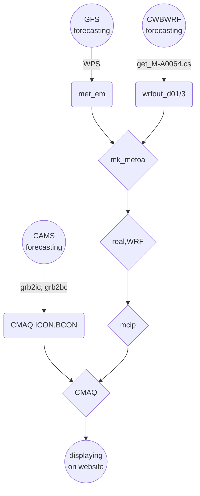

## 背景
- 以光化學網格模式進行高解析度空氣品質數值預報、對空品不良狀況的預告以及應變措施有重要的參考價值。確定性([deterministic][dtm])模式主要的特點與好處包括：
  - 基本的背景空氣品質預報
  - 區分境外與本土排放的貢獻
  - 區分背景與特定污染源的貢獻
  - 區分人為污染或天候因素
  - 緊急排放、或是假設性排放之投入與增量分析
- 背景預報的功能過去大多依靠統計模式、類型預報、類神經網路、機器學習等等模式系統，邏輯系統與因果關係模式較少，主要限制與解決對策列表如下：

### 高解析度空氣品質數值預報的限制與對策

項目|限制|對策|說明
-|-|-|-
大氣動力模式預報|現有GFS雖有3小時解析度但網格僅為1度</br>CWBWRF雖有3公里解析度但高度僅11層且項目不足</br>均未達解析度與完整性需求|就空品模擬範圍重新以WRF [FDDA][FDDA]進行模擬|除了風之外，大氣垂直穩定度、雲量及輻射量對光化學的模擬也非常重要。重跑有其必要性。
邊界與初始濃度場|CAMS有0.4度的[預報][CAMS]，但只有27個物質項目|以CAMS做為[邊界][CAMS_bc]與[初始濃度場][CAMS_ic]重新進行東亞與中國等重要境外來源的空品模擬|東亞及南中國範圍模擬約需要1~2小時，還在允許範圍。
即時排放量|TEDS無法即時更新所有內容|部分污染源有即時數據如火力電廠、石化業或交通污染，可就部分排放進行增量模擬預報,如[範例](https://sinotec2.github.io/cpuff_forecast/)|預報應有主題污染源。不需(也無法)針對所有污染源進行更新
濃度場之展現|現有[earth][eth]套件的解析度1度並不足夠|已經[修改][CWBwrf_3Km2NWC]可以顯示任何解析度濃度場|除了[earth][eth]之外，也可以使用wrf-python結果的GIF動態展示。
作業系統及網站平台|浮點計算速度、平行計算能力、網路上下載頻寬、網站穩定性|1.超微工作站</br>2.光纖網路</br>3.github.io網站|每天僅進行1次下載、計算、上載更新循環，負荷不會太大。

### 整體作業流程


## 下載作業

項目|用途（處理方式）|檔案數量|說明
-|-|-|-
GFS預報|wrf的初始及邊界、FDDA</br>ungrib, metgrid, mk_metoa||
CAMS預報|[邊界][CAMS_bc]與[初始濃度場][CAMS_ic]||
CWBWRF預報|[get_M-A0064.cs][get_M]||

### CWBWRF之下載
- CWBWRF的時間約與實際時間落差6~10小時，因此如需00Z（0800LST）起始的預報結果，則需在1800LST起動下載。
- CWB沒有提供下載選項、所幸變數、層數有限，也僅提供每6小時預報，檔案容量與個數並不多。
- CWB WRF程式結果每6小時更新，分別為每天的2/8/14/20時(LST)等4次。各次預報起始時間與安排如下：

檔案上架時間LST|模式起始UTC|用途|說明
:-:|:-:|:-|-
2:00|12:00|[earthCWB][CWBwrf_3Km2NWC]|只下載3Km結果、不存檔。
8:00|18:00|[earthCWB][CWBwrf_3Km2NWC]|只下載3Km結果、不存檔。
14:00|0:00|[earthCWB][CWBwrf_3Km2NWC]、推動CMAQ|CMAQ必須自00Z起始。需完整下載、不存檔。
20:00|6:00|[get_M-A0064.cs][get_M]、推動cpuff預報|午夜進行下載計算、避免干擾公司正常作息。完整下載存檔。

### GFS預報檔下載與分析
- GFS預報時間較長(384 hr)，層數、變數項目較完整，然而NOAA也提供了部分下載的功能，可供展示使用。
- GFS預報數據是否存檔的考量
  1. 畢竟是模式計算結果，仍有一定程度的不準度。
  1. 相同解析度另有[FNL再分析數據][fnl]，結合觀測及預報之三維場，有更高的正確性。只是稍晚才會上架，約延遲2天。
  1. 如果GFS一定要存檔，僅需渡過前述空窗期即可刪除。或可考慮下載模式起始所使用的分析檔。(https://nomads.ncep.noaa.gov/pub/data/nccf/com/gfs/prod/gfs.YYYYMMDD/HH/atmos/gfs.tHHz.pgrb2.1p00.anl)、YMDH分別為UTC之年月日時，約35M
  1. NOAA 也只開放下載最近10天內的預報作業結果。
- 下載的作業細節可以參考[GFS數據驅動WRF->GFS預報結果的下載](https://sinotec2.github.io/FAQ/2022/08/10/GFStoWRF.html#FS預報結果的下載)
- 下載安排如下：

檔案下載時間LST|模式起始UTC|用途|說明
:-:|:-:|:-|-
2:00|12:00|[GFS數據自動下載轉換][earth_gfs]|只下載部分結果、不存檔。
8:00|18:00|[GFS數據自動下載轉換][earth_gfs]|只下載部分結果、不存檔。
14:00|0:00|[GFS數據驅動WRF][gfs2wrf]、推動CMAQ|CMAQ必須自00Z起始。需完整下載、不存檔。
20:00|6:00|[get_M-A0064.cs][get_M]|只下載部分結果、不存檔。

- 下載後即按照WRF的執行流程進行準備。

執行檔|serial/parellel|所需檔案|重要檢核項目
:-:|:-:|-|-
ungrib|serial|GRIBFILE連結、geo_em檔|由於GFS檔名中含有日期，需每次更新連結
metgrid|serial|逐3小時之解壓縮檔|每日會產生新的分析檔，相同時間會覆蓋
mk_metoaD12|serial|namelist.input、met_em檔、CWB_wrfout_d01(d03)|需另預備CWB數據檔
mk_metoaT|parallel|(同上)|同步執行、需開啟wait監視程式
real|serial<sup>*</sup>|met_em、metoa_em|wait OK、且需檢視每3小時結果都已準備好

<sup>*</sup> real的執行本身是平行，但在整體腳本流程中只是一個動作，不會由腳本另外開啟需等候完成的程序。

## CAMS預報結果之下載
- 使用[get_All.py][get_All.py]
- 引數：
  1. dt：YYYY-MM-DD， `dt=$(date -d "now -20hours" +%Y-%m-%d)`
  1. hr:HH:00，`hr=$(date -d "now -20hours" +%H:00)`
  1. 1 ~ 3部分物質種類。詳見[CAMS_ic][CAMS_ic]
- 由於CAMS數據較實際時間晚12小時，再加上時差，因此差距為20小時。如要下載0時數據，只能
  1. 在前1天的20時(LST)，以預報第1天(第9筆)的結果來替代當天0時值。(get_All.py每3小時下載一筆)  
  1. 在8時下載前1天12:00起始的預報，以預報第5筆)的結果來替代當天0時值。

### CAMS預報數據之下載與分析
- CAMS預報數據除了[寫成CMAQ邊界檔][CAMS_bc]及[初始場][CAMS_ic]之外，也是[earth][CAMS]展示的重點項目。
- CAMS預報的更新頻率為12小時，如表所示：

檔案下載時間LST|模式起始UTC|用途|說明
:-:|:-:|:-|-
8:00|12:00|[earth套件貼上CAMS臭氧濃度][CAMS]、推動CMAQ|不儲存完整下載檔、儲存臭氧。
20:00|0:00|[earth套件貼上CAMS臭氧濃度][CAMS]|儲存臭氧。

- get_all.cs
  1. 0 ~ 120小時，每3小時下載
  1. 27項污染物質，分3批下載
  1. 下載後轉nc檔有較快的讀取速度
  1. 抽出第5筆，為當天0時預報值(注意ncks -O以覆蓋同一檔名)
  1. 執行橫向整合[merge][merge.cs]，後將做為CMAQ的初始檔
  1. 執行[grb2icon.py][CAMS_ic]
  1. 執行[grb2bcon.py][CAMS_bc]

```bash
#kuang@node03 /nas1/ecmwf/CAMS/CAMS_global_atmospheric_composition_forecasts/2022
#$ cat get_all.cs
src=/nas1/ecmwf/CAMS/CAMS_global_atmospheric_composition_forecasts/2022
ncl=/opt/miniconda3/envs/ncl_stable/bin/ncl_convert2nc
ncks=/usr/bin/ncks
cd $src
dt=$(date -d "now -20hours" +%Y-%m-%d)
hr=$(date -d "now -20hours" +%H:00)
hr=12:00
for i in 1 2 3;do
  rm allEA_$i.grib
  ./get_All.py $dt $hr $i >& /dev/null
  $ncl allEA_$i.grib -nc4c >& /dev/null
  if [[ -e allEA_$i.nc4 ]];then mv allEA_$i.nc4 allEA_$i.nc;fi
  $ncks -O -d forecast_time0,12 allEA_$i.nc allEA_$i.nc_0
done
if [[ -e AllEA.nc ]];then rm AllEA.nc;fi
./merge.cs
./grb2icon.py
./grb2bcon.py
```
- crontab：每天8時執行

```bash
0 8 * * * get_all.cs
```
## 計算核心
### wrf及mcip
- 執行腳本如下所示
  1. real與wrf必須循序進行
  1. mcip與其他沒有相關，可獨立平行執行。

```bash
#kuang@DEVP /nas1/backup/data/NOAA/NCEP/GFS/YYYY/TWEPA_3k
#$ cat ../fcst.cs
wget=/usr/bin/wget
root=https://nomads.ncep.noaa.gov/pub/data/nccf/com/gfs/prod/gfs.
today=$(date -d +1day +%Y%m%d)
dir=$today/00/atmos/
gfs=/nas1/backup/data/NOAA/NCEP/GFS/YYYY
cmaq=/home/cmaqruns/2022fcst
fcst=/nas2/cmaqruns/2022fcst
sub=~/bin/sub
cd $gfs

# 執行gfs檔案下載
for ((i=0;i <= 120; i+=3));do
  iii=$(printf "%03d" $i)
  file=gfs.t00z.pgrb2.1p00.f$iii
  if [ -e $file ];then rm $file;fi
  $wget --no-check-certificate -q $root$dir$file
#  if [ $i -eq 120 ];then sleep 60;fi
done

# WPS中的ungrib及metgrid
link_grib.csh gfs*
## 置換模版中的起迄日期
cp namelist.wps_loop namelist.wps
BEGD=$(date -d "$today +0days" +%Y-%m-%d)
ENDD=$(date -d "$today +5days" +%Y-%m-%d)
for cmd in 's/BEGD/'$BEGD'/g' 's/ENDD/'$ENDD'/g';do
  sed -ie $cmd namelist.wps
done
## ungrib
LD_LIBRARY_PATH=/nas1/WRF4.0/WRFv4.3/WRFV4/LIBRARIES/lib:/opt/intel_f/compilers_and_libraries_2020.0.166/linux/compiler/lib/intel64_lin /nas1/WRF4.0/WRF_chem/WPS/ungrib/src/ungrib.exe >& /dev/null
## metgrid
LD_LIBRARY_PATH=/nas1/WRF4.0/WRFv4.3/WRFV4/LIBRARIES/lib:/opt/intel_f/compilers_and_libraries_2020.0.166/linux/compiler/lib/intel64_lin /nas1/WRF4.0/WRF_chem/WPS2/metgrid.exe >& /dev/null

# 依序執行3個domain的real及wrf
DOM=( 'CWBWRF_45k' 'SECN_9k' 'TWEPA_3k' )
GRD=( 'grid45'     'grid09'  'grid03' )
## 起迄年 、 月 、 日B
yea1=$(echo $BEGD|cut -d'-' -f1);mon1=$(echo $BEGD|cut -d'-' -f2);day1=$(echo $BEGD|cut -d'-' -f3)
yea2=$(echo $ENDD|cut -d'-' -f1);mon2=$(echo $ENDD|cut -d'-' -f2);day2=$(echo $ENDD|cut -d'-' -f3)
for i in 0 1 2;do
  cd $gfs/${DOM[$i]}
  ## 置換模版中的起迄日期
  cp namelist.input_loop namelist.input
  for cmd in "s/SYEA/$yea1/g" "s/SMON/$mon1/g" "s/SDAY/$day1/g" \
             "s/EYEA/$yea2/g" "s/EMON/$mon2/g" "s/EDAY/$day2/g" ;do
    sed -i $cmd namelist.input
  done
  rm met_em* metoa_em*
  ## 連結met_em檔案
  d=$(( $i + 1 ))
  for j in $(ls ../met_em.d0${d}*);do k=${j/d0${d}/d01};l=${k/..\//};ln -s $j $l;done
  if [ $i -eq 0 ] || [ $i -eq 1 ];then
    ## 連結metoa_em檔案
    for j in $(ls ../met_em.d0${d}*);do k=${j/d0${d}/d01};l=${k/..\//};m=${l/met_/metoa_};ln -s $j $m;done
  else
    ## 執行CWBWRF結果的內插
    EXE=./mk_metoaT.py
    for j in {0..40};do $sub $EXE $j;sleep 10s;done
    ## 等候所有的程序都完成，才執行下一動作。
    while true;do
      n=$(psg ${EXE}|wc -l)
      if [ $n -lt 2 ];then
        break
      else
        sleep 60
      fi
    done
  fi

  rm -f $gfs/${DOM[$i]}/wrf*
  # real
  LD_LIBRARY_PATH=/nas1/WRF4.0/WRFv4.3/WRFV4/LIBRARIES/lib:/opt/intel_f/compilers_and_libraries_2020.0.166/linux/compiler/lib/intel64_lin:/opt/mpich/mpich-3.4.2-icc/lib /opt/mpich/mpich-3.4.2-icc/bin/mpirun -np 90 /nas1/WRF4.0/WRFv4.3/WRFV4/main/real.exe >& /dev/null
  # wrf
  LD_LIBRARY_PATH=/opt/netcdf/netcdf4_gcc/lib /opt/mpich/mpich3_gcc/bin/mpirun -f ../machinefile -np 192 /opt/WRF4/WRFv4.2/main/wrf.exe >& /dev/null

  # mcip
  cd $cmaq/data/wrfout
  j=0;for f in $(ls $gfs/${DOM[$i]}/wrfout*);do ln -sf $f wrfout_d0${d}_$j;j=$(( $j + 1 ));done
  cd $fcst
  csh run_mcip_DM.csh ${GRD[$i]} >&/dev/null
  cd $fcst/${GRD[$i]}/mcip
  /bin/bash ~/bin/add_firstHr.sh >&/dev/null
  /bin/bash ~/bin/brk_day2.cs METBDY3D.nc >&/dev/null
done

#CMAQ stream
cd $fcst
YYYYJJJ=$(date -d ${BEGD} +%Y%j)
mcip_start=$BEGD
mcip_end=$(date -d ${BEGD}+4days +%Y-%m-%d)
cp project.config_loop project.config
for cmd in 's/YYYYJJJ/'$YYYYJJJ'/g' \
           's/mcip_start/'$mcip_start'/g' \
           's/mcip_end/'$mcip_end'/g';do
  sed -ie $cmd project.config
done

dates=()
for id in {0..4};do
  dates=( ${dates[@]} $(date -d "$BEGD +${id}days" +%Y%m%d) )
done
for i in 0 1 2;do
  ii=$(echo ${GRD[$i]}|cut -c5-)
  cd $fcst/grid$ii/smoke
  ../../mk_emis.py $BEGD
  cd $fcst
  csh ./run.cctm.${ii}.csh >&/dev/null

  # nest down BCON and ICON
  test $i -eq 2 && continue
  for id in {0..4};do
    nc=$fcst/grid$ii/cctm.fcst/daily/CCTM_ACONC_v532_intel_${DOM[$i]}_${dates[$id]}.nc
    csh ./run_bcon_NC.csh $nc >&/dev/null
  done
  cd $fcst/grid$ii/bcon #(same bcon pool)
  j=$(( $i + 1))
  f=()
  for id in {0..4};do
    f=( ${f[@]} BCON_${dates[id]}_${DOM[$j]} )
  done
  ncrcat -O  ${f[@]} BCON_today_${DOM[$j]}
  cd $fcst
  csh ./run_icon_NC.csh $fcst/grid$ii/icon/ICON_yesterday_${DOM[$i]} >&/dev/null
done
```

[eth]: <https://github.com/cambecc/earth> "cambecc(2016), earth building, launching and etc on GitHub. "
[dtm]: <https://zh.wikipedia.org/zh-tw/确定性模型> "在數學、計算機科學和物理學中，確定性模型（Deterministic model）是指不包含任何隨機成份的模型。因此，確定性模型將始終從給定的起始條件或初始狀態產生相同的輸出。"
[GFS]: <https://sinotec2.github.io/FAQ/2022/08/05/earth_gfs.html> "GFS數據自動下載轉換"
[CAMS]: <https://sinotec2.github.io/FAQ/2022/08/03/wind_ozone.html> "earth套件貼上CAMS臭氧濃度"
[CWBwrf_3Km2NWC]: <https://sinotec2.github.io/FAQ/2022/07/26/CWBwrf_3Km2NWC.html> ""
[FDDA]: <https://zh.wikipedia.org/zh-tw/数据同化> "數據同化，或稱資料同化，是通過數學模型擬合觀測數據的一種漸進方式，通常用於複雜系統的建模和動態預報。"
[CAMS_bc]: <https://sinotec2.github.io/FAQ/2022/08/16/CAMS_bc.html> "CAMS預報數據寫成CMAQ邊界檔"
[CAMS_ic]: <https://sinotec2.github.io/FAQ/2022/08/16/CAMS_ic.html> "CAMS預報數據寫成CMAQ初始檔"
[get_M]: <https://sinotec2.github.io/Focus-on-Air-Quality/wind_models/cwbWRF_3Km/fil_grb_nc/> "wind models->cwb WRF_3Km->相同網格系統之grb2轉檔"
[fnl]: <https://rda.ucar.edu/datasets/ds083.2/> "NCEP FNL Operational Model Global Tropospheric Analyses, continuing from July 1999"
[gfs2wrf]: <https://sinotec2.github.io/FAQ/2022/08/10/GFStoWRF.html> "GFS數據驅動WRF"
[get_All.py]: <https://github.com/sinotec2/Focus-on-Air-Quality/blob/main/AQana/GAQuality/ECMWF/get_All.py> "下載CAMS空品預報之程式"
[merge.cs]: <https://sinotec2.github.io/FAQ/2022/08/16/CAMS_ic.html#污染項目間之橫向合併mergecs> "污染項目間之橫向合併(merge.cs): 三個nc檔案持續在變數維度方向進行疊加"