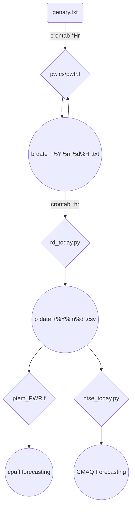

## 背景

- 這項加值應用的總體目標是建立臺灣地區未來5日火力機組粒狀物(含衍生性)增量的CMAQ預報。但首先需產生CMAQ點源排放的增量檔案。
- 整體計算邏輯
  1. 公版模式中已將所有的點源以高空網格形式輸入，需先將這些污染源自基準排放量(`base`)切割出來後成為**無**火力機組排放量(`baseX`)，再加入增量檔案(`baseN`)，以計算其濃度差值：`dC = cmaq(baseN)-cmaq(baseX)`，`cmaq()`表示CMAQ模式之執行，輸入排放量產出濃度之函數。
  1. 此處之`baseX`除少數可自網格內獨立出來(如大型燃煤電廠、高空網格無其他污染源併列)，其餘機組無法清楚切割，則以額外(重複)添加方式辦理，因光化反應的非線性過程，此舉可能對這些機組的貢獻量造成高估。

### 整體作業流程

- 排放檔案之取得、產生與自動排程之整體流程


- 階段成果
  - b`date +%Y%m%d%H`.txt：逐時下載整理，全臺所有發電機組前1小時運轉比例
  - p`date +%Y%m%d`.csv：逐時整理回溯過去1天，全臺火力發電機，24小時逐時運轉比例。
- 最終應用
  - [cpuff預報][UNRESPFcst]
  - [CMAQ預報][fcst]
- 執行到臺灣地區的CMAQ空品預報可能到了早晨7:00。因此讀到的檔案應該是過去1天7時起算24小時的運轉率。

### 火力機組個數統計
- 既有opendata數據，有的是機組合併成全廠計算，與實際機組數不符。

燃料|從屬|機組數|煙囪數
:-:|:-:|:-:|:-:
coal|台電|19|9
coal|ipp|5|2
lng|台電|24|13
lng|ipp|10|
cogen|ipp|1|1
oil|台電|3|3
合計|||


## 集束煙囪
- 集束煙囪有其大氣擴散的意義，然而CMAQ公版模式並沒有辦法特別加以處理，需先將點源自網格排放中分離出來，再將點源中之集束煙囪予以特殊處理。
- 此處以python dictionary的方式予以納入計算。
- 火力發電機組整併情形

```python
kuang@125-229-149-182 ~
$ cat cmbstk.py
import json

coals={}
coals.update({'U0100258_1':set(['P001','P002'])}) #heping
coals.update({'S3200688_1':set(['P001','P002'])}) #xingda
coals.update({'S3200688_2':set(['P003','P004'])}) #xingda
coals.update({'P5801719_1':set(['P101','P201','P301'])}) #mailiao
coals.update({'L0200473_1':set(['P101','P201'])}) #taizhong
coals.update({'L0200473_2':set(['P301','P401'])}) #taizhong
coals.update({'L0200473_3':set(['P501','P601'])}) #taizhong
coals.update({'L0200473_4':set(['P701','P801'])}) #taizhong
coals.update({'L0200473_5':set(['P011','P021'])}) #taizhong
coals.update({'F1700736_1':set(['P601','P701','P801'])}) #linko
coals.update({'E5600896_1':set(['P701','P801'])}) #dalin

lngs={}
lngs.update({'E5400878_1':set(['P001','P002','P003'])}) #nanbu
lngs.update({'E5600896_2':set(['P007','P008'])}) #dalin
lngs.update({'S3200688_3':set(['P005','P006'])}) #xingda
lngs.update({'S3200688_4':set(['P007','P008'])}) #xingda
lngs.update({'H5307960_1':set(['P001','P002'])}) #datan
lngs.update({'H5307960_2':set(['P003','P004'])}) #datan
lngs.update({'H5307960_3':set(['P005','P006'])}) #datan

CP_cmbstk={}
for d in [coals, lngs]:
  for i in d:
    CO=i.split('_')[0]
    for j in d[i]:
      CP=CO+j
      CP_cmbstk.update({CP:i})
```

## 煙囪高度及範圍的篩選([upper_stack.py]())
- 由於公版模式將所有的煙囪都納入3維的網格內，這項作法可以有一個修正，就是將高空排放量刪除，改以點源方式輸入模式，而這些點源的高度就必須高於第一格的厚度。
- 由於CMAQ的厚度(metcro3d中的ZF)是每一點都不同，因此必須逐點進行比較。(使用2次`np.where`指令)
- 除此之外，公版模式的範圍也不能納入所有的TEDS點源數據，部分離島無法納入，在進行座標串聯時將出現錯誤。需要2階段篩選
  1. 將既有TEDS點源檔案按照公版模式設定進行座標轉換，去除不在範圍內之點源。
  1. 篩選後點源位置的ZF，如在點源高度以下，則納入計算，如否則予以刪除。

- 點源數據之讀取
  - 因常數檔及變數檔的時間範圍不同，此處以一個dict(`nts`)將其記錄下來，以利在未來應用(不同變數名稱搭配不同的時間長度)。
  - 使用`exec`指令，直接以變數名稱命名各數據內容。

```python
#kuang@master /nas2/cmaqruns/2022fcst/grid03/smoke
#$ cat upper_stack.py
...
bdate=datetime.datetime.strptime(sys.argv[1],"%Y-%m-%d")
m=bdate.month
mm='{:02d}'.format(m)
const='/nas1/cmaqruns/2019base/data/ptse/twn/teds11.19'+mm+'.const.nc'
timvr='/nas1/cmaqruns/2019base/data/ptse/twn/teds11.19'+mm+'.timvar.nc'
v3=[]
nts={}
for fn in [const,timvr]:
  nc1 = netCDF4.Dataset(fn, 'r')
  nt=nc1.dimensions['TSTEP'].size
  V1=[list(filter(lambda x:nc1.variables[x].ndim==j, [i for i in nc1.variables])) for j in [1,2,3,4]]
  v3+=V1[3]
  for v in V1[3]:
    nts.update({v:nt})
    exec(v+'=np.array(nc1["'+v+'"][:nt,0,:,0])')
  nc1.close()
```

- 第1階段篩選
  - 座標計算

```python  
...
fname='/nas2/cmaqruns/2022fcst/grid03/mcip/METCRO3D.nc'
nc = netCDF4.Dataset(fname, 'r')
nrow,ncol=(nc.dimensions[i].size for i in ['ROW','COL'])
pnyc = Proj(proj='lcc', datum='NAD83', lat_1=nc.P_ALP, lat_2=nc.P_BET, lat_0=nc.YCENT, lon_0=nc.XCENT, x_0=0, y_0=0.0)
zf=np.array(nc['ZF'][0,0,:,:])
...
x,y=pnyc(LONGITUDE,LATITUDE, inverse=False)
ix,iy=np.array((x-nc.XORIG)//nc.XCELL,dtype=int),np.array((y-nc.YORIG)//nc.YCELL,dtype=int)
XLOCA,YLOCA=x,y
COL,ROW=ix,iy
```
- 範圍篩選。原`變數`存放到`變數1`

```python
...
boo=(ix>=0)&(ix<ncol)&(iy>=0)&(iy<nrow)
idx=np.where(boo)[1]
for v in v3:
  exec(v+'1='+v+'[:nts["'+v+'"],idx[:]]')
```

- 第2階段篩選
  1. 符合範圍的指標現在變成`(ROW1, COL1)`了
  1. 因為都屬於常數檔案，時間維度為0。 

```python
idx1=np.where(STKHT1[0,:]>zf[ROW1[0,:],COL1[0,:]])[0]
```

- 儲存篩選結果
  1. 以`ncks -d`指令裁剪出正確長度的模板檔案
  1. 依序開啟
  1. 寫入前述篩選結果

```python
os.system(ncks+' -O -d ROW,1,'+str(len(idx1))+' '+const+' const'+mm+'.nc')
os.system(ncks+' -O -d ROW,1,'+str(len(idx1))+' '+timvr+' timvr'+mm+'.nc')
for fn in ['const'+mm+'.nc','timvr'+mm+'.nc']:
  nc1 = netCDF4.Dataset(fn, 'r+')
  V1=[list(filter(lambda x:nc1.variables[x].ndim==j, [i for i in nc1.variables])) for j in [1,2,3,4]]
  for v in V1[3]:
    exec('nc1["'+v+'"][:,0,:,0]='+v+'1[:,idx1[:]]')
  for i in atts:
    exec('nc1.'+i+'=nc.'+i)
  nc1.close()
```

## 時間平移(mk_ptse.py)
- 仿照mk_emis.py的做法，讀取同月接近日同一星期(weekday)的TEDS數據，切割出來，以進行CMAQ模擬。

```python
#kuang@DEVP /nas2/cmaqruns/2022fcst/grid03/smoke
#$ cat mk_ptse.py
#!/opt/anaconda3/bin/python
import numpy as np
import netCDF4
import os, sys, subprocess, datetime
from dtconvertor import dt2jul, jul2dt

ncks=subprocess.check_output('which ncks',shell=True).decode('utf8').strip('\n')
tdy=sys.argv[1]
bdate=datetime.datetime.strptime(tdy,"%Y-%m-%d")
mm=tdy.split('-')[1]
nts={'const':1,'timvr':121}
for fn in nts:
  fname=fn+mm+'.nc'
  fnameO=fname.replace(mm,'')
  if 'timvr' in fname:
    nc = netCDF4.Dataset(fname, 'r')
    ebdate=datetime.datetime.strptime(str(nc.SDATE),"%Y%j")
    ebdat2=datetime.datetime.strptime(str(nc.SDATE).replace('19','22'),"%Y%j")
    dd=(bdate-ebdat2).days+1-3
    if dd<0:dd+=7
    begh=dd*24-1
    endh=begh+nts[fn]
    os.system(ncks+' -O -d TSTEP,'+str(begh)+','+str(endh)+' '+fname+' '+fnameO)
  else:
    os.system('cp '+fname+' '+fnameO)
  nc1 = netCDF4.Dataset(fnameO,'r+')
  nc1.SDATE,nc1.STIME=dt2jul(bdate)
  SDATE=[bdate+datetime.timedelta(hours=int(i)) for i in range(nts[fn])]
  for t in range(nts[fn]):
    nc1.variables['TFLAG'][t,0,:]=dt2jul(SDATE[t])
  var=np.array(nc1.variables['TFLAG'][:,0,:])
  var3=np.zeros(shape=nc1.variables['TFLAG'].shape)
  var3[:,:,:]=var[:,None,:]
  nc1.variables['TFLAG'][:]=var3[:]
  nc1.TSTEP=10000
```

- 雖然點源檔案有常數、時變等2個檔案。但此處只是處理時間，就此觀點這2個檔案的差異僅為時間軸的長度(1小時或5天121小時)，同樣以dict型態(`nts`)一併處理。
- 由模版製作成檔案的過程略有差異
  1. 常數檔：由模版複製
  1. 時變檔：由2019年模版檔案以`ncks`切割拮取

[rd_today.py]: <https://sinotec2.github.io/Focus-on-Air-Quality/TrajModels/CALPUFF/Forecast/#前日運轉率之彙整與應用> "opendata中臺灣地區火力機組前日運轉率之彙整與應用"
[UNRESPFcst]: <https://sinotec2.github.io/Focus-on-Air-Quality/TrajModels/CALPUFF/Forecast> "本土化CALPUFF濃度預報系統之實現"
[fcst]: <https://sinotec2.github.io/FAQ/2022/08/20/CMAQ_fcst.html> "運用GFS/CWB/CAMS數值預報數進行台灣地區CMAQ模擬"