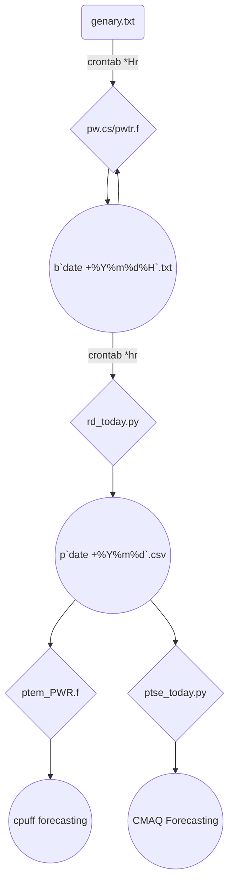

## 背景
- 這項加值應用的總體目標是建立臺灣地區未來5日火力機組粒狀物(含衍生性)增量的CMAQ預報。但首先需產生CMAQ點源排放的增量檔案。
- 整體計算邏輯
  1. 公版模式中已將所有的點源以高空網格形式輸入，需先將這些污染源自基準排放量(`base`)切割出來後成為**無**火力機組排放量(`baseX`)，再加入增量檔案(`baseN`)，以計算其濃度差值：`dC = cmaq(baseN)-cmaq(baseX)`，`cmaq()`表示CMAQ模式之執行，輸入排放量產出濃度之函數。
  1. 此處之`baseX`除少數可自網格內獨立出來(如大型燃煤電廠、高空網格無其他污染源併列)，其餘機組無法清楚切割，則以額外(重複)添加方式辦理，因光化反應的非線性過程，此舉可能對這些機組的貢獻量造成高估。
### 整體作業流程
- 排放檔案之取得、產生與自動排程之整體流程

- 階段成果
  - b`date +%Y%m%d%H`.txt：逐時下載整理，全臺所有發電機組前1小時運轉比例
  - p`date +%Y%m%d`.csv：逐時整理回溯過去1天，全臺火力發電機，24小時逐時運轉比例。
- 最終應用
  - [cpuff預報][UNRESPFcst]
  - [CMAQ預報][fcst]
- 執行到臺灣地區的CMAQ空品預報可能到了早晨7:00。因此讀到的檔案應該是過去1天7時起算24小時的運轉率。

### 火力機組個數統計
- 既有opendata數據，有的是機組合併成全廠計算，與實際機組數不符。

燃料|從屬|機組數|煙囪數
:-:|:-:|:-:|:-:
coal|台電|19|9
coal|ipp|5|2
lng|台電|24|13
lng|ipp|10|
cogen|ipp|1|1
oil|台電|3|3
合計|||

## 程式設計

[rd_today.py]: <https://sinotec2.github.io/Focus-on-Air-Quality/TrajModels/CALPUFF/Forecast/#前日運轉率之彙整與應用> "opendata中臺灣地區火力機組前日運轉率之彙整與應用"
[UNRESPFcst]: <https://sinotec2.github.io/Focus-on-Air-Quality/TrajModels/CALPUFF/Forecast> "本土化CALPUFF濃度預報系統之實現"
[fcst]: <https://sinotec2.github.io/FAQ/2022/08/20/CMAQ_fcst.html> "運用GFS/CWB/CAMS數值預報數進行台灣地區CMAQ模擬"