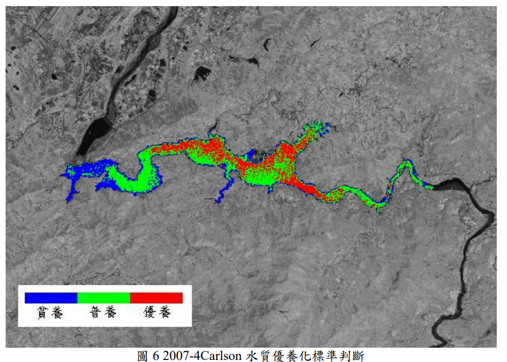
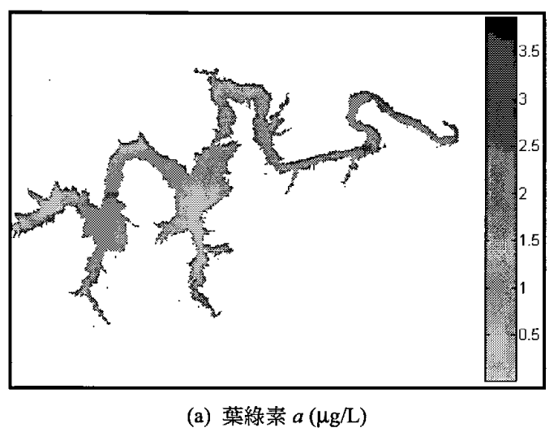
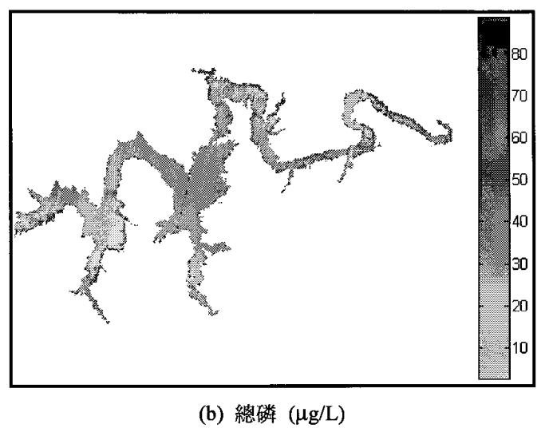
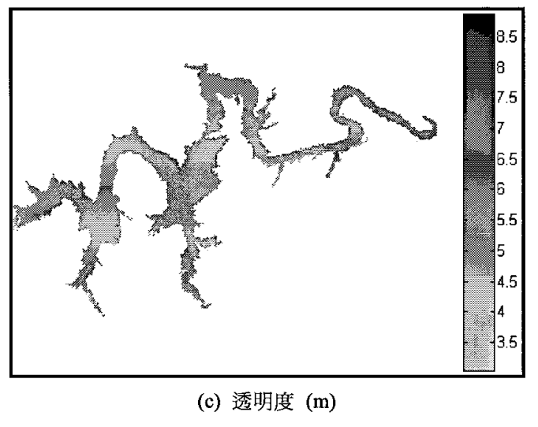
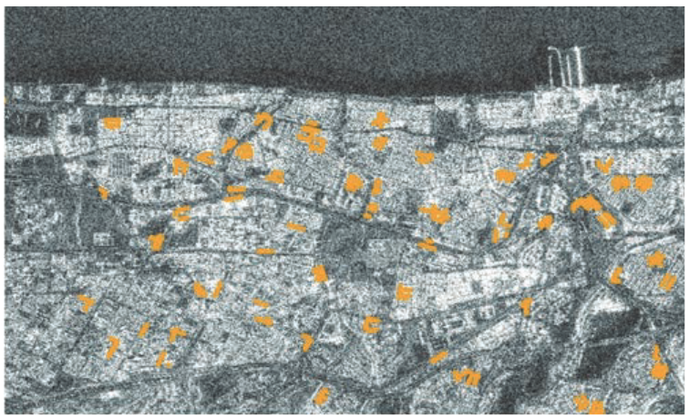

## 背景說明

- 人類居住脫離不了水源及排水，大型都會區一定有其藍帶水體的建設考量。
- 水質監測非但是環境管理的要項，也是漁業(包括休閒漁業)、水上運動、城市能量管理的重要指標。
- 隨著科技的發展與資訊的公開，有更多具有綜觀、連續性的衛星數據被應用在水質管理的領域，此處將其相關新聞及學位、期刊論文作一彙總，以提供進一步規劃研究之需要。

## 水質模式

- 過去水質模式的發展奠基於傳統的監測方式，適用在當時監測的空間與時間解析度條件。
- 水質模式領域是否會因著衛星遙測數據的引入，發展成包括了地面水、地下水、逕流、灌溉水、線形的河川與面形的湖泊海洋、整合成「一個水環境」的模式，有著更高的解析度，品質更高的預報結果，值得拭目以待。
- 如需進一步了解模式的現況亦可參考[水環境資訊與模式](https://sinotec2.github.io/FAQ/2022/10/07/EnvMdl.html)[^1]

## News

- 雖然這方面的新聞不絕於耳，但事實上除了傳統環保單位標準方法的監測結果之外，其餘數據資料並沒有良好的公開或彙總。
- 由政府出資、工研院負責研發的長效型、低價IoT微型檢測器，自5年前開始研發，迄今尚未有革命性、突破性的發展，水質的微型檢測仍以養殖漁業應用為主力。

### 衛星遙測

- [2022/07/05 衛星幫你巡田水！日衛星服務商「天地人」今起開放查詢][inside]
  > 日本衛星資訊新創公司「天地人」，今（ 5 日）宣布將無償開放全日本的地形、地質、土壤、植被等資料。衛星圖上日本以外的所有地區，則可以免費取得 2021 年起的氣溫雨量推移資料。最大可同時顯示 3 處資訊。
  - [https://compass.tenchijin.co.jp/map](https://compass.tenchijin.co.jp/map) with UN(email) and PWD
  - leaflet, mapbox, OpenStreetMap, and Mapbox
- 科技大觀園(2021報導)[衛星追蹤珊迪後污染趨勢][inside2021]
  > 劇烈的暴風混攪了許多污染物、廢棄物，產生汙水、沉積物，這個問題影響深遠，卻鮮少被注意到。
  > 「人們容易注意到珊迪颶風短暫的作用，像是橫掃我們居住環境的暴雨、暴風、巨浪以及暴風雪，但事實上超級颶風的影響力遠比我們的想像長久，包括颶風過後的沉積物和流入排水道的污染物。」美國地質調查局局長瑪西亞說明。
- 公視新聞網(2021-04-20)[科技解旱 台大產再生水、中大3D衛星監測最新水情](https://news.pts.org.tw/article/522544)
  > 中央大學太空及遙測研究中心教授蔡富安從3D的立體測繪分析，並計算水庫高水位跟低水位時候水量的差異，發現曾文水庫水體的面積，縮減大概1158或1160公頃。
- [以低軌衛星技術經驗研發水質監測 資策會攜手騰暉電信科技與馬來西亞合作 - 本會新聞 - 資策會](https://www.iii.org.tw/Press/NewsDtl.aspx?fm_sqno=14&nsp_sqno=2323)
- 自由時報(2008/10/12)[衛星遙測水質 準確率逾9成 - 生活 - 自由時報電子報](https://news.ltn.com.tw/news/life/paper/249763)
  > 逢甲大學土地管理系副教授李瑞陽接受國科會委託進行「福衛二號衛星影像於水質監測研究」，他以日月潭、明德與鳳山等三個水質狀況不同的水庫進行採樣，並同步進行福衛二號影像拍攝（見上圖），將採樣所得水質參數值，配合衛星影像上的光譜反射值，建立兩者間公式，用以推估全面性水質。 
- 科技部台灣研究亮點(2020/10/22)[衛星遙測技術即時監控水域](https://trh.gase.most.ntnu.edu.tw/tw/article/content/162)
  > 國立成功大學研究團隊結合地球資源衛星及類神經網路技術，以遙感探測方式使用光學衛星影像評估水體表面水質(葉綠素a濃度)。

  

### IoT及微型感測

- [台南布置移動式水質感測器 工廠放流水難逃法眼 @環境資訊中心](https://e-info.org.tw/node/229044)
- [移動式水質感測器運用5G資通訊、AI技術等，監測pH值、導電度、溫度、溶氧等數值，每分鐘上傳至環保署水科技物聯網應用平台](https://e-info.org.tw/node/229044)

## Thesis and student's Competetion

### 中華大學

- 土木與工程資訊系、陳莉教授
- [黃文娟(2006)應用自組織映射網路結合倒傳遞類神經推估翡翠水庫葉綠素-a與濁度之遙測影像研究][黃文娟 (2006)]
- [彭暐鈞(2008) 遺傳程式應用遙測技術監測水庫水質之研究][peng2008]
- [黃建洲(2008)應用Landsat7衛星影像於水庫水質監測之研究][huang2008]
  > 本研究以翡翠水庫為對象，使用美國大地衛星（Landsat 7）之影像，經由線性迴歸建立現地總磷、葉綠素a、透明度與波段之關係式，從關係式來推估出水庫整體的水質狀況，並比較何種推估方式能代表現地狀況，如此便可即時的掌握水庫水質的變化。

  > 研究中利用線性迴歸方式，建構影像因子與地面水質參數（葉綠素a、總磷、透明度）之模型關係，尋求較佳之迴歸公式，並應用類神經網路模式加以比較。
- [詹秉昇(2008)應用遺傳程式研究衛星影像之翡翠水庫濁度][Jan2008]
  > 採用線性複迴歸方法（MLR）及遺傳程式方法（GAOT）進行水庫濁度之分析，並建立關係式達到對水庫預警之用。
- [王泰盛(2010)應用不同尺度衛星影像於監測台灣內陸水體水質之研究][wange2010]
  > 使用不同尺度衛星影像：Formosat-2、**SPOT-4**、Landsat-7、Terra等衛星所分別提供8 m、20 m、30 m與250 m等之尺度影像，以葉綠素-a（Chlorophyll-a, Chl-a）、總磷（Total Phosphorus, TP）、懸浮固體（Suspended Sediment, SS）、濁度（Turbidity, TB）與透明度（Secchi Disk Depth, SDD）等水質參數為研究對象，並使用多元線性迴歸（Multiple Linear Regression, MLR）、類神經網路（Artificial Neural Network, ANN）與遺傳運算樹（Genetic Algorithm of Operation Tree, GAOT）等方法，分別建立各尺度影像之光譜波段（紅光波段與近紅外光短波段）與現地水質之預測模式。

  > 論文第二部份為提高對內陸水體之觀測頻率，使用遺傳運算樹建構不同水質參數於各尺度影像下，有高相關性之最佳組合波段型式，再以此型式亦利用遺傳運算樹建立不同兩尺度影像間之數據同化模式（Data Assimilation Model）。經研究案例顯示，各水質參數於尺度250 m與20 m之影像間進行數據同化作用，其濃度變化能成功地呈現於新尺度20 m之影像上。

  - [退役的福爾摩沙衛星二號 帶我們看見大自然的變遷過程](https://scitechvista.nat.gov.tw/Article/C000003/detail?ID=3c5202a7-3f23-400d-8ae9-d7f1d64aa3b8)
    - 王泰盛(財團法人農業工程研究中心)、劉說安(中央大學太空及遙測研究中心)、何淑霓(中央大學太空及遙測研究中心)
    105/11/23科技大觀園,Sci-Tech-Vista, NSTC
  - [陳莉、魏曉萍、王泰盛，2004，監督式分類法於遙測影像判釋之研究，農業工程學報第50卷第3期。][chen2004]
  - 王泰盛(2018)應用預警模式推估藻華發生之可行性研究 [2018 台灣地理資訊學會年會暨學術研討會2018年7月4日-7月5日逢甲大學](https://tgis2018.conf.tw/site/userdata/1204/program0608.pdf)
- [黃泓仁(2013)遺傳運算樹應用於遙測台灣高山湖葉綠素-a之研究-以翠峰湖為例][黃泓仁 (2013)]
- [應用MODIS影像推估海水表層鹽度-以台灣海峽為例][ba2015]
  > 本文就台灣海峽海水表面的水質參數，從中解析度成像光譜儀影像資料(MODIS,Moderate-Resolution Imaging Spectroradiameter )進行研究。從太空遙測中心取得美國太空總署的Terra衛星500公尺解析度含有SSS (Sea Surface Salinity)資訊的影像資料。線性迴歸與遺傳運算樹 (GAOT, Genetic Algorithm of Operation Tree)運用了衛星照片與現場含鹽度數據，來建立預測模型。這個 GAOT方法在資料探勘工作中，常被用來自動發現許多非線性系統的相互關係。基於GAOT，輸入與輸出之間的關係可以表示成解析樹。此 GAOT方法通常有過早收斂的問題，也就是說，它不能在高維的問題上提供另人滿意的解答與結果。因此 GAOT方法需要使用自動遞增過程來搜尋能力並避免落入局部最佳化的陷阱，以加強它的功能稱IGAOT。IGAOT方法，在每次執行運算時取得最佳的結果，並利用此最佳結果執行下一次運算。這最佳結果將自動納入原先的結果作為下一次運算的基礎，使它的結果是更精確的。
  > 結果說明，改良型的 IGAOT模型比原來的 GAOT方法更為有效妥適，比線性迴歸(RA)展現了更高的相關性係數(CCs)並減少了估測的誤差(EEs)。
- [吳俊穎(2016)以MODIS Aqua海洋水色衛星影像評估台灣近岸水質][wu2016]
  > 本研究以內政部公告之海岸地區範圍為基準，運用2003至2013年MODIS Aqua遙測影像共約4,950幅影像，以Level 1A形式將資料彙整下載，修正其大氣校正方法以及選擇不同的演算法進行水質反算，並使用SeaDAS(SeaWiFS Data Analysis System)軟體以及搭配批次生產系統SeaBatch腳本，批次處理成Level 2含各水色產品之遙測影像，所得水質參數包含：葉綠素a(Chl-a)、總懸浮物質(TSM)、漫射衰減係數(Kd(490))、粒狀有機碳(POC)、粒狀無機碳(PIC)、遙測反射率Rrs(λ)、離水輻射強度nLw(λ)、各項IOP產品、有光層深度(Zeu)等。經由影像再處理，調整NIR-SWIR大氣校正方法以及雲覆遮罩參數的取消，結果顯示近岸影像資料相比標準產品提升約10％，得到更完整台灣近岸水質資訊。葉綠素演算法選擇結果最接近環保署測值之OC3M演算法。

  > 其次，利用已驗證之遙測水色影像，每年八天為單位組合後46幅，11年共506幅影像，針對葉綠素a及總懸浮固體物利用ArcGIS軟體對縣市海域範圍內水質參數進行時、空統計分析，並以水質分布盒鬚圖呈現。在空間分布方面，葉綠素a及懸浮固體物濃度為中部海域大於南部海域，再者是北部海域，水質情況最佳為東部海域。在時間趨勢方面，西岸海域在2007 ~ 2010年間葉綠素a濃度偏高，而在2011 ~ 2013年有下降趨勢，懸浮固體物濃度趨勢則相反，於2010 ~ 2013年有上升趨勢；東岸水質普遍清澈乾淨，整體葉綠素a濃度較西岸為低，不過卻在2011 ~ 2013年間有上升趨勢，與西岸在同期間整體水質變化呈現相反的情況，懸浮固體物則無此現象。

  > 利用水色產品具有計算水質空間離散度之優勢，各海域範圍內所有水質資料統計計算所得標準差呈現東部海域水質分布較為均勻，北部新北、基隆、宜蘭也同樣標準差偏低，西岸由於受河川出海口高濁度的影響，及西部沿海工業區放流口影響所致，葉綠素a與懸浮固體物濃度呈現出較高的離散程度，水質分布是不平均的。

  > 最後，本研究比較現有環保署測站與分區水色產品在時間趨勢、空間分佈、季節特徵之差異。現有環保署測站多選點在河口或重要排放口附近，且採樣頻率極低，無法代表各分區水質狀況，因此，測站與水色產品於時間趨勢上無顯著相關。測站值因位於河口及資料量低，使其年間變化波動大，不易看出分區水質變化趨勢；反之，由水色產品可明顯看出近年(2010-2013)東岸Chl-a有逐年上升趨勢，且在Chl-a影像上沒有顯示出測站值呈現之西岸Chl-a下降趨勢。此外，測站值呈現之季節性Chl-a分布也與水色影像完全不同，西岸測站因受河口沖刷及採樣頻率低影響使其濃度高值多發生在雨季，但由水色產品可看出其實西岸分區Chl-a濃度因受黑潮及臺灣海峽溫暖海水的影響，常在秋、冬季有較高的Chl-a濃度。本研究發現，在沒有水色產品的輔助下，使用現有的測站水質評估各縣市海岸區域管理範圍水質，最多僅能說明東岸水質較西岸好，無法進一步看出各分區水質變動年間與季節性趨勢。

  > 本研究結果顯示，遙測水色影像能反映台灣近岸在不同時間、季節所呈現之各水質參數濃度上的差異，以及做為長期監控水質變化之依據。

- [高進明(2017)應用衛星影像監測台灣高山湖泊水體水質之研究-以太平山翠峰湖為例][gao2017]
  > 本論文利用**SPOT-4**衛星提供20 m之尺度影像，以葉綠素-a（Chlorophyll-a, Chl-a）與總磷（Total Phosphorus, TP）水質參數為研究對象，並使用遺傳運算樹（Genetic Algorithm of Operation Tree, GAOT）方法建立影像之光譜波段（紅光波段與近紅外光短波段）與現地水質之預測模式，且分析其模式之精確度，最後再外推湖區之水體變化。
  > 總和結果，在葉綠素-a的部分，改進過的遺傳運算樹其預測模式相比文獻有一成的改善幅度，相關係數達0.78；總磷的部分，則可維持相關係數達0.96之前提下，導出型式簡易的預測方程式。
- [柯邁德(2017)使用LANDSAT8影像估算藻類濃度-以德基水庫為例][Ko2017]

### 成功大學

- 環工系張智華教授、衛星資訊暨地球環境研究所劉正千教授、余騰鐸教授、測量系朱宏杰教授
- [林孟勳(2006)使用高解析力衛星影像量測河海泥砂量之研究][林孟勳 2006]
- [鄭依凡(2010)運用福爾摩沙二號衛星高時空分辨率遙測影像探討曾文水庫水質之時空變化][鄭依凡 2010]
- [楊凱傑(2012)運用雙衛星平台遙測影像建立沿岸水體高時空分辨率總懸浮物質分佈圖：以高屏河口為例][楊凱傑 2012]
- [邱耀勝(2012)應用福衛二號高時空分辨率衛星影像進行高屏河口沖淡水團分類][邱耀勝 (2012)]
- [吳祐欣(2016)以MODIS Aqua海洋水色衛星影像評估台灣近岸水質][wu2016]
- [江燮珍(2016)以時空地理加權迴歸模式建立衛星影像遙測水庫水質之研究][江燮珍 2016]
- [楊善博(2017)以多頻譜高解析度衛星影像結合最佳半解析光學理論模式模擬台灣水庫透明度分佈圖][楊善博 2017]
- [曾立德(2020)應用逐時觀測之海洋水色衛星影像探討颱風對台灣東北海域海水表面物質傳輸現象之影響][曾立德 (2020)]
- [葉冠儀(2021)以中尺度地球資源衛星影像分析台灣主要民生水庫枯水期水質分佈、藻類生長限制因子與可能人為影響來源][葉冠儀 2021]

### 雲林科技大學
- 環安系萬騰州、張銘坤、張維欽教授
- [詹志中(2005)大氣校正與NDVI指數對衛星圖譜預測氨氮濃度效能之影響][詹志中 2005]
- [羅文憶(2006)**SPOT**衛星遙測河川水質指標之研究][羅文憶 2006]
- [林家宏(2007)衛星影像預測河川水質指標輸入變量篩選之研究][林家宏 2007]
- [林珈禎(2009)結合衛星影像及現場採樣建立河川污染指標面化圖][林珈禎 2009]
- [洪志豪(2011)評估以衛星影像(**SPOT**)校正並估算河川水質指標(RPI)之研究][洪志豪 2011]

### 臺灣大學

- 生環系鄭克聲教授
  - [雷祖強(2001)衛星遙測及隨機變域模擬於水庫優養之機率評估][雷祖強 2001](博士)
    > 因此本研究考慮臺灣地區污染狀況及環境因子不同於美國，針對Carlson模式中兩個主要因子，也就是最大透明度(即64 m)與SDD倍率因子2予以修正，進而得到德基營養狀況指標(Te-Chi Trophic State Index，TTSI)，修正後之倍率因子b為1.544及係數a為8.605。研究中同時驗證此指標之適用性，其結果顯示在各斷面上所得之三種單一營養狀況指標(TTSI(SDD)，TTSI(Chla)，TTSI(TP))，均比CTSI模式之單一營養狀況指標(CTSI(SDD)，CTSI(Chla)，CTSI(TP))具較一致之結果，且轉換後葉綠素-a、透明度及總磷的尺度較符合德基水庫環境特性，足証修正之TTSI指標適用於德基水庫。
    > 本研究使用大地衛星(**Landsat**)之多光譜影像，經濛氣校正（Haze Correction）後建構水質參數與影像灰階統計模型關係、建立TTSI(Chla)指標之半變異元，並利用HYDRO_GEN隨機變域模擬方法來繁衍多次表現值，進而推估德基水庫全域平均及各斷面上TTSI(Chla)指標之機率分佈，並據以評判各種營養狀況發生機率，以供水庫管理單位規劃治理與環境管理之重要參考。

  - [蘇元風(2009)衛星遙測應用於環境評估之研究][蘇元風 2009](博士)
    > 以SPOT衛星監測員山子分洪隧道出口海域水質變化，評估分洪對於該海域水質的影響。研究中提出水體表面反射率反算程序，此程序適用於小區域尺度的遙測應用。傳統海域水質監測多以單變量模式建立推估式，然而水中所含物質例如懸浮顆粒、有機溶解物質與藻類等同時影響水體的光譜反射特性，吾人提出多變量模式可更有效推估水質變數，且符合水質變數物理特性，推估結果明顯優於單變量模式，最後繪製水質變數海域分布圖，供決策單位使用。
    > 以AVHRR(Advanced Very High Resolution Radiometer)影像推估地表溫度，提出新的方式評估AVHRR像元內土地利用類別比例對空氣溫度的影響。
    > 第三部份是評估乾旱造成林地植生生理特性改變的監測，使用**SPOT**衛星計算植生指標，提出以植生指標所定義的林地乾旱等級；同時以NOAA衛星探討林地於植生指標與地表溫度特徵空間的季節變動特性。

  - [許淑媚(2009)衛星遙測應用於翡翠水庫水質監測](https://www.airitilibrary.com/Publication/alDetailedMesh1?DocID=U0001-2007200916584700)
    >  重新建構適合翡翠水庫水質環境之營養狀況指標(FeiTsui Trophic State Index, FTSI)，得到三項單一營養狀況指標(FTSI(SDD)，FTSI(Chla)，FTSI(TP))，再利用葉綠素-a濃度(FTSI(Chla))作為營養程度之主要判斷依據，小於61為貧養，大於68為優養，介於61至68間為普養。將水質採樣日期接近之**SPOT**衛星影像資訊，求出不同影像波段水體反射率與三項水質指標之關係，並反推出庫區全水域之水質指標空間分布，而影像推估之水質指標數值與實際採樣結果相比，相關係數達到0.88，而影像運算結果發現，翡翠水庫僅有在上游部分河段及支流匯流口有優養之現象，下游蓄水區水質較佳，整體而言，近年來翡翠水庫水質情形良好，維持在貧養或普養狀態。此方式可大幅提升評估水庫整體優養化之能力，且節省現地採樣所耗費人力、成本和時間，提供管理單位對於水庫未來全面性的水質監控。
- 漁業科學研究所韓玉山教授
  - [陳怡柔(2017)利用衛星遙測技術分析日本鰻棲地品質在中國的長期變遷][陳怡柔 2017]
  - [楊智超(2018)以衛星遙測技術評估台灣主要河川日本鰻棲地品質現況][楊智超 2018]

### 中央大學

- [古培榮(2011)利用衛星遙測技術辨識Fonseca灣中懸浮物與混濁度在時間與空間上的模式][古培榮 2011]
- [王禹翔(2015)應用多元衛星光學影像於懸浮沉積物之監測 －以台灣卑南溪河口為例][王禹翔 2015]

### 中興大學

- 土木所楊明德教授(植生復育與崩塌潛勢分析、風沙變遷分析、稻作氮吸收分級)、陳正炎教授
- [張騏顯(2008)應用類神經網路與衛星影像於水庫水質推估─以石門水庫為例][張騏顯 2008]
- [蕭文哲(2013)應用**SPOT**衛星影像於石門水庫優養判釋與趨勢分析][蕭文哲 2013]

### 海洋大學

- 比較偏向藻類及漁業相關應用(環境生物與漁業科學學系)
- 海洋大學[陳黃谷(2001)臺灣北部海域水中光學特性與衛星遙測水色模式之選定][陳黃谷 2001]
- 海洋大學[連俐植(2017)利用衛星遙測資料反演臺灣周邊海域基礎生產力與驗證之研究][連俐植 2017]

### 逢甲大學

- 逢甲大學[鄭淳樺(2005)應用多評準決策分析與衛星影像在水庫污染削減位置優選之研究][鄭淳樺 2005]
  - 導師：環境工程與科學所特約講座孔祥琜教授，專長在環境系統分析, 模式, 與模擬。
- 逢甲大學[李宜真(2007)應用福爾摩沙二號衛星影像於水庫水質監測之研究][李宜真 2007]
  - 導師：環境資訊科技研究所李瑞陽教授，專長在遙測、空間分析方面。

### 其他

- 交大土研所[劉雅琦(2017)以GRACE衛星偵測東海陸棚沉積物及黑潮質量變化][劉雅琦 2017]
- 竹東高中(2022)[利用人工智慧分析高屏溪海洋藻華現象的可能影響][yang2022]  

## Jurnals/conference

### 石門水庫

- [楊明德, 劉益誠, and 張騏顯 (2008). 應用衛星影像於石門水庫水質優養監測. Presented at the 第十七屆水利工程研討會, 台中市逢甲大學人言大樓啟垣廳][yangMD2008_conf]
  > 本研究以石門水庫為研究地點，利用 2006 年 5 月至 2007 年 10 月間之衛星影像與現地採樣的資料(總磷、透明度、葉綠素)，建立水質與光普值參數的的回規模式。藉著回歸模式將光譜資訊轉換為對應的水質參數，將水質参數以 Carlson 與 OECD 優養化指標之分類結果來展現水庫優養化的情形。

- [陳永彧等(2018)應用衛星影像監測石門水庫集水區水體濁度][chen2018]
  > 本研究使用水文模式(Soil and Water Assessment Tool, SWAT)與光學衛星影像(**SPOT**與Landsat系列)，建立石門水庫集水區水質預測模型，並進行校準與驗證。而後使用SWAT模式進行篩選，找出濁度上升事件，再使用衛星影像之預測模型估算水體濁度，並與實測資料比對，討論其準確度與濁度上升之問題。
  > 結果衛星影像應用於預估水面濁度可行度較高，平均相對誤差約30%。水庫庫區的水體預測比預測河道水面更為準確。

### 翡翠水庫

- [楊明德等(2008)結合衛星影像與模糊理論於水庫水質優養判釋與管理][YangMD2008_CICHE]
  > 本研究以翡翠水庫為研究區域，利用2004年二月**SPOT4**衛星影像萃取之水體影像，推求與葉綠素a、總磷及透明度等水質相關參數，以建立衛星影像轉換水質參數回歸模式，達成全水域優養評估。並引入模糊理論方法於傳統卡爾森指標，考慮使用者注重水質安全與管理者注重管理成本的立場設計對應的隸屬函數，以模糊綜合評價討論兩者對同一優養評等下的差異認定。

### 河川水生植物清除  

- 王禹翔等(2021)[多時相衛星遙測技術於水資源防災產業發展芻議][wang2021]
  > Utilis公司成功的應用了水體的特徵表現，為全球多個國家施行至少 250 項的地下水源洩漏檢測商業化應用服務，依據衛星的再訪週期以月為單位產出調查報告，透過大面積的遙測影像（圖 8）來節省傳統人力聽音調查的高額成本，甚至提升水源洩漏篩檢效率，近幾年更逐步推行土壤濕度調查與管線汰舊建議等服務。
  > 興創知能公司與臺灣大學地理系合作，利用雷達衛星（Sentinel-1）後向散射係數，萃取泰國河道與水生植物的反射訊號特徵，藉由定義好的訊號門檻進行辨識，監測水生植物過度繁殖的情況。排除天氣的影響，雷達衛星得穿透雲層直接偵測目標物，以取得高頻率（每週一張）的河道影像，除了即時的面積擴散掌控，由歷史的觀測數據也能夠協助了解淤積熱區，加強清除或預防改善。

||
|:-:|
|雷達影像漏水檢測熱區圖 from Warner, B. (2021), “Water tech that’s out of this world". [Atlas of the Future](https://atlasofthefuture.org/project/utilis/)|

## online resource

- [臺北市, 臺北市, 臺灣水蒸氣衛星天氣圖 - AccuWeather](https://www.accuweather.com/zh/tw/taipei-city/315078/satellite-wv/315078)
- [行政院農業委員會-水產試驗所全球資訊網-台灣沿近海衛星水溫資料](https://www.tfrin.gov.tw/cp.aspx?n=254)

[huang2008]: https://hdl.handle.net/11296/5u7jq5 "黃建洲 (2008). 應用Landsat7衛星影像於水庫水質監測之研究 土木與工程資訊學系(所). 中華大學, 新竹市."
[inside]: https://www.inside.com.tw/article/28187-jaxa-tenchijin-bigdata "土地・氣象資訊 - INSIDE：衛星幫你巡田水！日衛星服務商「天地人」今起開放查詢"
[wange2010]: https://ndltd.ncl.edu.tw/cgi-bin/gs32/gsweb.cgi/login?o=dnclcdr&s=id=%22098CHPI5015038%22.&searchmode=basic "王泰盛 (2010). 應用不同尺度衛星影像於監測台灣內陸水體水質之研究 土木與工程資訊學系(所). 中華大學, 新竹市."
[chen2004]: https://tpl.ncl.edu.tw/NclService/JournalContentDetail?SysId=A04026775 "選擇水利會之竹東工作站為研究區域，主要以最大概似法(maximum-likelihood)和人工智慧領域之倒傳遞類神經網路(back-propagation neural network)進行影像分類，其訓練程序由地面調查可能之耕作面積和影像分類所判釋之面積兩者互相比較。本研究利用之監督分類方法具有高度之準確性，此外，這兩種方法可根據影像分類和生長及收成之圖像協助我們計算每一農作物所需之水量。"
[yang2022]: https://sciexplore.colife.org.tw/uploadfiles/TM21831f1622/TM21831f1622.pdf "2022全國科學探究競賽-這樣教我就懂，利用人工智慧分析高屏溪海洋藻華現象的可能影響，新竹縣國立竹東高級中學楊頤樺同學邱姿函同學葉鈞喬 老師"
[YangMM2008_CICHE]: https://www.airitilibrary.com/Publication/alDetailedMesh?docid=10155856-200806-20-2-205-215-a "楊明德, 昌林佑, 鈺蔡婷, and 芬楊曄 (2008). 結合衛星影像與模糊理論於水庫水質優養判釋與管理. 中國土木水利工程學刊 20 (2):205–215. doi:10.6652/JoCICHE.200806_20(2).0005."
[inside2021]: https://scitechvista.nat.gov.tw/Article/C000003/detail?ID=5eeca7f6-7077-460e-beb7-2d71a58b23d9 "陳慈忻(2011)衛星追蹤珊迪後污染趨勢"
[chen2018]: http://twc.bse.ntu.edu.tw/upload/ckfinder/files/66-1-13-25.pdf "陳永彧, 吳瑞賢, 曾國欣, and 彭新雅 (2018). 應用衛星影像監測石門水庫集水區水體濁度. 臺灣水利 第 66 卷 (第 1 期):13–25."
[wang2021]: http://www.ciche.org.tw/wordpress/wp-content/uploads/2021/06/DB4803-P020-專輯-多時相衛星遙測技術.pdf "王禹翔, 沈哲緯, 張淵翔, and 吳笙緯 (2021). 多時相衛星遙測技術於水資源防災產業發展芻議. 土木水利 第四十八卷 (第三期):20–28. doi:DOI: 10.6653/MoCICHE.202106_48(3).0003."
[wu2016]: https://hdl.handle.net/11296/az6qmx "吳祐欣 (2016). 以MODIS Aqua海洋水色衛星影像評估台灣近岸水質 環境工程學系. 國立成功大學, 台南市."
[yangMD2008_conf]: http://www.ce.nchu.edu.tw/Pic/Writings/1480_M2_full.pdf "楊明德, 劉益誠, and 張騏顯 (2008). 應用衛星影像於石門水庫水質優養監測. Presented at the 第十七屆水利工程研討會, 台中市逢甲大學人言大樓啟垣廳."
[yangMD2008_CICHE]: https://www.airitilibrary.com/Publication/alDetailedMesh?docid=10155856-200806-20-2-205-215-a "楊明德, 昌林佑, 鈺蔡婷, and 芬楊曄 (2008). 結合衛星影像與模糊理論於水庫水質優養判釋與管理. 中國土木水利工程學刊 20 (2):205–215. doi:10.6652/JoCICHE.200806_20(2).0005."
[gao2017]: https://hdl.handle.net/11296/3tjn57 "高進明 (2017). 應用衛星影像監測台灣高山湖泊水體水質之研究-以太平山翠峰湖為例 土木工程學系. 中華大學, 新竹市."
[wu2001]: https://hdl.handle.net/11296/te87gw "吳俊穎 (2001). 衛星影像監測永和山水庫水質之研究 土木工程學系碩士班. 中華大學, 新竹市."
[peng2008]: https://hdl.handle.net/11296/9qnr2u "彭暐鈞 (2008). 遺傳程式應用遙測技術監測水庫水質之研究 環境資源與能源科技研究所. 中華大學, 新竹市."
[Ko2017]: https://hdl.handle.net/11296/r35tw3 "柯邁德 (2017). 使用LANDSAT8影像估算藻類濃度-以德基水庫為例 土木工程學系. 中華大學, 新竹市."
[ba2015]: https://hdl.handle.net/11296/g4vdq6 "芭絲瑪 (2015). 應用MODIS影像推估海水表層鹽度-以台灣海峽為例 土木工程學系博士班. 中華大學, 新竹市."
[Jan2008]: https://hdl.handle.net/11296/wm2wh4 "詹秉昇 (2008). 應用遺傳程式研究衛星影像之翡翠水庫濁度 土木與工程資訊學系(所). 中華大學, 新竹市."
[葉冠儀 2021]: https://hdl.handle.net/11296/4r366p "葉冠儀. “以中尺度地球資源衛星影像分析台灣主要民生水庫枯水期水質分佈、藻類生長限制因子與可能人為影響來源.” 環境工程學系. 國立成功大學, 2021."
[楊智超 2018]: https://hdl.handle.net/11296/bxmv2b "楊智超. “以衛星遙測技術評估台灣主要河川日本鰻棲地品質現況.” 漁業科學研究所. 國立臺灣大學, 2018."
[劉雅琦 2017]: https://hdl.handle.net/11296/n7aypn "劉雅琦. “以GRACE衛星偵測東海陸棚沉積物及黑潮質量變化.” 土木工程系所. 國立交通大學, 2017."
[楊善博 2017]: https://hdl.handle.net/11296/zz4aux "楊善博. “以多頻譜高解析度衛星影像結合最佳半解析光學理論模式模擬台灣水庫透明度分佈圖.” 環境工程學系. 國立成功大學, 2017. "
[連俐植 2017]: https://hdl.handle.net/11296/6g45bf "連俐植. “利用衛星遙測資料反演臺灣周邊海域基礎生產力與驗證之研究.” 環境生物與漁業科學學系. 國立臺灣海洋大學, 2017. "
[陳怡柔 2017]: https://hdl.handle.net/11296/8m49n4 "陳怡柔. “利用衛星遙測技術分析日本鰻棲地品質在中國的長期變遷.” 漁業科學研究所. 國立臺灣大學, 2017. "
[江燮珍 2016]: https://hdl.handle.net/11296/8ax562 "江燮珍. “以時空地理加權迴歸模式建立衛星影像遙測水庫水質之研究.” 測量及空間資訊學系. 國立成功大學, 2016."
[王禹翔 2015]: https://hdl.handle.net/11296/k78bc3 "王禹翔. “應用多元衛星光學影像於懸浮沉積物之監測 －以台灣卑南溪河口為例.” 遙測科技碩士學位學程. 國立中央大學, 2015."
[陳黃谷 2001]: https://hdl.handle.net/11296/u672x2 "陳黃谷. “臺灣北部海域水中光學特性與衛星遙測水色模式之選定.” 漁業科學學系. 國立海洋大學, 2001."
[雷祖強 2001]: https://hdl.handle.net/11296/8477b5 "雷祖強. “衛星遙測及隨機變域模擬於水庫優養之機率評估.” 農業工程學研究所. 國立臺灣大學, 2001."
[蕭文哲 2013]: https://hdl.handle.net/11296/sexa5v "蕭文哲. “應用SPOT衛星影像於石門水庫優養判釋與趨勢分析.” 土木工程學系所. 國立中興大學, 2013. "
[楊凱傑 2012]: https://hdl.handle.net/11296/cvyvne "楊凱傑. “運用雙衛星平台遙測影像建立沿岸水體高時空分辨率總懸浮物質分佈圖：以高屏河口為例.” 環境工程學系碩博士班. 國立成功大學, 2012."
[古培榮 2011]: https://hdl.handle.net/11296/947pcn "古培榮. “利用衛星遙測技術辨識Fonseca灣中懸浮物與混濁度在時間與空間上的模式.” 國際環境永續發展碩士在職專班國際專班. 國立中央大學, 2011."
[洪志豪 2011]: https://hdl.handle.net/11296/yt86aq "洪志豪. “評估以衛星影像(SPOT)校正並估算河川水質指標(RPI)之研究.” 環境與安全工程系碩士班. 國立雲林科技大學, 2011."
[鄭依凡 2010]: https://hdl.handle.net/11296/fjyv8e "鄭依凡. “運用福爾摩沙二號衛星高時空分辨率遙測影像探討曾文水庫水質之時空變化.” 衛星資訊暨地球環境研究所. 國立成功大學, 2010. "
[林珈禎 2009]: https://hdl.handle.net/11296/ed63w2 "林珈禎. “結合衛星影像及現場採樣建立河川污染指標面化圖.” 環境與安全工程系碩士班. 國立雲林科技大學, 2009. "
[蘇元風 2009]: https://hdl.handle.net/11296/563394 "蘇元風. “衛星遙測應用於環境評估之研究.” 生物環境系統工程學研究所. 國立臺灣大學, 2009."
[張騏顯 2008]: https://hdl.handle.net/11296/hk42fx "張騏顯. “應用類神經網路與衛星影像於水庫水質推估─以石門水庫為例.” 土木工程學系所. 國立中興大學, 2008."
[李宜真 2007]: https://hdl.handle.net/11296/8g8shm "李宜真. “應用福爾摩沙二號衛星影像於水庫水質監測之研究.” 環境資訊科技研究所. 逢甲大學, 2007."
[林家宏 2007]: https://hdl.handle.net/11296/yk83xv "林家宏. “衛星影像預測河川水質指標輸入變量篩選之研究.” 環境與安全工程系碩士班. 國立雲林科技大學, 2007. "
[林孟勳 2006]: https://hdl.handle.net/11296/y34gxn "林孟勳. “使用高解析力衛星影像量測河海泥砂量之研究.” 地球科學系碩博士班. 國立成功大學, 2006. "
[羅文憶 2006]: https://hdl.handle.net/11296/7a6y8n "羅文憶. “SPOT衛星遙測河川水質指標之研究.” 環境與安全工程系碩士班. 國立雲林科技大學, 2006. "
[詹志中 2005]: https://hdl.handle.net/11296/r8x78k "詹志中. “大氣校正與NDVI指數對衛星圖譜預測氨氮濃度效能之影響.” 環境與安全工程系碩士班. 國立雲林科技大學, 2005."
[鄭淳樺 2005]: https://hdl.handle.net/11296/a3aek3 "鄭淳樺. “應用多評準決策分析與衛星影像在水庫污染削減位置優選之研究.” 環境工程與科學所. 逢甲大學, 2005."
[黃泓仁 (2013)]: https://hdl.handle.net/11296/5dzzaw "黃泓仁 (2013). 遺傳運算樹應用於遙測台灣高山湖葉綠素-a之研究-以翠峰湖為例 土木工程學系碩士班. 中華大學, 新竹市."
[黃文娟 (2006)]: https://hdl.handle.net/11296/4cuh87 "黃文娟 (2006). 應用自組織映射網路結合倒傳遞類神經推估翡翠水庫葉綠素-a與濁度之遙測影像研究 土木工程學系碩士班. 中華大學, 新竹市."
[邱耀勝 (2012)]: https://hdl.handle.net/11296/kyrt8u "邱耀勝 (2012). 應用福衛二號高時空分辨率衛星影像進行高屏河口沖淡水團分類 地球科學系碩博士班. 國立成功大學, 台南市."
[曾立德 (2020)]: https://hdl.handle.net/11296/r2n5aj "曾立德 (2020). 應用逐時觀測之海洋水色衛星影像探討颱風對台灣東北海域海水表面物質傳輸現象之影響. 地球科學系. 國立成功大學, 台南市."

[^1]: https://sinotec2.github.io/FAQ/2022/10/07/EnvMdl.html " 水環境資訊與模式"
