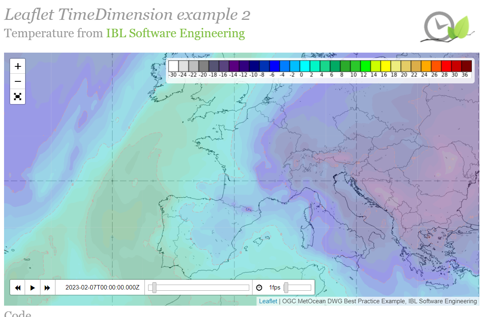
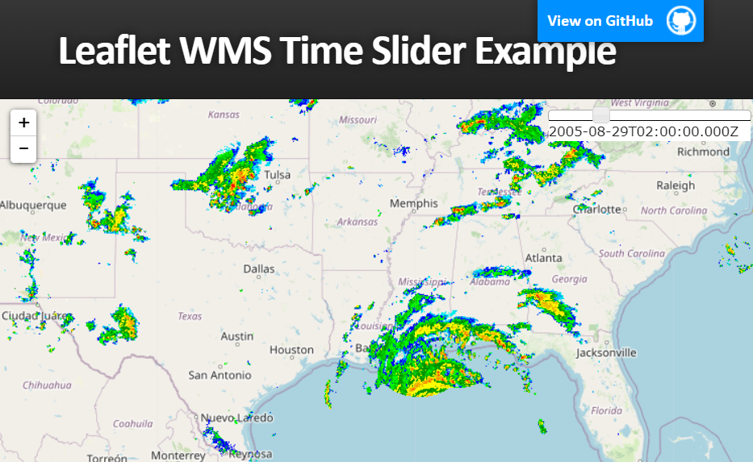
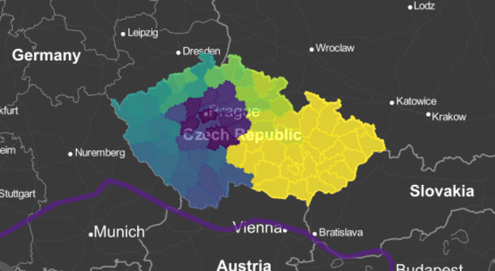

## 背景

- 目前空品預報官方網頁
  - [歐洲哥白尼官網][CAMS_FCST]
  - [AirNow Interactive Map of Air Quality, USA](https://gispub.epa.gov/airnow/?showgreencontours=false)
  - USA
    - EPA [air now](https://www.airnow.gov/?city=New%20York&state=NY&country=USA)
    - [GMO forecast](https://fluid.nccs.nasa.gov/cf/classic_geos_cf/), NASA
    - National Weather Service [Air Quality Forecast Guidance](https://airquality.weather.gov/), NOAA
    - Spare the Air：[Air Quality Forecast](https://www.sparetheair.org/understanding-air-quality/air-quality-forecast), Bay Area Air Quality Management District, CA.
  - 環保署空氣品質監測網[全國各空品區空氣品質指標(AQI)預報](https://airtw.epa.gov.tw/CHT/Forecast/Forecast_3days.aspx)
- 民間空品預報
  - [日本大氣污染情報的網站](https://pm25.jp/)
  - [https://aqicn.org](https://aqicn.org/here/)
  - 中研院環境變遷研究中心[高解析度空氣品質診斷與預報模式發展計畫模擬預報資料](https://ci.taiwan.gov.tw/dsp/forcast_air.aspx)

## 比較leaflet插件方案

- 目前earth空間資料就是以geojson方式提供，在不同解析度可以有快取之方案，似乎具發展潛力。
- 目前leaflet的等值圖(heatmap)似乎不是很好，有顯著模糊化的缺點。可能是官方網站並未使用的原因，重要官方預報、衛星及回波仍是使用其他軟體內插或直接使用點陣圖、png似也有其必要性。
- 如果以非官方形式提供預報資訊，似乎精確度不應是重點，流暢性及方便性才是重點。

項目\提供形式|rasterWMS/png|geojson/cluster|說明
:-:|:-:|:-:|:-:
時間間距|短|中長|前者適合網格數據
解析度快取金字塔|無|有|會提升不同解析度顯示速度
顯示速度|慢|快|如果太慢會拉長總連線時間
應用範例|[L.TimeDimension][3]、[sliderControl][4]|[glify][1]、[GridCluster][2]|

||
|:-:|
|[TimeDimension][33]：Add time dimension capabilities on a Leaflet map.|

||
|:-:|
|[sliderControl][44]:Leaflet-WMS-Time-Slider from BobTorgerson
|

||
|:-:|
|[glify][11]:Fast rendering for large (+100MB) GeoJSON datasets with WebGL.|

||
|:-:|
|[GridCluster][22]:Create grid-based clusters in realtime.|

[1]: https://onaci.github.io/Leaflet.glify.layer/ "Fast rendering for large (+100MB) GeoJSON datasets with WebGL."
[11]: https://www.npmjs.com/package/leaflet.glify "web gl renderer plugin for leaflet in typescript"
[2]: http://andy-kay.github.io/Leaflet.GridCluster/ "Leaflet.GridCluster with animation"
[22]: https://github.com/andy-kay/Leaflet.GridCluster "This small plug-in allows you to cluster your point-shaped data in Leaflet using a grid-based cell structure. It can be useful for thematic mapping purposes, or to declutter icons."
[3]: https://apps.socib.es/Leaflet.TimeDimension/examples/example2.html "Leaflet TimeDimension example 2, Temperature from IBL Software Engineering"
[33]: https://apps.socib.es/Leaflet.TimeDimension/ "Socib Applications for modern web browsers and mobile platforms.: Add time dimension capabilities on a Leaflet map."
[4]: http://bobtorgerson.github.io/Leaflet-WMS-Time-Slider/ "Leaflet WMS Time Slider Example"
[44]: https://github.com/BobTorgerson/Leaflet-WMS-Time-Slider "The Leaflet WMS Time Slider enables you to dynamically update a WMS layer based on a dimension such as time. This tool uses the JQuery UI slider . For WMS layers where a range of time is more desirable than a single time step, two sliders appear to allow for a tailored time range to be created."
[CAMS_FCST]: https://confluence.ecmwf.int/display/CKB/CAMS%3A+Global+atmospheric+composition+forecast+data+documentation "CAMS: Global atmospheric composition forecast data documentation"