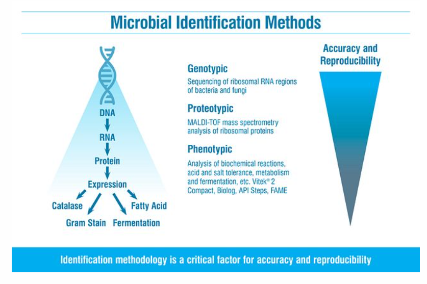

## 背景

- 依據wikipedia[人工智能](https://zh.wikipedia.org/zh-tw/人工智能)的說明
  > [資料科學](https://zh.wikipedia.org/zh-tw/数据科学)和[人工智慧]()被哈佛商業評論稱為《二十一世紀最Sexy的職業》[35]，人工智慧需求量大，鼓勵了不少大學諸如伯克利大學專門成立資料科學系。矽谷和紐約為主的《[The Data Incubator](https://en.wikipedia.org/wiki/The_Data_Incubator)》公司於2012年成立，焦點是資料科學，大數據，和人工智慧企業培訓，提供國際大數據培訓服務。
- [財團法人台灣人工智慧學校基金會](https://aiacademy.tw/20200714-2/)針對人工智慧的內容，發表了以下的闡述：
  > 如何開始第一堂人工智慧課程？

  > 其實學習 AI 沒有那麼難，只要肯踏出第一步。以台灣人工智慧學校的技術領袖培訓班為例，我們希望您先學會一種可以運用在 AI 的程式語言，例如: Python，然後跟著以下順序：機器學習(ML)、深度學習(DL)、卷積神經網路(CNN)、遞迴神經網路(RNN)+自然語言處理(NLP) 修業完成，就完成了技術領袖培訓班的修業。
- 此處討論的核心技術YOLO（深度學習-物件偵測:You Only Look Once (YOLO)）即為以CNN為主體的人工智慧技術。
- 以下以國家圖書館臺灣博碩士論文知識加值系統中有關YOLO之應用型研究為對象，歸納出交通調查、廢棄物辨識、以及生物調查等3個領域加以說明。

## 車輛辨識與速度計算

- 車流量及車速在交通規劃、管制、城市規劃等領域為重要的基礎資訊。過去仰賴人工路邊交通調查、影片調查、以及交通監測(VD、感應線圈原理)為主。在環工的應用則為配合排放遙測之車牌車型辨識、車速即時調查配合即時性排放推估、定檢車輛之路邊篩選等等。
- YOLO的強項在與車型的詳細分類、快速回應、車輛轉向追蹤等等，大幅提高傳統監測方式的解析度與正確性。
- 使用YOLO進行車輛數及車速計算之實作案例已經有非常多的成果，如github之公開程式碼（[bamwani(2022)](https://github.com/bamwani/car-counting-and-speed-estimation-yolo-sort-python)），然其中也發現在實作過程中，仍存在瓶頸有待突破。

### 辨識速度之提升以應用在即時系統

不論無人車或者是環工上的應用，沒有高速平行化計算資源，以手持、車載或戶外定點之小型化裝置，要能進行快速的YOLO計算並不容易，但為了能輔助或取代傳統攝像之光學辨識或雷達回波原理，這是必須突破的屏障。

- 余韋志. 「基於YOLO演算法即時偵測移動車輛」. 機械與自動化工程學系. 義守大學, [2018](https://hdl.handle.net/11296/qqwcjc).
- 蔣亞哲. 「基於優化YOLO-v4的**邊緣運算**[^1]應用於即時交通車流物件偵測」. 電機工程系. 國立臺北科技大學, [2021](https://hdl.handle.net/11296/dgx76h).
  > 本研究著重於優化，將YOLO-v4 (you only look once)模型透過壓縮方法，將其實現部署於邊緣裝置GPU嵌入式系統上，並且達到即時偵測交通車流之能力。
  > 本文採用當今最佳的即時物件偵測深度學習模型YOLO(You Only Look Once, YOLO)來進行優化，此模型YOLO-v4的優勢為具有最合適的推論速度與準確率之平衡，適合用於終端裝置之部署，採用NVIDIA Jetson TX2 GPU嵌入式系統與為部署裝置，但原始官方提供的模型只能達到約10 FPS(Frame Per Second)的辨識速度，不合乎對即時影像30 FPS 的要求，因此本研究提出一個優化模型。
 
  > 第一部分先對模型進行剪枝稀疏正則化處理，將模型中不重要的權重參數去除，第二部分將模型送進部署裝置進行量化與融合模型，得出優化模型推論結果為，以VGA(640x480 解析度)的串流影片輸入進行交通車流辨識，能提升模型推論速度達55 FPS，
 
  > 且另在Xilinx ZCU104 FPGA嵌入式系統上推論速度達71 FPS，證明透過我們提出的優化方法，可實現即時交通車流物件辨識於多部邊緣裝置硬體系統上。
- 評論
  - 這2篇除了考量了硬體、通訊的限制，也解決YOLO-v4軟體模型的枝節屏障，值得參考。

### 機車警示系統

早期機車騎士暴露評估試驗中，只有進行汙染物採樣分析，並沒有辦法紀錄騎士週邊的車流量；路邊遙測系統也無法追蹤車輛(顏色、車型、車牌)達成即時取締的目的。YOLO即時性車輛辨識系統似乎具有滿足這些需求的潛力。

- 梁文勇. 「基於YOLO v4影像辨識技術之智慧型機車安全距離警示系統」. 機械工程學系. 中原大學, [2022](https://hdl.handle.net/11296/f78kg4).
  > 本研究利用偵測準確度高且運算速度快的YOLO v4深度學習技術並配合影像辨識方法偵測出於街道中移動的大型車輛，藉由標記影像特徵且利用深度神經網路進行模型訓練模型，對於想要偵測的目標物做影像辨識。同時偵測與目標物的相對距離，當車輛進入到安全距離時，會透過警示來提醒機車駕駛人事前做出防範的措施，以減少機車的交通意外事故發生。

  > 實驗結果證明，本研究使用AI影像辨視方法進行大型車輛偵測其偵測的準確率結果為94%，是一個相當不錯的結果。
- 何儒德. 「基於YOLO-Tiny 摩托車安全輔助系統之設計與實作」. 電機工程系碩士班. 國立虎尾科技大學, [2022](https://hdl.handle.net/11296/8879pf).
  > 本系統硬體使用Nvidia Jetson Nano 與鏡頭，軟體部分使用 YOLO-tiny 模型檢測和預測物體。

  > 本盲點偵測系統安裝在摩托車尾部，鏡頭影像可以用來偵測來自後方盲點位置的物體，並計算座標以找出物體的位置。車輛偵測是由YOLOv7-Tiny結合DeepSORT演算法完成，準確率和辨識速度測試結果分別為，在YOLOv7-Tiny中可得到的 mAP 結果接近 93.4%，YOLOv7-Tiny的幀率可以達到 6.11 fps。

  > 雖然在系統中添加 DeepSORT 演算法後，幀率降低為 5.97 fps，但DeepSORT可改善安全輔助系統效率。
- 賴建佑. 「在智慧型手機平台上基於改進Yolo網路之車輛碰撞預警系統」. 資訊工程學系. 國立彰化師範大學, [2022](https://hdl.handle.net/11296/6745a9).
- 評論
  1. 不管居於安全角度、或者其他需即時反應之人工智慧，辨識的速率(幀率)為系統成功的關鍵，看來也是各研究所努力提升的標竿。
  2. 這些研究中對於車輛距離及速度也具有觀測的能力，相關技術也值得借鏡。

### 車速之計算

- 賴國彰. 「基於YOLO演算法之影像式車速估計方法」. 電腦與通訊工程系. 國立高雄科技大學, [2021](https://hdl.handle.net/11296/343j2w).
  - no abs/pdf, will reveal@2026
  > key words: YOLO、相機校正、針孔相機模型、車速估計
  > 3.2 系統幾何模型 7
     3.2.1 待測物之座標轉換 9
     3.2.2 待測物之距離估計 15
     3.2.3 相機架設角度估計 18
     3.2.4 車速估計 21
   4.1 基於相機角度量測之測速方法 23
     4.1.1 時速30公里驗證 24
     4.1.2 時速50公里驗證 25
   4.2 基於世界座標已知點校正之測速方法 26
     4.2.1 時速30公里驗證 28
     4.2.2 時速50公里驗證 29
   4.3 測速範圍量測 30
   4.4 精確度比較 33
  - Reference
    - [1] T. Huang@*Institute for Transportation, Iowa State University*, “**Traffic Speed Estimation from Surveillance Video Data: For the 2nd NVIDIA AI City Challenge Track 1**,”2018 IEEE/CVF Conference on Computer Vision and Pattern Recognition Workshops (CVPRW), pp. 161-1614, [2018](https://ieeexplore.ieee.org/document/8575456).
    - [2] W. D. Wahyu and B. Setiyono@*Institut Teknologi Sepuluh Nopember,Surabaya, East Java, Indonesia*. “**Speed Estimation On Moving Vehicle Based On Digital Image Processing**.”International Journal of Computing 3 ([2017](https://www.researchgate.net/publication/317312246_Speed_Estimation_On_Moving_Vehicle_Based_On_Digital_Image_Processing)): 21-26.
    - [3] D. C. Luvizon, B. T. Nassu and R. Minetto@*Université de Cergy-Pontoise Cergy-Pontoise, France*, “**A Video-Based System for Vehicle Speed Measurement in Urban Roadways**,” in IEEE Transactions on Intelligent Transportation Systems, vol. 18, no. 6, pp. 1393-1404, June [2016](https://www.researchgate.net/publication/308662894_A_Video-Based_System_for_Vehicle_Speed_Measurement_in_Urban_Roadways).
    - [4] S. Javadi, M. Dahl, and M. I. Pettersson, @BTH, Karlskrona, Sweden “**Vehicle speed measurement model for video-based systems**,” Computers and Electrical Engineering., vol. 76, pp. 238-248, [2019](https://www.sciencedirect.com/science/article/pii/S0045790618317774).
    - [5] A. Dehghani and A. Pourmohammad@*Malek Ashtar University of Technology, Tehran, Iran*,  “**Single camera vehicles speed measurement**,” 2013 8th Iranian Conference on Machine Vision and Image Processing (MVIP), pp. 190-193, [2013](https://www.researchgate.net/publication/271546929_Single_camera_vehicles_speed_measurement).
    - [6] Y. Zhang, J. Zhao, Y. Xiang and J. Shu@*School of Information Science and Technology, North China University of Technology, Beijing, China*, “**Video-Based Traffic Flow Monitoring Algorithm**,” 2020 IEEE 3rd International Conference on Computer and Communication Engineering Technology (CCET), pp. 181-185, [2020](https://ieeexplore.ieee.org/document/9213115).
    - [7] J. Redmon, S. Divvala, R. Girshick and A. Farhadi, “**You Only Look Once: Unified, Real-Time Object Detection**,” 2016 IEEE Conference on Computer Vision and Pattern Recognition (CVPR), pp. 779-788, [2016](https://www.researchgate.net/publication/311609522_You_Only_Look_Once_Unified_Real-Time_Object_Detection)@(*University of Washington*, *Allen Institute for AI*,  and *Facebook AI Research*).
    - [8] A. Bochkovskiy, C. Y. Wang, and H. Y. M. Liao@*Academia Sinica Taipei, Taiwan* “**YOLOv4: Optimal speed and accuracy of object detection**,” Computer Vision and Pattern Recognition, [2020](https://www.researchgate.net/publication/340883401_YOLOv4_Optimal_Speed_and_Accuracy_of_Object_Detection).
    - [9] F. Peng, C. Liu, and X. Ding, “**Camera calibration and near-view vehicle speed estimation**,” Proceedings of SPIE-The International Society for Optical Engineering, [2008](https://www.researchgate.net/publication/253418120_Camera_calibration_and_near-view_vehicle_speed_estimation).
    - [10] T. N. Schoepflin and D. J. Dailey, “**Dynamic camera calibration of roadside traffic management cameras for vehicle speed estimation**,” in IEEE Transactions on Intelligent Transportation Systems, vol. 4, no. 2, pp. 90-98, June [2003](https://ieeexplore.ieee.org/abstract/document/1253217).
    - [11] Z. Zhang, “A flexible new technique for camera calibration,” in IEEE Transactions on Pattern Analysis and Machine Intelligence, vol. 22, no. 11, pp. 1330-1334, Nov. 2000.
    - [12] Y. Salih and A. S. Malik, “**Depth and Geometry from a Single 2D Image Using Triangulation**,” 2012 IEEE International Conference on Multimedia and Expo Workshops, pp. 511-515, [2012](https://ieeexplore.ieee.org/document/6266436).
    - [13] T. Celik and H. Kusetogullari, “**Solar-Powered Automated Road Surveillance System for Speed Violation Detection**,” in IEEE Transactions on Industrial Electronics, vol. 57, no. 9, pp. 3216-3227, Sept. [2010](https://ieeexplore.ieee.org/document/5371869).
    - [14] T. T. Nguyen, X. D. Pham, J. H. Song, S. Jin, D. Kim and J. W. Jeon@*School of Information and Communication Engineering, Sungkyunkwan University, Suwon, South Korea*, “**Compensating Background for Noise due to Camera Vibration in Uncalibrated-Camera-Based Vehicle Speed Measurement System**,” in IEEE Transactions on Vehicular Technology, vol. 60, no. 1, pp. 30-43, Jan. [2011](https://ieeexplore.ieee.org/document/5658172).
  - 評論
    1. 這篇3年前的研究，要求6年後才能公開，顯見對業界具有高度競爭力及衝擊性。
    2. 從其目錄與參考文獻內容可以發現，作者花了很大的苦工在影像幾何圖形的辨識，以其尺寸的時間變化來進行速度計算，取代傳統的雷達回波原理，以提高在市區行駛狀態中~慢速、車多狀態下的偵測效率。

- 許致銓. 「應用YOLO模型之車流時空分布特性研究」. 都市計劃學系. 國立成功大學, [2020](https://hdl.handle.net/11296/aj4kzf).
  > YOLOv3開源的深度學習架構對三種性質不同的運具：小客車、大客車及機車進行自動化地辨識，而後並結合多目標追蹤的演算法DeepSORT，藉此實現TBD(Tracking by Detection)的概念，以提取各路段、長時間的車流量變化及車流軌跡資料。
  > 而後關聯空拍影像圖，計算單應性矩陣(Homography Matrix)進行兩座標平面的投影轉換，以此投影於真實世界座標取得其車流的微觀交通特性，如瞬時速度、瞬時加速度、側向偏移距離及變換車道點分布等等。

  > 另一方面，藉由空間型構法則(Space Syntax)對於乘載其車流特性之路網結構進行拓樸指標的量化，包括全域相對便捷值(Rn)及地方相對便捷值(R3)，及路網選擇度(Choice)等等。
  > 最後，透過車流特性與路網拓樸指標及路寬之關聯性分析，本研究得出了與過往研究中相似的結果，全域相對便捷值及路寬均能有效地預測車流量之分布情形且其車流量時間變化特性會受到路網層級之影響；而後也藉由分析微觀車流的空間分布特性及關聯特性，以此從根本上推論影響都市中車流特性差異之因素。
- 黃金玲. 「智慧型即時車輛偵測系統」. 資訊工程系. 國立勤益科技大學, [2021](https://hdl.handle.net/11296/tmavk5).
  > 利用 YOLOv3 演算法的卷積神經網路來解決車輛偵測遭遇的問題。此外，本研究提出了一種基於虛擬檢測區域搭配YOLOv3演算法的即時車輛偵測系統，藉以提高車輛計數的準確率。

    > 在車輛計數中，我們採用虛擬檢測區域和虛擬檢測車道線來檢測車輛；此外，車輛行駛的距離和時間用於計算車輛的行駛速度。

    > 為了驗證所提出的模型，使用實際交通流量影像做為訓練數據集。實驗結果，分別使用白天和夜間的影像進行車輛檢測比對，準確率分別為96.3%和92.3%。而使用所提出的方法計算車速的平均速度百分比誤差不超過10%。最後，也使用[MAVD-traffic數據集](https://zenodo.org/record/3338727#.ZDelm3bP1PY)，其白天所得到的車輛計數準確率為93.84%。
  - Lin, Cheng-Jian, Shiou-Yun Jeng及Hong-Wei Lioa. 「A Real-Time Vehicle Counting, Speed Estimation, and Classification System Based on Virtual Detection Zone and YOLO」. Mathematical Problems in Engineering [2021](https://doi.org/10.1155/2021/1577614) (2021年11月2日): e1577614.
    - 勤益科技大學資訊系所**林正堅**講座教授

## Waste Identification

- 垃圾、或一般物料分選技術領域，已有智慧化機械手臂技術的引入。因廢棄物的形狀可能在收集運送過程遭到毀損，因此，以形狀為辨識的準則應不太適用，大多還是依照廢棄物的性質、重量、大小、光學特性等進行分類為主流。
- 然而在分散式處理設施與場域、需高準確度的分類程序，YOLO似乎有其強勢之處。

### 海灘、海洋垃圾的即時偵測

- 陳氏玲慈. 「應用無人機及物件偵測於大園海灘的瓶裝海洋垃圾」. 水文與海洋科學研究所. 國立中央大學, [2021](https://hdl.handle.net/11296/6s5ry7).
  > 本研究設計了三個實驗區域進行圖像收集用於模型訓練，且為了確保此方法在長期研究上的可行性，另外收集了兩處真實區域(非實驗區域)之圖像用於驗證模型強健性。接著，使用無人機於不同高度收集圖像，其解析度為 0.12 至 1.54 厘米/像素；物件辨識系統則採用You Only Look Once version 2 (YOLO v2) ，其使用無人機收集之圖像進行訓練 BMD辨識模型；此外本研究應用背景移除之影像處理技術來移除圖像中的雜訊、於訓練過程中應用數據增強(Data augmentation)之技術增加訓練數據量以提升模型可信性，並採用聯合交集（IoU）來評估訓練效率。
  > 研究發現在航測上使用 0.5 厘米/像素的解析度能得到最佳的結果，該解析度於實驗區域之準確率(precision)達到 0.94及召回率(recall rate)達到0.97 ，可得 0.95 的 F1-score；在真實區域上，檢測的平均準確率為 0.61，召回率為 0.86，F1-score為 0.72。
  > 本研究顯示，數據增強之應用在訓練過程中起著至關重要的作用，其結果IoU 超過 0.68；而背景移除技術則大量節省整個檢測時間，也因為移除了大量雜訊，減少了於真實區域中檢測錯誤的情況，證實數據增強及背景移除技術可以更準確、快速和客觀地識別海灘上的垃圾。
  - 評論
    - 海灘垃圾的偵測有其特殊性：垃圾可以保持形狀完整、巡守面積遼闊、需依靠無人機自動巡弋回報。台灣地區海岸線很長，很多海岸的可及性很低，有推廣應用的發展性。
    - 依據[新北市](https://www.epd.ntpc.gov.tw/Article?catID=1984)的統計，2018~2020 3年共出動了近20萬人次淨灘，平均每個週末清理50段海灘、每人清出5公斤垃圾，很多也是半掩埋狀態，必須人工清除、是非常耗費人力的工作、需要源頭、末端同時進行減量及清除。
    - 綠色和平組織2019年[海邊的垃圾，關我什麼「塑」？](https://www.greenpeace.org/taiwan/update/9030/海邊的垃圾，關我什麼「塑」？)
      - 該報告總結了一年來在台灣百餘個海灘點的量測結果，對於台灣海灘垃圾的來源數量做了充分的調查與建議。
      - 未來如果能建立無人機巡守、監測機制，可以更有效提出具體的數據，進行國際環保的推動。
      - 報告中對淨灘施作方式建議以船隻載運、舢舨接駁。事實上載重無人機在攝影、農業、救援、輸配電線設置過程參與很深，16～25公斤的技術已經成熟，對於海灘垃圾之集散應能發揮效力。

### 廢棄物分選

- Tatzer, P., Wolf, M., Panner, T. ([2005](https://doi.org/10.1016/j.rti.2005.04.003)). Industrial application for inline material sorting using hyperspectral imaging in the NIR range. Real-Time Imaging 11, 99–107. 
  - 這篇早期的研究使用了目前常用的NIR光學篩選技術，依據物質的吸光頻譜作為辨識的依據。因為物質的類別是有限的、其頻譜線型的差異也足夠大，可以應用在快速鑑定與分選。
  - 因為新材料發展的速度很快，以頻譜作為YOLO辨識的對象，在別的領域已有應用實例，在可見光、NIR、X ray等不同光源頻譜的辨識，應有值得關注之處。
- Scavino, E., Abd Wahab, D., Hussain, A., Basri, H., Mustafa, M. ([2009](https://doi.org/10.1631/jzus.A0820788)). Application of automated image analysis to the identification and extraction of recyclable plastic bottles. Journal of Zhejiang University SCIENCE A 10, 794–799. 
  - 雖然YOLO是最新的AI技術，但這篇早期的論文已經應用了類神經網路來輔助碎形瓶罐類廢棄物的辨識，綜合歐幾里得向量、自我組織圖等類辨識機制，可以提高辨識率到97%。
- Erin, Kenan, Bünyamin Bingöl及Barış Boru@*Sakarya University of Applied Sciences*. 「YOLO – Based Waste Detection」. Journal of Smart Systems Research (JOINSSR) 3, 期 2 ([2022](https://dergipark.org.tr/en/download/article-file/2748494)): 120–27.
- 評論
  - 由於容器材質日新月異，民眾分類的錯誤率越來越高，回收價值日益下降，政府打算從[村里資源回收站][1]來提高分類的正確性。
  - 如果辨識的機制及硬體投資可以有效減少、更能輔助村里回收點的廢棄物辨識，對目前國內回收的窘境應有解套的可能。

## 生物監測

- 生物檢測方面的應用有很多限制
  1. 野生生物會躲避人類觀測，只能在一定範圍之外，因此圖像較小、畫質不佳、容易被遮蔽
  2. 目前雖然已經存在靜態、清晰大圖的辨識APP(如[Merlin Bird ID by Cornell Lab](https://apps.apple.com/us/app/merlin-bird-id-by-cornell-lab/id773457673)、甚至[線上YOLO實作][ijert])，但實務上如何在野外快速辨識、迅速反應追蹤等，仍存在困難。

### 鳥類

- 這個領域在國外是非常競爭的，成果也非常多。倒是國內目前還沒有，可能認為鳥類鑑別工作並非涉及民生必需吧。
- Santhosh et. al(2019)[^3]這篇印度大學生的習作除了使用YOLO TINY之外，也使用GoogLeNet 27層CNN針對鳥類的臉部細節進行學習。系統組合以NCS[^4] + TINY YOLO為最佳化結果，高正確率解析速度為8.64FPS，相對其他競爭者2.34FPS為優。
  
### 齧齒動物

- Hatton-Jones, Kyle M., Corey Christie, Tia A. Griffith, Amanda G. Smith, Saba Naghipour, Kai Robertson, Jake S. Russell, 等. 「A YOLO Based Software for Automated Detection and Analysis of Rodent Behaviour in the Open Field Arena」. Computers in Biology and Medicine 134 ([2021](https://doi.org/10.1016/j.compbiomed.2021.104474)).
  - 評論
    1. 這篇雖然是開放空間、具有眾多變數、但仍然是一個控制的實驗室場域，攝像鏡頭可以自由轉動跟拍、而且實驗鼠只有正常與肥胖2種，沒有地方可以躲藏，與野外情況還是有很大的差異。
    2. 由於研究的主題是實驗鼠的運動行為，YOLO的計算速率經過考驗證實可行。

### 魚類

- 錢定遠. 「智能無人機之鯨豚偵測追蹤技術研究」. 工程科學及海洋工程學研究所. 國立臺灣大學, [2021](https://hdl.handle.net/11296/w672ub).
  > 本篇論文介紹白海豚偵測程式應用於虛擬無人機自主追蹤白海豚，為實海域實機測試前期準備。**SITL飛行模擬器**[^2]使開發者可在個人電腦使用ArduPilot無人機系統，該無人機系統與未來實體測試使用之系統相同。模擬讓我們得以了解程式將如何運行於無人機上，也可減少未來實體測試的研究成本及財產安全損失。
  > 利用台大鯨豚實驗室整理之已命名PHOTO ID的2018年白海豚資料庫，使用YOLO v4訓練資料庫照片，建立白海豚即時視覺偵測模型。在實海域拍攝白海豚之影片中，該程式測得在最小702 個像素，以0.5AP(平均準確率)以上偵測信心，正確偵測出白海豚。透過模擬環境，本論文也提供本偵測模型合適的偵測高度、距離及俯仰角，以利後續開發效能更佳的鯨豚追蹤演算法。
  > 另也利用已鑑定為Doufu白海豚的照片，以Blender建立3D白海豚模型。在Gazebo模擬器，3D白海豚以10節速度在海洋中以正方形、圓形、8字形在水面上水平移動，利用虛擬無人機上的鏡頭拍攝，並透過自建的白海豚偵測程式，在特定條件下可成功追蹤不跟丟。
  > 在實海域影片測試中，利用公視由船上拍攝視角可得出約50%以上的準確率，而由於缺乏俯視圖訓練，因此在蔡嘉揚博士空拍白海豚畫面中僅得不到10%的準確率。
  - 評論
    1. 在海象惡劣的臺灣週邊海域，鯨豚偵測追蹤技術過去以高成本的聲納系統、人工肉眼的觀察方式，如果可以用快速反應的圖像辨識來輔助，在實務上有其發展的必要性與充分性，不單在瀕危物種的檢測、即使對數量較多的鯨豚，也有觀光及漁業上的價值。
    2. 即使歷史影片的辨識率低，但系統功能與辨識速度已經證實可行。
    3. 除了白海豚，如果訓練可以擴及其他鯨豚、或透過國際合作取得更多空拍畫面，將能以逐步收斂的方式來提高準確率。

### 音頻監測

- 王前文. 「基於深度學習影像物件偵測應用於音頻事件檢測以蛙種分類為例」. 電機工程學系甲組. 元智大學, [2022](https://hdl.handle.net/11296/2p9g63).
  > 本文目標協助使用者辨別台灣35種青蛙叫聲。將聲音事件經傅立葉等方法轉換成時頻圖，並應用在影像辨識的網路中，而其中物件偵測的方法在圖片及影片中都能有效檢測出複雜上下文中的對象。
  > 採用物件框偵測的方式去檢測蛙類叫聲的時頻圖，我們所使用的網路架構為YOLOv5，在速度上以及準確度上都有一定的水準，而我們也成功的利用該方法在少量數據集中檢測出聲音類別。
  > 在過程中我們也針對各項增強及部分模塊做消融研究，讓網路的準確度得到提升的同時減少運算成本，在本研究的方法中能夠標記聲音及類別發生時段，更方便資料的裁切回收及利用，減少後續資料人工處理的耗費成本。
  - 評論
    1. 聲音頻譜作為識別圖像，是一件非常具有啟發性質的應用，在生態調查成果的數位化程序中，有其定性、定量上的重要價值。
    2. 相對一般的圖像，頻譜特徵的資訊量相對較少，這可能是沒法進入正確辨識比例相關討論的原因。
    3. 應用上，辨識速度的要求與後續監控的行為有密切的關係，如追蹤攝影、計數、蛙類行為的紀錄及預測等等。
    4. 還需要研究的是音量的定量分析。一如影像有外型、大小，音頻也有線型定性與音量的判別，才能完整分析、記錄其位置、移動與速率分析。

### Microbial Identification

- overall algorithm

- [「Microbial Identification - an overview | ScienceDirect Topics」](https://www.sciencedirect.com/topics/biochemistry-genetics-and-molecular-biology/microbial-identification)
- [criver.com](https://www.criver.com/products-services/qc-microbial-solutions/microbial-id-strain-typing/identification-methods?region=3701)

### YOLO instances

- Sun, Lesheng, Ying Xu, Zhikang Rao, Juntao Chen, Zhe Liu及Ning Lu. 「YOLO Algorithm for Long-Term Tracking and Detection of Escherichia Coli at Different Depths of Microchannels Based on Microsphere Positioning Assistance」. Sensors (Basel, Switzerland) 22, 期 19 (2022年9月30日): 7454. https://doi.org/10.3390/s22197454.
- Liu, Dan, Pengqi Wang, Yuan Cheng及Hai Bi. 「An improved algae-YOLO model based on deep learning for object detection of ocean microalgae considering aquacultural lightweight deployment」. Frontiers in Marine Science 9 (2022年). https://www.frontiersin.org/articles/10.3389/fmars.2022.1070638.

### 極小物件偵測

- 陳平揚. 「即時遞迴神經網路之極小物件偵測」. 資訊工程學系. 國立臺灣海洋大學, [2019](https://hdl.handle.net/11296/6quh67).
  > 本文發展出ReCORE net (Recursive COncatenated REorganized feature pyramid network)並將其運用在多尺度的物件偵測 (Object Detection)上。此架構包括新運算架構 (如善用多重執行緒之新平行運算方法 )或新學習法則等，改善執行速度與準確度，進而能在此低效能的GPU晶片上執行即時辨識。
  >「特徵金字塔 (Feature Pyramid)」的概念最早發表於 CVPR 2017，相關文獻利用了深層卷積網路 (deep convolutional networks)裡的固有多尺度 (inherent multi-scale)金字塔層次架構，有效地建立特徵金字塔。
  > 本文的研究主要是提出有效且快速的特徵融合方法，藉由遞迴 (Recursive)的方式，不僅僅只是將深層和淺層網路作融合，而是利用「 CORE BLOCK」促使特徵更加豐富。
  > 實驗結果在公開資料庫「 [COCO-dev 2018 (bbox)](https://cocodataset.org/#home) 」的小物件偵測 (APs)有顯著的成果，而在公開資料庫「 [PASCAL VOC 2012](http://host.robots.ox.ac.uk/pascal/VOC/voc2012/)」，其偵測速度與其他方法比較，獲得了 2-3倍的效能提升。
  - 評論
    1. 極小物件在微生物鏡檢、鳥類等攝影為常見的問題，
    2. 除了可以應用攝影機追焦放大的功能，以光學方式放大之外，此處GIS的金字塔的數位技術，應具有更優秀的表現。
    3. 本文為較舊的論文實作，目前的進度如何，還待進一步了解。

[^1]: 邊緣運算(Edge Computing)是一種網路運算架構，運算過程盡可能靠近資料來源以減少延遲和頻寬使用。目的是減少集中遠端位置（例如「雲」）中執行的運算量，從而最大限度地減少異地用戶端和伺服器之間必須發生的通信量。近年來，技術的快速發展使硬體趨向小型化、高密度以及軟體的虛擬化，讓邊緣運算的實用度更加可行。[gigabyte.com(2020)](https://www.gigabyte.com/tw/Glossary/edge-computing)
[^2]: SITL（Software In The Loop, 循环中的软件）模拟器允许您在没有任何硬件的情况下运行Plane，Copter或Rover。 它是使用普通C++编译器构建的自动驾驶仪代码，为您提供了一个本机可执行文件，允许您在没有硬件的情况下测试代码。SITL允许您直接在PC上运行ArduPilot，无需任何特殊硬件。 它利用了ArduPilot是一个可以在各种平台上运行的便携式自动驾驶仪。 您的PC只是ArduPilot可以构建和运行的另一个平台。[雷迅创新](https://doc.cuav.net/tutorial/copter/simulation.html)
[^3]: Santhosh Kumar V, Anupriya K, Hari Balaji S及Prabhavathy P. 「Real Time Bird Detection and Recognition Using TINY YOLO and GoogLeNet」. International Journal of Engineering Research 8, 期 11 ([2019](https://www.ijert.org/research/real-time-bird-detection-and-recognition-using-tiny-yolo-and-googlenet-IJERTV8IS110358.pdf)).
[^4]: [Intel® Movidius™神經電腦棒 - 產品常見問題](https://www.intel.com.tw/content/www/tw/zh/support/articles/000033353/boards-and-kits/neural-compute-sticks.html)

[quora.com: What are some applications of machine learning to environmental science and environmental engineering?](https://www.quora.com/What-are-some-applications-of-machine-learning-to-environmental-science-and-environmental-engineering)

[1]: https://www.audit.gov.tw/app/index.php?Action=downloadfile&file=WVhSMFlXTm9MemswTDNCMFlWODBNakEyTlY4ME5qWTNPRE5mTURnM09UTXVjR1Jt&fname=WW54RPOKNPPOVXKK44VWUSWTRK30B425RKNOYSMPLPGDDCA5OKJCLOB4B0OOA4OKPOWWJD00DGZS30XT14FGIC35OPRKRKWSA1YTQPROZWNKVSOPOOTSB5USSSPOGG05DGNOSW14XSHC25MOWXICGGXSZTGDVSB0UWDCFC0120OKROTTYW542100EDXWPK10 "循環再生，永續臺灣─資源回收管理基金制度介紹█ 顏旭明‧曹芝寧"
[ijert]: https://www.ijert.org/research/real-time-bird-detection-and-recognition-using-tiny-yolo-and-googlenet-IJERTV8IS110358.pdf "Real Time Bird Detection and Recognition using TINY YOLO and GoogLeNet"
