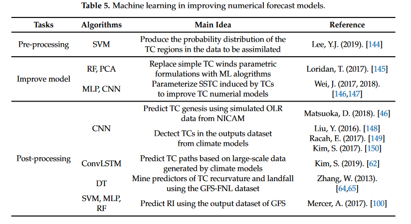

## Spatial/Temporal interpolation with machine learning

|sources|applications|methods|
|-|-|-|
|Li et al., (2011)[^4]|mud content samples in the southwest Australian margin spatial interpolation|RF 23 methods|
|Zhang et al(2017)[^10]|crowd flow prediction|ST-ResNet
|Dixon et al., (2018)[^11]|traffic volume and speed|Dynamic Spatio-Temporal Modeling|
|Helber et al., (2019)[^14]|landuse interpolation and fusion|deep convolutional neural networks
|Le et al., (2019)[^32]|Seoul|ConvLSTM |
|Abirami and Chitra (2021)[^12]|AQ in Delhi|STAA-LSTM|
|Shi and Wang(2021)[^9]|cone pressure/sounding|ensemble radial basis function network (RBFN)|
|Kiessling([2021][Kiessling21])|wind|Adaptive Random Fourier, NN, RF|
|Leirvik and Yuan, (2021)[^5]|solar radiation S/T interpolation|RF and other 7 models|
|Rendyk ([2021][Rendyk21])|Evapotransporation, Temperature|IDW, NN, Thin Plate Spline Regression, GAM, Triangulated Irregular Network, Ordinary Kriging, AutoKriging, Co-Kriging|
|Wang et al., (2021)[^7]|rainfall S/T interpolation| deep learning regression models|
|Melker Hoglund (2022)[^1]|wind monitor sites interpolation|neural network, random forest|
|Hengl et al. (2022)[^2]|temp at sites| Ensemble Machine Learning|
|Kirkwood et al.(2022)[^3]|remote sensing interpolation|Bayesian Deep Learning|
|Kim et al., (2022)[^6]|Korean House Prices|NN, RF, IDW, and Kriging|
|Brecht et al([2022][Brecht22])|wind and traj.|NN|
|Zhou et al [2022][zhou22]|Frost Prediction|ANN|
|Zhang et al., (2022)[^8]|PM2.5|Deep Geometric Spatial Interpolation|
|Elbaz et al., 2023[^15]|Noem HRA|ResNet+ConvLSTM|
|Oliveira Santos et al., (2023)[^33]|Houston|ozone prediction|GCNN, GraphSAGE

## CMAQ and AI's

作者年代|地區|應用|方法|
-|-|-|-
Friberg et al., 2016[^22]|Georgia|HRA|CMAQ+weightted variance
Lyu et al., 2019[^27]|中國|NRT analysis|CMAQ+ensemble deep learning
Eslami, 2020[^21]|德州|空品預報|CMAQ+CNN+EnKF  
O’Neill et al., 2021[^28]|加州|森林火災|CMAQ+datafusion
Sayeed et al., 2021[^30]|南韓|AQ forecasting|CMAQ+deep CNN
Sun et al., 2021[^31]|Bay Area|AQ forecasting|CMAQ+LSTM|
Dharmalingam et al., 2022[^20]|Atlanta|HRA|CMAQ+RF
Ren et al., 2022[^29]|美陸|空品變遷|CMAQ+BEML
Hong et al., 2022[^23]|釜山|local scale predictions|CMAQ+RNN+LSTM
Huang et al., 2022[^25]|北卡|source apportionment|CMAQ + datafusion + CMBGC-Iteration
Jang et al., 2022[^26]|釜山|hr PM2.5 predictions|CMAQ+datafusion
Huang et al., 2023[^24]|京津冀|emission adjustments and AQ forecasting|nudging+exRT

## WRF and AI'S

作者年代|地區|應用|方法|
-|-|-|-
Jiang et al., (2018)[^48]|-|typhopon forecast|DL
Jensen et al., (2019)[^46]|(a tool)|-|CNN
Weyn et al., (2021)[^42]|全球|DLWP, DLSEM|CNN
Xu et al., 2021[^44]|16 locations|para. testing|deep ML
|Hatfield et al., (2021)[^43]|-|climate predictions| NN for 4dVAR
Uchôa da Silva et al., (2022)[^51]||convective prediction|RF
|Singh et al., (2023)[^45]|India|NWP|DL,DLWP-CS
He et al., (2023)[^47]|-|finegrid prediction|DL
Liu et al., (2023)[^49]|-|-|NN for 3dVAR
Zhong et al., (2023)[^52]|-|-|WRF–ML v1.0
Sayeed et al., 2023[^41]|南韓|NWP|WRF+CNN

### Weyne and Durran

- Durran, D., Weyn, J., Cresswell-Clay, N., Caruana, R. (2021). **CAN DEEP LEARNING REPLACE CURRENT NUMERICAL WEATHER PREDICTION MODELS?**[aisis-2021.nucleares.unam.mx](https://aisis-2021.nucleares.unam.mx/sessions/session7/durran/DLWP_AISIS_2021.pdf)
- DALE DURRAN, JONATHAN WEYN, NATHANIEL CRESSWELL-CLAY, RICH CARUANA(2022) **DEEP LEARNING WEATHER PREDICTION: EPISTEMOLOGY AND NEW SCIENTIFIC HORIZONS**, [ECMWF 2022](https://events.ecmwf.int/event/294/contributions/3056/attachments/1751/3164/ML-WS_Durran.pdf).
- MMM Seminar: **Replacing Current NWP with Deep Learning Weather Prediction and Extensions to a Full Earth-System Model** , Mesoscale & Microscale Meteorology Laboratory, [2023/3](https://www.mmm.ucar.edu/events/seminar/2023/dale-durran-university-washington-133013)

## Spatio-Temporal Graph general surveys

### Ren's survey(2020)

Ren, X., Li, X., Ren, K., Song, J., Xu, Z., Deng, K., Wang, X. (2020). **Deep Learning-Based Weather Prediction: A Survey.** Big Data Research 23, 100178. [doi](https://doi.org/10.1016/j.bdr.2020.100178)[^50] 
  - In this paper, we survey the state-of-the-art studies of deep learning-based weather forecasting, in the aspects of the design of neural network (NN) architectures, spatial and temporal scales, as well as the datasets and benchmarks. Then we analyze the advantages and disadvantages of DLWP by comparing it with the conventional NWP, and summarize the potential future research topics of DLWP.

### Wang et al. survey(2022)

Wang, S., Cao, J., Yu, P.S. (2022). **Deep Learning for Spatio-Temporal Data Mining: A Survey.** IEEE Transactions on Knowledge and Data Engineering 34, 3681–3700. [doi](https://doi.org/10.1109/TKDE.2020.3025580) [^54]

(Autoencoder (AE) and Stacked AE.)

### Sahili and Awad(2023)

Sahili and Awad(2023)Spatio-Temporal Graph Neural Networks: A Survey[^53]

### Jin et al.(2023) survey for Predictive Learning in Urban Computing

- Jin, G., Liang, Y., Fang, Y., Huang, J., Zhang, J., Zheng, Y. (2023). Spatio-Temporal Graph Neural Networks for Predictive Learning in Urban Computing: A Survey.[arXiv:2303.14483](http://arxiv.org/abs/2303.14483)

   

[^1]: Melker Hoglund(2022) **Machine Learning Methods for Spatial Interpolation of Wind**, addvised by Anders Szepessy and Jonas Kiessling, KTH ROYAL INSTITUTE OF TECHNOLOGYSCHOOL OF ENGINEERING SCIENCES, [2020](https://www.diva-portal.org/smash/get/diva2:1437702/FULLTEXT01.pdf).
[^2]: Tom Hengl, Leandro Parente, Carmelo Bonannella and contributors(2022)[MLR], **Spatial and spatiotemporal interpolation using Ensemble Machine Learning based on Garrett Grolemund and contributors**[2017](https://r4ds.had.co.nz/) R for Data Science, Hadley Wickham. Also see [zenodo](https://zenodo.org/record/5894924#.ZFHPBHbP1PY)
[^3]: Kirkwood, C., Economou, T., Pugeault, N., Odbert, H. (2022). **Bayesian Deep Learning for Spatial Interpolation in the Presence of Auxiliary Information.** Math Geosci 54, 507–531. [doi](https://doi.org/10.1007/s11004-021-09988-0)
[^4]: Li, J., Heap, A.D., Potter, A., Daniell, J.J. (2011). **Application of machine learning methods to spatial interpolation of environmental variables.** Environmental Modelling & Software 26, 1647–1659. [doi](https://doi.org/10.1016/j.envsoft.2011.07.004)
[^5]: Leirvik, T., Yuan, M. (2021). **A Machine Learning Technique for Spatial Interpolation of Solar Radiation Observations.** Earth and Space Science 8, [doi](https://doi.org/10.1029/2020EA001527).
[^6]: Kim, J., Lee, Y., Lee, M.-H., Hong, S.-Y. (2022). **A Comparative Study of Machine Learning and Spatial Interpolation Methods for Predicting House Prices.** Sustainability 14, 9056. [doi](https://doi.org/10.3390/su14159056)
[^7]: Wang, Y. (Victor), Sebastian, A., Kim, S.H., Piechota, T., Kafatos, M. (2021). **Deep Learning for Spatial Interpolation of Rainfall Events (other).** Authorea. December 06, 2021. [doi](https://doi.org/10.1002/essoar.10509155.1),[pdf](https://d197for5662m48.cloudfront.net/documents/publicationstatus/108272/preprint_pdf/3f76a99472e9500c4de865938de59cdf.pdf)
[^8]: Zhang, M., Yu, D., Li, Y., Zhao, L. (2022). **Deep geometric neural network for spatial interpolation**, in: Proceedings of the 30th International Conference on Advances in Geographic Information Systems, Association for Computing Machinery, New York, NY, USA, pp. 1–4. [doi](https://doi.org/10.1145/3557915.3561008)
[^9]: Shi C., Wang Y. (2021). **Non-parametric machine learning methods for interpolation of spatially varying non-stationary and non-Gaussian geotechnical properties.** dxqy 12, 339–350. [doi](https://doi.org/10.1016/j.gsf.2020.01.011)
[^10]: Zhang, Junbo, Yu Zheng, and Dekang Qi. "**Deep Spatio-Temporal Residual Networks for Citywide Crowd Flows Prediction.**" AAAI. [2017](https://arxiv.org/pdf/1610.00081.pdf). 
[^11]: Dixon, M.F., Polson, N.G., Sokolov, V.O. (2018). **Deep Learning for Spatio-Temporal Modeling: Dynamic Traffic Flows and High Frequency Trading.**([pdf](https://arxiv.org/pdf/1705.09851.pdf))
[^12]: Abirami, S., Chitra, P. (2021). **Regional air quality forecasting using spatiotemporal deep learning.** Journal of Cleaner Production 283, 125341. [doi](https://doi.org/10.1016/j.jclepro.2020.125341)
[^13]: Helber, P., Bischke, B., Dengel, A., Borth, D. (2018). **Introducing Eurosat: A Novel Dataset and Deep Learning Benchmark for Land Use and Land Cover Classification**, in: IGARSS 2018 - 2018 IEEE International Geoscience and Remote Sensing Symposium, Presented at the IGARSS 2018 - 2018 IEEE International Geoscience and Remote Sensing Symposium, pp. 204–207. [doi](https://doi.org/10.1109/IGARSS.2018.8519248)
[^14]: Helber, P., Bischke, B., Dengel, A., Borth, D. (2019). **EuroSAT: A Novel Dataset and Deep Learning Benchmark for Land Use and Land Cover Classification.** IEEE Journal of Selected Topics in Applied Earth Observations and Remote Sensing 12, 2217–2226. [doi](https://doi.org/10.1109/JSTARS.2019.2918242)
[^15]: Elbaz, K., Hoteit, I., Shaban, W.M., Shen, S.-L. (2023). **Spatiotemporal air quality forecasting and health risk assessment over smart city of NEOM.** Chemosphere 313, 137636. [doi](https://doi.org/10.1016/j.chemosphere.2022.137636)
[^20]: Dharmalingam, S., Senthilkumar, N., D’Souza, R.R., Hu, Y., Chang, H.H., Ebelt, S., Yu, H., Kim, C.S., Rohr, A. (2022). **Developing air pollution concentration fields for health studies using multiple methods: Cross-comparison and evaluation.** Environmental Research 207, 112207. [doi](https://doi.org/10.1016/j.envres.2021.112207)
[^21]: Eslami, E. 1985- (2020). **Applications of Deep Learning in Atmospheric Sciences: Air Quality Forecasting, Post-Processing, and Hurricane Tracking** ([Thesis](https://uh-ir.tdl.org/handle/10657/5714)).
[^22]: Friberg, M.D., Zhai, X., Holmes, H.A., Chang, H.H., Strickland, M.J., Sarnat, S.E., Tolbert, P.E., Russell, A.G., Mulholland, J.A. (2016). **Method for Fusing Observational Data and Chemical Transport Model Simulations To Estimate Spatiotemporally Resolved Ambient Air Pollution.** Environ. Sci. Technol. 50, 3695–3705. [doi](https://doi.org/10.1021/acs.est.5b05134)
[^23]: Hong, H., Choi, I., Jeon, H., Kim, Y., Lee, J.-B., Park, C.H., Kim, H.S. (2022). **An Air Pollutants Prediction Method Integrating Numerical Models and Artificial Intelligence Models Targeting the Area around Busan Port in Korea.** Atmosphere 13, 1462. [doi](https://doi.org/10.3390/atmos13091462)
[^24]: Huang, C., Niu, T., Wu, H., Qu, Y., Wang, T., Li, M., Li, R., Liu, H. (2023). **A Data Assimilation Method Combined with Machine Learning and Its Application to Anthropogenic Emission Adjustment in CMAQ.** Remote Sensing 15, 1711. [doi](https://doi.org/10.3390/rs15061711)
[^25]: Huang, R., Li, Z., Ivey, C.E., Zhai, X., Shi, G., Mulholland, J.A., Devlin, R., Russell, A.G. (2022). **Application of an improved gas-constrained source apportionment method using data fused fields: A case study in North Carolina, USA.** Atmospheric Environment 276, 119031. [doi](https://doi.org/10.1016/j.atmosenv.2022.119031)
[^26]: Jang, E., Kim, M., Do, W., Park, G., Yoo, E. (2022). **Real-time estimation of PM2.5 concentrations at high spatial resolution in Busan by fusing observational data with chemical transport model outputs.** Atmospheric Pollution Research 13, 101277. [doi](https://doi.org/10.1016/j.apr.2021.101277)
[^27]: Lyu, B., Hu, Y., Zhang, W., Du, Y., Luo, B., Sun, X., Sun, Z., Deng, Z., Wang, Xiaojiang, Liu, J., Wang, Xuesong, Russell, A.G. (2019). **Fusion Method Combining Ground-Level Observations with Chemical Transport Model Predictions Using an Ensemble Deep Learning Framework: Application in China to Estimate Spatiotemporally-Resolved PM2.5 Exposure Fields in 2014–2017.** Environ. Sci. Technol. 53, 7306–7315. [doi](https://doi.org/10.1021/acs.est.9b01117)
[^28]: O’Neill, S.M., Diao, M., Raffuse, S., Al-Hamdan, M., Barik, M., Jia, Y., Reid, S., Zou, Y., Tong, D., West, J.J., Wilkins, J., Marsha, A., Freedman, F., Vargo, J., Larkin, N.K., Alvarado, E., Loesche, P. (2021). **A multi-analysis approach for estimating regional health impacts from the 2017 Northern California wildfires**. Journal of the Air & Waste Management Association 71, 791–814. [doi](https://doi.org/10.1080/10962247.2021.1891994)
[^29]: Ren, X., Mi, Z., Cai, T., Nolte, C.G., Georgopoulos, P.G. (2022). **Flexible Bayesian Ensemble Machine Learning Framework for Predicting Local Ozone Concentrations.** Environ. Sci. Technol. 56, 3871–3883. [doi](https://doi.org/10.1021/acs.est.1c04076)
[^30]: Sayeed, A., Lops, Y., Choi, Y., Jung, J., Khan, A. (2021). Bias **Correcting and Extending the PM Forecast by CMAQ up to 7 days using Deep Convolutional Neural Networks.** Atmospheric Environment. [doi](https://doi.org/10.1016/j.atmosenv.2021.118376)
[^31]: Sun, H., Fung, J.C.H., Chen, Y., Chen, W., Li, Z., Huang, Y., Lin, C., Hu, M., Lu, X. (2021). **Improvement of PM2.5 and O3 forecasting by integration of 3D numerical simulation with deep learning techniques.** Sustainable Cities and Society 75, 103372. [doi](https://doi.org/10.1016/j.scs.2021.103372)
[^32]: Le, V.-D., Bui, T.-C., Cha, S.K. (2019). **Spatiotemporal deep learning model for citywide air pollution interpolation and prediction.** [arxiv.org](http://arxiv.org/abs/1911.12919)
[^33]: Oliveira Santos, V., Costa Rocha, P.A., Scott, J., Van Griensven Thé, J., Gharabaghi, B. (2023). **Spatiotemporal Air Pollution Forecasting in Houston-TX: A Case Study for Ozone Using Deep Graph Neural Networks.** Atmosphere 14, 308. [doi](https://doi.org/10.3390/atmos14020308)

[Brecht22]: https://paperswithcode.com/paper/improving-trajectory-calculations-using-deep "Improving trajectory calculations using deep learning inspired single image superresolution, paperswithcode.com."
[zhou22]: https://arxiv.org/pdf/2204.08465v1.pdf "Ian Zhou, Justin Lipman, Mehran Abolhasan, Negin Shariat(2022) Intelligent Spatial Interpolation-based Frost Prediction Methodology using Artificial Neural Networks with Limited Local Data"
[Kiessling21]: https://paperswithcode.com/paper/wind-field-reconstruction-with-adaptive " Jonas Kiessling, Emanuel Ström, Raúl Tempone(2021) Wind Field Reconstruction with Adaptive Random Fourier Features, paperswithcode.com."
[Rendyk21]: https://www.analyticsvidhya.com/blog/2021/05/spatial-interpolation-with-and-without-predictors/ "Spatial Interpolation With and Without Predictor(s)"
[MLR]: https://opengeohub.github.io/spatial-prediction-eml/ "Spatial and spatiotemporal interpolation using Ensemble Machine Learning"
[^41]: Sayeed, A., Choi, Y., Jung, J., Lops, Y., Eslami, E., Salman, A.K. (2023). **A Deep Convolutional Neural Network Model for Improving WRF Simulations.** IEEE Transactions on Neural Networks and Learning Systems 34, 750–760. [doi](https://doi.org/10.1109/TNNLS.2021.3100902)
[^42]: Weyn, J.A., Durran, D.R., Caruana, R., Cresswell-Clay, N. (2021). **Sub-Seasonal Forecasting With a Large Ensemble of Deep-Learning Weather Prediction Models.** Journal of Advances in Modeling Earth Systems 13, e2021MS002502. [doi](https://doi.org/10.1029/2021MS002502)
[^43]: Hatfield, S., Chantry, M., Dueben, P., Lopez, P., Geer, A., Palmer, T. (2021). **Building Tangent-Linear and Adjoint Models for Data Assimilation With Neural Networks**. Journal of Advances in Modeling Earth Systems 13, e2021MS002521. [doi](https://doi.org/10.1029/2021MS002521)
[^44]: Xu, F., Shi, W., Du, Y., Chen, Z., Lu, Y. (2021). **DeepPE: Emulating Parameterization in Numerical Weather Forecast Model Through Bidirectional Network**, in: Dong, Y., Kourtellis, N., Hammer, B., Lozano, J.A. (Eds.), Machine Learning and Knowledge Discovery in Databases. Applied Data Science Track, Springer International Publishing, Cham, pp. 87–101. [doi](https://doi.org/10.1007/978-3-030-86517-7_6)
[^45]: Singh, M., Acharya, N., Patel, P., Jamshidi, S., Yang, Z.-L., Kumar, B., Rao, S., Gill, S.S., Chattopadhyay, R., Nanjundiah, R.S., Niyogi, D. (2023). **A modified deep learning weather prediction using cubed sphere for global precipitation.** [Frontiers in Climate 4.](https://www.frontiersin.org/articles/10.3389/fclim.2022.1022624/full)
[^46]: Jensen, D., Lucas, D., Anderson-Bergman, C., Wharton, S. (2019). iWet: The Intelligent WRF Ensemble Tool. [see NOAA poster](https://www.star.nesdis.noaa.gov/star/documents/meetings/2019AI/posters/P1.22_Jensen.pdf)
[^47]: He, J., Liu, X., Wang, H., Zhu, D., Liu, Z. (2023). **A high-precision prediction method for coarse grids based on deep learning and the Weather Research and Forecasting model** (preprint). In Review. [doi](https://doi.org/10.21203/rs.3.rs-2568065/v1)
[^48]: Jiang, G.-Q., Xu, J., Wei, J. (2018). **A Deep Learning Algorithm of Neural Network for the Parameterization of Typhoon-Ocean Feedback in Typhoon Forecast Models.** Geophysical Research Letters 45, 3706–3716. [doi](https://doi.org/10.1002/2018GL077004)
[^49]: Liu, Y., Liu, J., Li, C., Liu, L., Wang, Y. (2023). **A WRF/WRF-Hydro Coupled Forecasting System with Real-Time Precipitation–Runoff Updating Based on 3Dvar Data Assimilation and Deep Learning.** Water 15, 1716. [doi](https://doi.org/10.3390/w15091716)
[^50]: Ren, X., Li, X., Ren, K., Song, J., Xu, Z., Deng, K., Wang, X. (2020). **Deep Learning-Based Weather Prediction: A Survey.** Big Data Research 23, 100178. [doi](https://doi.org/10.1016/j.bdr.2020.100178)
[^51]: Uchôa da Silva, Y., França, G.B., Ruivo, H.M., Fraga de Campos Velho, H. (2022). **Forecast of convective events via hybrid model: WRF and machine learning algorithms.** Applied Computing and Geosciences 16, 100099. [doi](https://doi.org/10.1016/j.acags.2022.100099)
[^52]: Zhong, X., Ma, Z., Yao, Y., Xu, L., Wu, Y., Wang, Z. (2023). **WRF–ML v1.0: a bridge between WRF v4.3 and machine learning parameterizations and its application to atmospheric radiative transfer.** Geoscientific Model Development 16, 199–209. [doi](https://doi.org/10.5194/gmd-16-199-2023)
[^53]: Zahraa Al Sahili, Mariette Awad (2023). **Spatio-Temporal Graph Neural Networks: A Survey.** arxiv 2301/2301.10569.
[^54]: Wang, S., Cao, J., Yu, P.S. (2022). **Deep Learning for Spatio-Temporal Data Mining: A Survey.** IEEE Transactions on Knowledge and Data Engineering 34, 3681–3700. [doi](https://doi.org/10.1109/TKDE.2020.3025580)