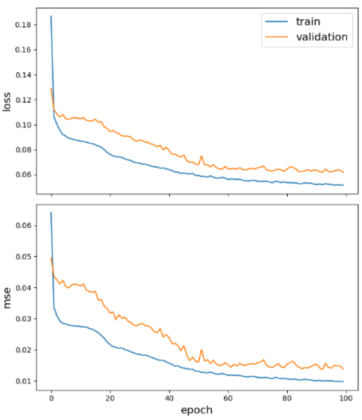
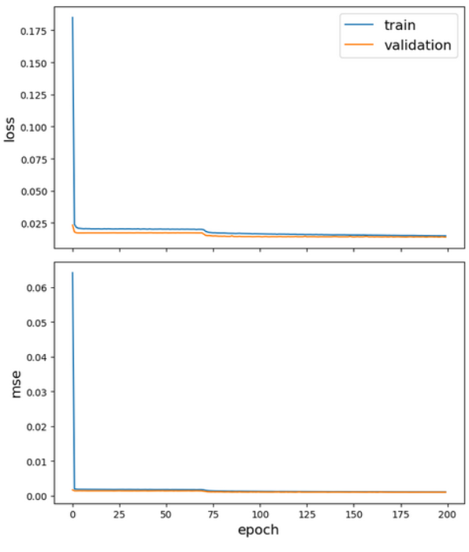

## 背景

## METR_LA analogue ressults

- Forecasting using spatio-temporal data with combined Graph Convolution + LSTM model, [ StellarGraph demos](https://stellargraph.readthedocs.io/en/stable/demos/time-series/gcn-lstm-time-series.html)
- [ipynb](https://github.com/sinotec2/FAQ/raw/main/_posts/2019ncHrGrid.ipynb)

### 數據特性之比較(Graph components)

- 圖形(節點、邊緣、加權等)為靜態、節點特徵值則為動態
- 單一特徵

項目|METRO_LA|2019.nc_NO2|說明
-|:-:|:-:|-
|data source|LA交通局數據|2019.nc CMAQ公版模式背景濃度模擬結果|
節點|速度監測站點|島內各網格點|前者較少、後者較多
特徵值|交通速度|空氣污染濃度值|分部有顯著差異(詳下)
時間頻率特徵|每5分鐘一筆|每小時一筆
邊緣加權|站點間的距離(作為邊緣的加權量)|網格點間距離-0.25|

### parameters

項目|METRO_LA|2019.nc_NO2|說明
-|:-:|:-:|-
seq_len|10|72|
pre_len|12|24|
gc_layer_sizes|[16, 10]|[16, 72]|
gc_activations|relu|relu|
lstm_layer_sizes|[20, 10]|[20, 72]|
lstm_activations|tanh|tanh|
epochs|100|200|
batch_size|60|60|
MASE|0.698|0.650|同一數量級

### Loss/MSE during training

|||
|:-:|:-:|
|<b>METR_LA速度預報訓練</b>|<b>2019.nc_NO2</b>|

### Distribution over segments

- speed training and testing results
  - training及testing都是扁胖形分布、訓練組更胖一些。表示原始數據可以符合高斯分布，並沒有顯著的極端值。訓練組的符合度更好一些。
  - 測試組之模擬誤差略為偏低

|||
|:-:|:-:|
|<b>METR_LA速度預報測試結果</b>|<b>2019.nc_NO2</b>|

- NO2
  - 原始數據與高斯模式的符合度不高。訓練及測試組皆然。(空氣品質的分布特性為對數高斯分布。)
  - training及testing都有強烈的趨中性質
  - 二者的平均絕對誤差值還蠻接近的
  - 測試組之誤差略為偏低

### all test result visualization

- speed predictoins

|||
|:-:|:-:|
|<b>METR_LA速度預報測試結果</b>|<b>2019.nc_NO2(部分值)</b>|

- NO2 predictions
  - 可以抓到日變化的趨勢
  - 對高值毫無預測能力

