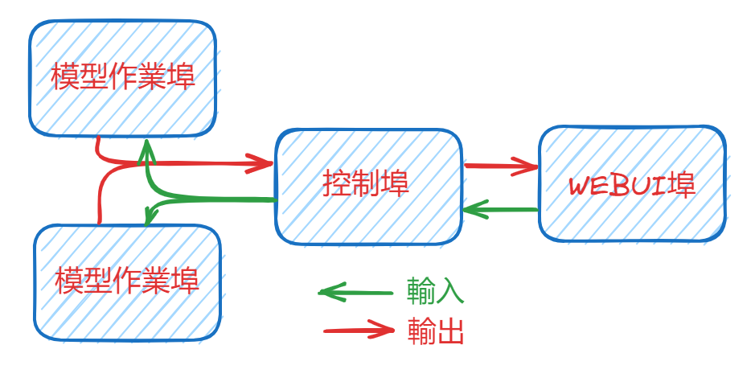

## 背景

- [chatWeb][3]安裝在[node03:7860](http://200.200.31.47:7860/)之後，對模型的核心計算使用別人的機器，總覺得有點過意不去，希望能用自己的機器來執行全套系統看看，畢竟還是要了解整個布建需要哪些軟/硬體。就去發現了[lmsys][1]在2023/4月公開的這套[FastChat][2]。
- 除了[官網][2]之外，另有不多的中文介紹，如<知乎>網友[薛定谔的皮丘(2023/08)](https://zhuanlan.zhihu.com/p/620801429)以及[Hok(2023/04)](https://zhuanlan.zhihu.com/p/622292418)，想讀中文介紹的讀者也可以去訪問他們的筆記。
- 這裡除了留存一些技術心得以外，併同前面[chatWeb][3]的經驗想法，也對未來語言模型在局地的應用架構有些總結。

### lmsys簡介

- 這各由美國學術界組成的開放研究組織，除了來自於頂尖的3所大學(UC Berkeley, UCSD and CMU)的研究師生之外，主要的功能在建構一個大型語言模型的競賽擂台[ChatBot Arena][4]，讓有興趣挑戰的同儕，可以在此鍛鍊進步。
- 該擂台所使用的模型都是目前私人公司與開放領域發展最新的語言模型，模型推理計算使用該機構的GPU，擂台的界面程式則是此處要引進的這套[FastChat][2]。
- [ChatBot Arena][4]的排行榜公開在[HuggingFace][5]的平台空間[lmsys/chatbot-arena-leaderboard][6]。
- 最新一版比試結果公開在[arXiv(2023/6)][7][^1]，第1名為GPT4，前5名全為私人單位發展知產品。

### FastChat簡介

[FastChat][2]界面獲得2萬7千多個github好評。依據其原版修訂應用版本有3千多個。由145個作者共同貢獻。核心功能包括多模型服務系統、API、評估工具等，其特色有下列幾點

- 多模型服務系統的特色包括：
  - 支援多種模型：該系統支援多種模型，包括LLama 2、Vicuna、Alpaca、Baize、ChatGLM、Dolly、Falcon、FastChat-T5、GPT4ALL、Guanaco、MTP、OpenAssistant、RedPajama、StableLM、WizardLM等等。
  - 分散式服務：該系統是一個分散式的多模型服務系統，可以同時運行多個模型。
  - 支援多種平台：該系統支援多種平台，包括CPU、GPU、Intel XPU、Metal Backend等，並提供了相應的指令和配置方式。
  - 高效性能：該系統通過優化和分佈式架構，提供了高效的模型服務性能，能夠處理大量的用戶請求。
  - 易於使用：該系統提供了詳細的安裝和使用文檔，用戶可以根據文檔進行快速部署和配置。
- API：該系統提供了網頁界面和OpenAI兼容的RESTful API，方便用戶進行模型服務和交換。可以像openAI一樣，經提供token後，使用雲端服務業者所提供的推理計算資源。
- "評估工具"的特色如下：
  - 使用MT-bench進行評估：評估工具使用MT-bench，一組具有挑戰性的多輪開放式問題，來評估模型的品質。
  - 自動化評估流程：評估工具使用強大的LLM（如GPT-4）作為評判，自動評估模型的回答品質。
  - 提供指導：評估工具提供了運行MT-bench的指示，以及使用fastchat/llm_judge進行評估的指示。

### FastChat架構

- fastchat.serve.controller
  - "fastchat.serve.controller"是FastChat中的一個模組，它的功能是管理分散式的模型工作器(model worker)。
  - 模型工作器是負責托管一個或多個模型的服務器，而控制器則負責協調這些模型工作器和與用戶交互的Web服務器之間的通信。控制器管理模型工作器的註冊、分配請求給適當的模型工作器以進行處理，並將結果返回給用戶UI。
  - 簡而言之，"fastchat.serve.controller"的功能是管理和協調FastChat中的模型工作器，以實現分散式的多模型服務。
- fastchat.serve.model_worker
  - 用於大型語言模型的聊天機器人訓練、提供服務和評估。為最耗費計算資源的部分。
  - 它是FastChat的核心組件之一，負責承擔模型的運算和處理輸入輸出。
  - 可以使用任何形式的計算資源，包括遠端或局地CPU、GPU、Intel XPU、Metal Backend等等。
  - 模型工作器（model_worker）通常與FastChat的控制器（controller）一起使用。
- fastchat.serve.gradio_web_server(server_multi)
  - 啟動一個單單/多標籤的Gradio伺服器，其中包括Chatbot Arena的標籤。
  - web_server單模式版本：與一般chatbot並沒有太大的差異。可調整temperature及topP等2個參數值。
  - 多模式版本(server_multi)：這個功能可以讓你在網頁上同時展示多個模型，並與這些模型進行對話。

## ip and portal arrangements

### 3個埠的關係

[FastChat][2]會需要3個埠(不能重複。如不給定，三支程式內設都會是21001，只能用一次)

1. 控制埠( \$addc=http://${ip}:21001內設)，搭配controller-address(作業埠需要)/controller-url(UI埠需要)之引數
2. 作業埠( \$add=http://${ip}:$port)。引數worker-address只需設定一次。
3. UI埠( \$addu=http://${ip}:$port1)，為使用者最後看到的界面。

安裝與其餘設定詳見[jondurbin/FastChat](https://github.com/jondurbin/FastChat)。此處詳解devp(ip=200.200.32.195)上的啟動方式。([結果位址](http://200.200.32.195:55081))



### 控制埠的啟動

- 控制埠為其他2埠作業的核心，因此其ip必須讓所有的埠都能順利取用。
- 如不指定host，則會是內設值localhost。如果為localhost，則其他2埠也必須設在localhost，因其他機器都無法存取控制埠。

```bash
python3 -m fastchat.serve.controller --host $ip &
```


- 模型作業埠
  - model-path可以指定到特定的模型。不一定是lmsys。
  - 上接控制埠、下啟UI埠。
  - 同一個控制埠及UI埠可以(同時)使用多個模型，只要開在不同的位址就好了。
  - 必須指定device，否則內設為gpu


```bash
python3 -m fastchat.serve.model_worker --model-path lmsys/vicuna-7b-v1.5-16k \
--host $ip \
--worker-address $add \
--controller-address $addc --port $port --device cpu &
```

- 測試模型是否正常運作
  - 需指定工作埠位址。啟動模型也必須與工作模型一致。
  - 此處不需再指定device

```bash
python3 -m fastchat.serve.test_message --model-name vicuna-7b-v1.5-16k --worker-address $add
```

- webui程式埠
  - 需要設定2組位址，一個是控制埠(controller-url)，一個是使用者會連上的最後位址。

```bash
python3 -m fastchat.serve.gradio_web_server --host $ip --port $port1 --controller-url $addc
```

[1]: https://lmsys.org/about/ "Large Model Systems Organization (LMSYS Org)開放研究組織。該組織由UC Berkeley的學生和教職員與UCSD和CMU合作創立。他們的目標是通過共同開發開放模型、數據集、系統和評估工具，使大型模型對每個人都可用。他們的工作涉及機器學習和系統的研究。他們訓練大型語言模型並使其廣泛可用，同時開發分佈式系統來加速模型的訓練和推理。該組織的成員包括UC Berkeley、UCSD、CMU和MBZUAI等機構的學生和教職員。"
[2]: https://github.com/lm-sys/FastChat "FastChat 是一個開放平台，用於訓練、服務和評估基於大型語言模型的聊天機器人。 核心功能包括：最先進模型（例如 Vicuna）的權重、訓練代碼和評估代碼，以及具有 Web UI 和 OpenAI 兼容 RESTful API 的分佈式多模型服務系統。"
[3]: https://github.com/SkywalkerDarren/chatWeb "SkywalkerDarren(2022) ChatWeb 可以抓取任何網頁或從 PDF、DOCX、TXT 文件中提取文本，並生成嵌入式摘要。 它還可以根據文本內容回答您的問題。 它是使用基於gpt3.5的chatAPI和embeddingAPI以及向量數據庫來實現的。"
[4]: https://chat.lmsys.org/?arena "⚔️Chatbot Arena ⚔️ : Benchmarking LLMs in the Wild"
[5]: https://zh.wikipedia.org/zh-tw/Hugging_Face "Hugging Face是一家美國公司，專門開發用於構建機器學習應用的工具。該公司的代表產品是其為自然語言處理應用構建的transformers庫，以及允許使用者共享機器學習模型和資料集的平台"
[6]: https://huggingface.co/spaces/lmsys/chatbot-arena-leaderboard "Leaderboard/該排行榜基於以下三個基準。(1)Chatbot Arena - 眾包、隨機的戰鬥平台。 我們使用 50K+ 用戶投票來計算 Elo 評級。(2)MT-Bench - 一組具有挑戰性的多回合問題。 我們使用 GPT-4 對模型響應進行評分。(3)MMLU (5-shot) - 衡量模型在 57 項任務上的多任務準確性的測試。" 
[7]: https://doi.org/10.48550/arXiv.2306.05685 "Zheng, L., Chiang, W.-L., Sheng, Y., Zhuang, S., Wu, Z., Zhuang, Y., Lin, Z., Li, Z., Li, D., Xing, E.P., Zhang, H., Gonzalez, J.E., Stoica, I. (2023). **Judging LLM-as-a-judge with MT-Bench and Chatbot Arena**."

[^1]: Zheng, L., Chiang, W.-L., Sheng, Y., Zhuang, S., Wu, Z., Zhuang, Y., Lin, Z., Li, Z., Li, D., Xing, E.P., Zhang, H., Gonzalez, J.E., Stoica, I. (2023). **Judging LLM-as-a-judge with MT-Bench and Chatbot Arena**. [doi](https://doi.org/10.48550/arXiv.2306.05685)
