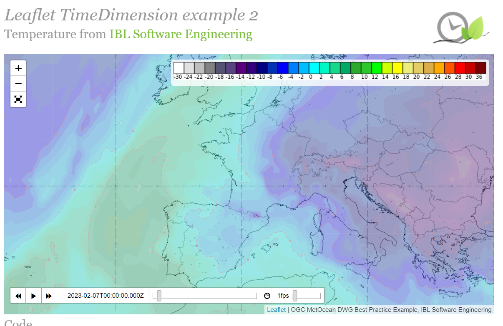
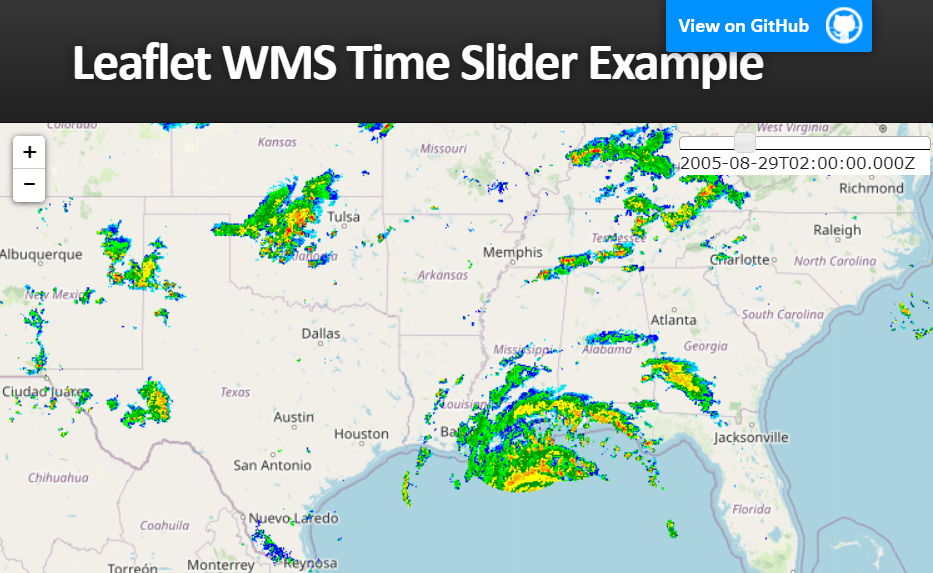
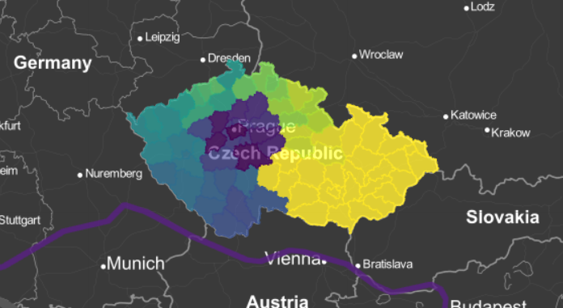
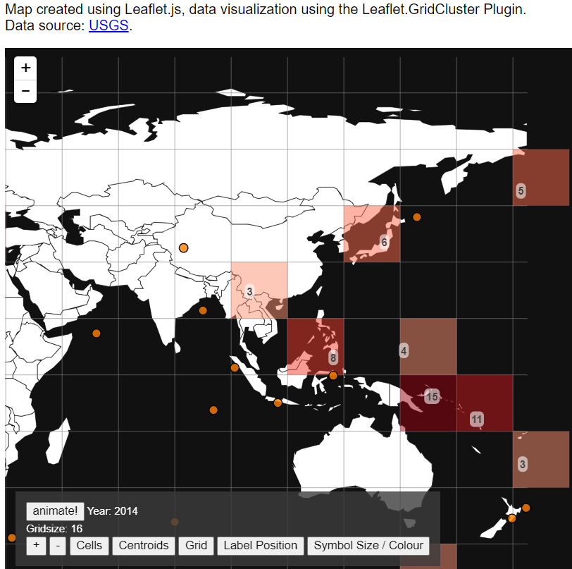

# Tuesday, February 7, 2023

### MapServer

> MapServer 是一個開放原始碼的開發環境，用於建立空間網際網路應用。它可以作為 CGI 程式或通過 MapScript 執行。MapScript 支援數種程式語言。MapServer 由明尼蘇達大學開發。它的開發最初由 NASA 支援，以使其衛星影像開放給公眾。 [維基百科](https://zh.wikipedia.org/zh-tw/MapServer)

- [mapserver.org](https://mapserver.org/)
- MapServer Suite Products
  - MapServer Core
    - The MapServer core source code, written in C, and consistently is one of the fastest and most configurable online mapping engines in the world.
  - MapCache
    - As of MapServer 6.0, MapServer also includes powerful tile caching capabilities through the MapCache project.
  - TinyOWS
    - As of MapServer 6.0, MapServer also includes the much needed ability to perform transactional requests (online editing of **features**) through the **WFS** specification, using the TinyOWS project.

### time sequence of leaflet map

- 目前earth空間資料就是以geojson方式提供，在不同解析度可以有快取之方案，似乎具發展潛力。
- 目前leaflet的等值圖(heatmap)似乎不是很好，有顯著模糊化的缺點。可能是官方網站並未使用的原因，重要官方預報、衛星及回波仍是使用其他軟體內插或直接使用點陣圖、png似也有其必要性。

項目\提供形式|rasterWMS/png|geojson/cluster|說明
:-:|:-:|:-:|:-:
時間間距|短|中長|前者適合網格數據
解析度快取金字塔|無|有|會提升不同解析度顯示速度
顯示速度|慢|快|如果太慢會拉長總連線時間
應用範例|[L.TimeDimension][3]、[sliderControl][4]|[glify][1]、[GridCluster][2]|

||
|:-:|
|[TimeDimension][33]：Add time dimension capabilities on a Leaflet map.|

||
|:-:|
|[sliderControl][44]:Leaflet-WMS-Time-Slider from BobTorgerson
|

||
|:-:|
|[glify][11]:Fast rendering for large (+100MB) GeoJSON datasets with WebGL.|

||
|:-:|
|[GridCluster][22]:Create grid-based clusters in realtime.|

[1]: https://onaci.github.io/Leaflet.glify.layer/ "Fast rendering for large (+100MB) GeoJSON datasets with WebGL."
[11]: https://www.npmjs.com/package/leaflet.glify "web gl renderer plugin for leaflet in typescript"
[2]: http://andy-kay.github.io/Leaflet.GridCluster/ "Leaflet.GridCluster with animation"
[22]: https://github.com/andy-kay/Leaflet.GridCluster "This small plug-in allows you to cluster your point-shaped data in Leaflet using a grid-based cell structure. It can be useful for thematic mapping purposes, or to declutter icons."
[3]: https://apps.socib.es/Leaflet.TimeDimension/examples/example2.html "Leaflet TimeDimension example 2, Temperature from IBL Software Engineering"
[33]: https://apps.socib.es/Leaflet.TimeDimension/ "Socib Applications for modern web browsers and mobile platforms.: Add time dimension capabilities on a Leaflet map."
[4]: http://bobtorgerson.github.io/Leaflet-WMS-Time-Slider/ "Leaflet WMS Time Slider Example"
[44]: https://github.com/BobTorgerson/Leaflet-WMS-Time-Slider "The Leaflet WMS Time Slider enables you to dynamically update a WMS layer based on a dimension such as time. This tool uses the JQuery UI slider . For WMS layers where a range of time is more desirable than a single time step, two sliders appear to allow for a tailored time range to be created."