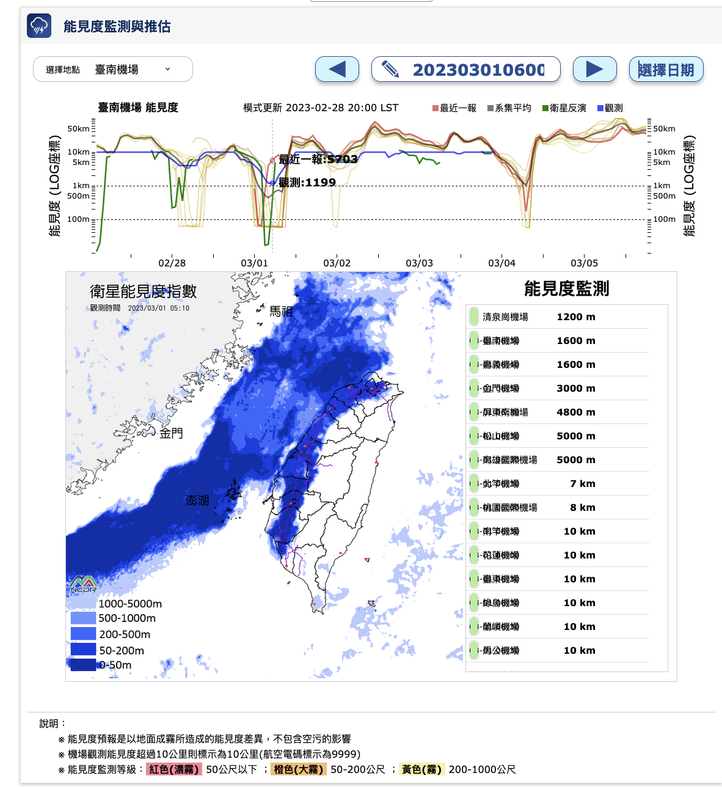

# Friday, March 3, 2023

### Surface deposition of marine fog and its treatment in the WRF model

- Taylor, Peter Allan, Zheqi Chen, Li Cheng, Soudeh Afsharian, Wensong Weng, George A. Isaac, Terry W. Bullock and Yongsheng Chen(2021) Surface Deposition of Marine Fog and Its Treatment in the WRF Model. Preprint. Aerosols/Atmospheric Modelling/Troposphere/Physics (physical properties and processes), 2021/6/28. https://doi.org/10.5194/acp-2021-344.

- [acp-2021-344-manuscript-version3](https://acp.copernicus.org/preprints/acp-2021-344/acp-2021-344-manuscript-version3.pdf)
- [acp-2021-344-supplement](https://acp.copernicus.org/preprints/acp-2021-344/acp-2021-344-supplement.pdf)

### vertical resolution

The impact of vertical resolution in the explicit numerical forecasting of radiation fog: a case study. Pure Appl. Geophys., 164, 1221-1240

### wrf chem @jiangsu

- Zong, Peishu, Yali Zhu, Huijun Wang及Duanyang Liu. 「WRF-Chem Simulation of Winter Visibility in Jiangsu, China, and the Application of a Neural Network Algorithm」. Atmosphere 11, 期 5 (2020年5月): 520. https://doi.org/10.3390/atmos11050520.

### mp_physics

- 選擇Morrison 2-moment scheme，wrfout變數多了4項

```bash
<  mp_physics                          =10,    10,     2,     2,
---
>  mp_physics                          = 2,     2,     2,     2,
1

$ ncdump -h $nc|grep -i concent
                QNICE:description = "Ice Number concentration" ;
                QNSNOW:description = "Snow Number concentration" ;
                QNRAIN:description = "Rain Number concentration" ;
                QNGRAUPEL:description = "Graupel Number concentration" ;
```

### sinica's results

網格資料說明
資料名稱及格式
• 檔名：surfgrid_RCEC_YYYYMMDD.rar
• YYYY/MM/DD 00 LST開始 48小時預報資料(目前暫提供隔天起48小時預報資料)
• 如：2020/02/05中午可以抓2/6及2/7兩天的預報資料，檔名為surfgrid_RCEC_20200206.rar，為
2020/02/06 00時至2020/02/07 23時的每小時預報資料
• 解壓縮後，資料夾內有48個檔案，檔名如下：surfgrid_RCEC_YYYMMDDhh.txt
• 如：surfgrid_RCEC_2020020600.txt為2020/02/06 00時的預報資料
• 如：surfgrid_RCEC_2020020716.txt為2020/02/07 16時的預報資料，以此類推。
.
.
.
.
.
資料名稱及格式
• 每個檔案共有10個欄位及16171列
• 其中欄位分別為不同變數，第一欄至第十欄分別為緯度(度)、經度(度)、PM10(μg 𝑚−3
)、
PM2.5(μg 𝑚−3
) 、O3
(ppb)、O3八小時平均(ppb)、風速(m s-1
)、風向(360度)、溫度(K)、相
對溼度(%)
• 每列表示每個網格點的資料
• 讀寫方式，以fortran為例:
open(1, file=‘surfgrid_RCEC_2020020600.txt’)
do i = 1, 103
do j = 1, 157
read (1, ‘(10f11.4)’) lat, lon, PM10, PM25, O3, O3_8, WS, WD, T2, RH
enddo
enddo
close(1)
變數名稱： 緯度 經度 PM10 PM2.5 O3
O3八小時平均 風速 風向 溫度 相對溼度
單位 ： 度 度 μg 𝑚−3 μg 𝑚−3 ppb ppb m s-1 度 K %
共103*157=16171列
範例檔案： surfgrid_RCEC_2020020600.txt
範例檔案： surfgrid_RCEC_2020020600.txt

### physics/mp28_updated

- Notes for running WRF with the Aerosol-aware Thompson Scheme (mp_physics = 28) by [Greg Thompson and Trude Eidhammer](https://www2.mmm.ucar.edu/wrf/users/physics/mp28_updated.html)
- paper [^2]
- quoted by [^1]

[^1]: Weston, Michael, Stuart Piketh, Frédéric Burnet, Stephen Broccardo, Cyrielle Denjean, Thierry Bourrianne及Paola Formenti. 「Sensitivity Analysis of an Aerosol Aware Microphysics Scheme in WRF during Case Studies of Fog in Namibia」. Preprint. Clouds and Precipitation/Atmospheric Modelling/Troposphere/Physics (physical properties and processes), 2022年3月16日. https://doi.org/10.5194/acp-2022-152.
[^2]: Thompson, Gregory, 及Trude Eidhammer. 「A Study of Aerosol Impacts on Clouds and Precipitation Development in a Large Winter Cyclone」. Journal of the Atmospheric Sciences 71, 期 10 (2014年10月1日): 3636–58. https://doi.org/10.1175/JAS-D-13-0305.1.


### 能見度監測/預報第二版

- [能見度監測與推估](https://watch.ncdr.nat.gov.tw/watch_vis_v2)
- [能見度監測 第二版](https://watch.ncdr.nat.gov.tw/watch_vis)
- 
  - 
- 