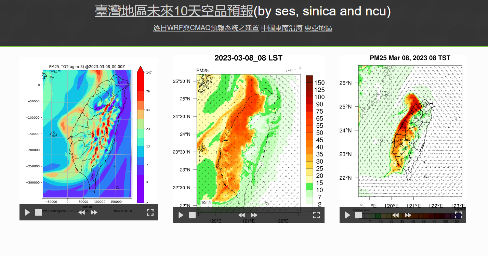

# Sunday, March 5, 2023

ip|date|break|OK|doing job
-|-|-|-|-
nas2|Feb 28|00:35:06|08:44:14|tw_CWBWRF_45k/wrffdda_d01(real.exe)
nas1|Feb 28|00:35:37|08:44:19|tw_CWBWRF_45k/wrffdda_d01(real.exe)
nas1|Mar  1|00:27:19|06:48:02|tw_CWBWRF_45k/wrffdda_d01(real.exe)
nas2|Mar  1|00:27:20|06:48:02|tw_CWBWRF_45k/wrffdda_d01(real.exe)
nas1|Mar  2|00:26:37|06:55:58|tw_CWBWRF_45k/wrffdda_d01(real.exe)
nas2|Mar  2|00:27:02|06:56:00|tw_CWBWRF_45k/wrffdda_d01(real.exe)
nas1|Mar  3|05:41:07|06:47:49|grid09 (cmaq)
nas2|Mar  3|05:41:14|06:47:55|grid09 (cmaq)
nas1|Mar  4|05:41:07|06:47:49|grid09 (cmaq)
nas2|Mar  4|05:41:14|06:47:55|grid09 (cmaq)
nas1|Mar  5|06:04:12|07:01:38|grid09 (cmaq)
nas2|Mar  5|06:04:14|07:01:46|grid09 (cmaq)
nas1|Mar  6|03:32:00|06:54:33|TWEPA_3k/wrfout_d01_2023-03-11(wrf.exe)
nas1|Mar  7|05:48:07|06:18:14|()
nas2|Mar  7|05:44:59|06:18:14|
nas1|Mar  8|00:45:37|06:18:14|()
nas2|Mar  8|05:44:59|06:18:14|

### centos 7網路監看程式

- `sudo iftop`
- `sudo nethogs`

- 583 × 773 px vs 645 × 740 px

https://watch.ncdr.nat.gov.tw/00_Wxmap/2F7_ECMWF_0.4deg/202303/2023030612/ECMWF850mf_2023030612_f096.gif

