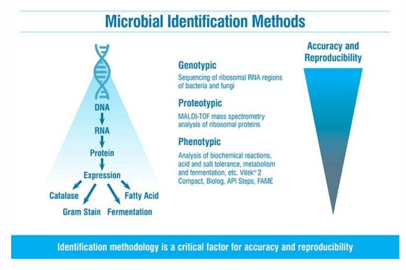

# Thursday, March 30, 2023

## C# and YOLO

### C#封装YOLOv4算法进行目标检测

[cnblogs](https://www.cnblogs.com/zypblog/p/13656366.html)

### C\#yolo on GitHub

- github上共有[21個專案](https://github.com/topics/yolo?l=c%23)，C#大多負責週邊或包裝。多數專案在2019~2021年代之間，並無後續發展。
- 相對python有803個專案，

作者|作品|大要
-|-|-
Tino Hager@australia 教授團隊|[Alturos.Yolo](https://github.com/AlturosDestinations/Alturos.Yolo)(2020)|以C# (Visual Studio) 建立的的實時對象檢測系統。支持CPU 和 GPU，後者執行速度快些。本項目為yolo輕度引用者，後台使用 AlexeyAB/darknet 的 Windows Yolo 版本。 將圖像路徑或字節數組發送到 yolo 並接收檢測到的對象的位置，系統則返回影像類型和位置之可處理數據。 系統支持 YoloV3 和 YoloV2 預訓練數據集。
LKneringer and Tino Hager|[Alturos.ImageAnnotation](https://github.com/AlturosDestinations/Alturos.ImageAnnotation)(2020)|Collaborative annotation of images/Verification of image annotation data/Export for yolo (train.txt, test.txt, obj.names) with filters/No requirement for a custom server
Poker-sang@china|[yolov5-net](https://github.com/techwingslab/yolov5-net)(2020~)|YOLOv5 object detection with ML.NET(6), ONNX
[Died](https://www.died.tw/2019/01/c-yolo3-with-opencvsharp4.html)@china|[OpenCvSharpDnnYolo](https://github.com/died/OpenCvSharpDnnYolo)(2018)|OpenCvSharp Dnn module with Yolo2
Died@china|[YOLO3 With OpenCvSharp4](https://github.com/died/YOLO3-With-OpenCvSharp4)(2019)|This is a demo of implement pjreddie's YOLO3 with shimat's OpenCvSharp4 using C#. more detail please check blog artile : [C#] YOLO3 with OpenCvSharp4
BobLd@London|[YOLOv4MLNet](https://github.com/BobLd/YOLOv4MLNet)(2021)|YOLOv3~v5 with ML.Net
Denis Pettens@micbelgique, Belgium|[YoloCSharp](https://github.com/micbelgique/YoloCSharp#yolocsharp----dotnet-wrapper--for-yolo)(2018)|YoloCSharp is a cross platform wrapper of Yolo/Darknet for .Net Standard 2.0./Warning: Only 64 bits;/Support for Windows/Linux/Docker;Compatible with .Net Framework 4.6.1+/.Net Core 2.0;GPU Computation with CUDA;No CPU Computation available.
FlorisDevreese@Basel, Switzerland|[YOLOv3-CNTK-CS](https://github.com/FlorisDevreese/YOLOv3-CNTK-CS)(2019)|The goal of this project was to implment YOLOv3 using CNTK and written in C#. The implementation is based on Tutorial on implmenting YOLO v3 from scratch in PyTorch

## CUDA

CUDA (or Compute Unified Device Architecture計算統一設備架構) is a parallel computing platform and application programming interface (API) that allows software to use certain types of graphics processing units (GPUs) for general purpose processing, an approach called general-purpose computing on GPUs (GPGPU). CUDA is a software layer that gives direct access to the GPU's virtual instruction set and parallel computational elements, for the execution of compute kernels.[1]

https://en.wikipedia.org/wiki/CUDA

- [硬體加速搞不懂？CUDA讓一切變得更簡單。電腦DIY 2011.04.26 顯示卡](https://www.computerdiy.com.tw/nvidia-cuda/)

### Amazon Web Services achieves fastest training times for BERT and Mask R-CNN

BERT, or Bidirectional Encoder Representations from Transformers, is a popular NLP model, which at the time it was published was state-of-the-art on several common NLP tasks.

https://aws.amazon.com/cn/blogs/machine-learning/amazon-web-services-achieves-fastest-training-times-for-bert-and-mask-r-cnn/

## 实践 / C# 在 ONNX 上运行 YOLOv3/4/5,并使用 DirectML 加速

https://zhuanlan.zhihu.com/p/421994173

### ONNX

什么是 ONNX？
ONNX[音：欧尼克思](Open Neural Network Exchange) 开放式神经网络交换是一个机器学习互操作的开放标准。

什么是ONNX Runtime？
ONNX Runtime 是 ONNX 标准的具体实现。在 ONNX Runtime 的 主页 上可以看到如下图所示的 Onnx Runtime 选择工具。 ONNX Runtime 包含在多种语言和多种平台上运行符合ONNX标准模型来进行推理(Inferencing)和训练(Training)的实现。

### 淺談ONNX交換格式

papayuan 2019-01-29 08:37:38 ‧ 10870 瀏覽

https://ithelp.ithome.com.tw/articles/10210800

### other instances

- [教學課程：在 ML.NET 中使用 ONNX 偵測物件](https://learn.microsoft.com/zh-tw/dotnet/machine-learning/tutorials/object-detection-onnx)
- [C#调用YOLOv3算法dll动态链接库](https://blog.csdn.net/weixin_42136882/article/details/107730456)
- [c#调用yolov4 yolov4实例](https://download.csdn.net/download/a572560159/58043353)

### YoloCSharp

- [YoloCSharp - Dotnet wrapper for Yolo](https://github.com/micbelgique/YoloCSharp)
  - YoloCSharp is a cross platform wrapper of Yolo/Darknet for .Net Standard 2.0.
    - Warning: Only 64 bits;
    - Support for Windows/Linux/Docker;
    - Compatible with .Net Framework 4.6.1+/.Net Core 2.0;
    - GPU Computation with CUDA;
    - No CPU Computation available.

## MDF

MDF全稱Measurement Data Format，即測量數據格式，是一種二進位文件格式，用於存儲記錄或計算的數據，以用於後測量處理、離線評估或長期存儲。

## Microbial Identification

### overall algorithm

- [「Microbial Identification - an overview | ScienceDirect Topics」](https://www.sciencedirect.com/topics/biochemistry-genetics-and-molecular-biology/microbial-identification)
- [criver.com](https://www.criver.com/products-services/qc-microbial-solutions/microbial-id-strain-typing/identification-methods?region=3701)

### YOLO instances

- Sun, Lesheng, Ying Xu, Zhikang Rao, Juntao Chen, Zhe Liu及Ning Lu. 「YOLO Algorithm for Long-Term Tracking and Detection of Escherichia Coli at Different Depths of Microchannels Based on Microsphere Positioning Assistance」. Sensors (Basel, Switzerland) 22, 期 19 (2022年9月30日): 7454. https://doi.org/10.3390/s22197454.
- Liu, Dan, Pengqi Wang, Yuan Cheng及Hai Bi. 「An improved algae-YOLO model based on deep learning for object detection of ocean microalgae considering aquacultural lightweight deployment」. Frontiers in Marine Science 9 (2022年). https://www.frontiersin.org/articles/10.3389/fmars.2022.1070638.

## Vehicle Identification and Speed calculation

[bamwani(2022)](https://github.com/bamwani/car-counting-and-speed-estimation-yolo-sort-python)
- Lin, Cheng-Jian, Shiou-Yun Jeng及Hong-Wei Lioa. 「A Real-Time Vehicle Counting, Speed Estimation, and Classification System Based on Virtual Detection Zone and YOLO」. Mathematical Problems in Engineering 2021 (2021年11月2日): e1577614. https://doi.org/10.1155/2021/1577614.
  - 靜宜大學資訊系(碩士生)
