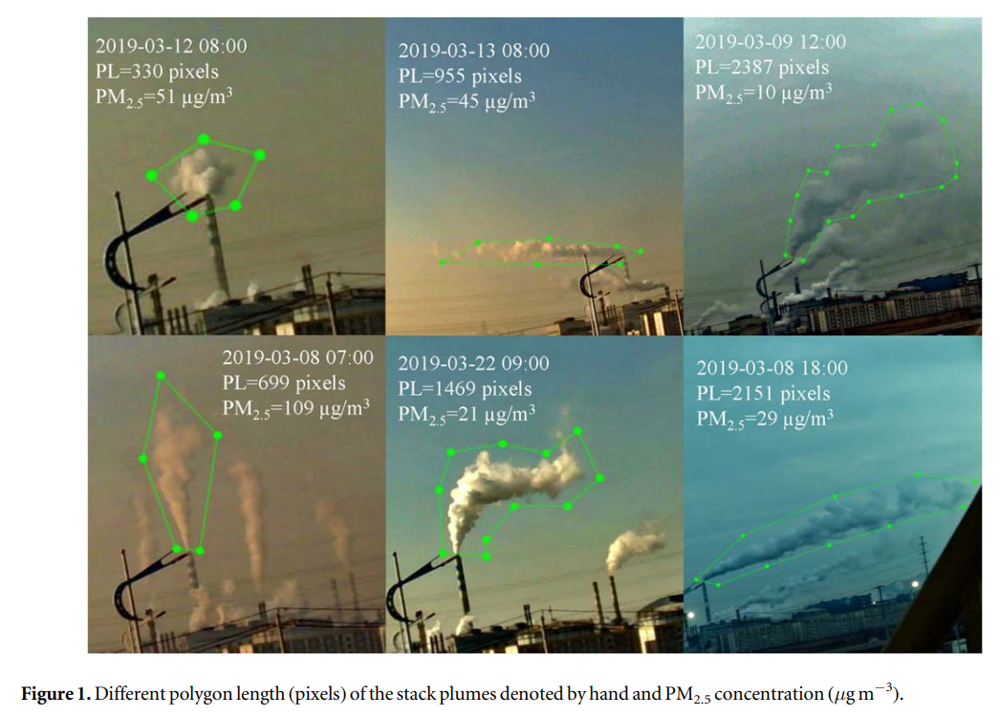

# Monday, April 24, 2023

## Multivariate Logistic Regression in Python

- [Sowmya Krishnan(2020)](https://towardsdatascience.com/multivariate-logistic-regression-in-python-7c6255a286ec)
  - A machine learning technique for classification
  - github resource: [LeadConversion_LogReg](https://github.com/sowmya20/LeadConversion_LogReg)
  

### Model Building

```python
X = leads.drop(['Converted'], 1)
y = leads['Converted']
# Split the dataset into 70% train and 30% test

X_train, X_test, y_train, y_test = train_test_split(X, y, train_size=0.7, test_size=0.3, random_state=100)


# Import 'LogisticRegression' and create a LogisticRegression object
from sklearn.linear_model import LogisticRegression
logreg = LogisticRegression()
# Import RFE and select 15 variables
from sklearn.feature_selection import RFE
rfe = RFE(logreg, 15)             
rfe = rfe.fit(X_train, y_train)
```

- [recursive feature elimination, RFE](https://scikit-learn.org/stable/modules/generated/sklearn.feature_selection.RFE.html)
- 

  ### test model

```python
col = X_train.columns[rfe.support_]
X_train = X_train[col]
# Import statsmodels

import statsmodels.api as sm
X_train_sm = sm.add_constant(X_train)
logm2 = sm.GLM(y_train, X_train_sm, family = sm.families.Binomial())
res = logm2.fit()
res.summary()
```

### variance_inflation_factor

```python
from statsmodels.stats.outliers_influence import variance_inflation_factor
# Make a VIF dataframe for all the variables present

vif = pd.DataFrame()
vif['Features'] = X_train.columns
vif['VIF'] = [variance_inflation_factor(X_train.values, i) for i in range(X_train.shape[1])]
vif['VIF'] = round(vif['VIF'], 2)
vif = vif.sort_values(by = "VIF", ascending = False)
vif
X_train.drop('Lead Source_Reference', axis = 1, inplace = True)
```

### Precision-Recall Trade-off

```python
# Let's check the overall accuracy
metrics.accuracy_score(y_pred_final['Converted'], y_pred_final.final_predicted)
TP = confusion2[1,1] # true positive 
TN = confusion2[0,0] # true negatives
FP = confusion2[0,1] # false positives
FN = confusion2[1,0] # false negatives
# Calculate Precision
TP/(TP+FP)
# Calculate Recall
TP/(TP+FN)
```

## Machine Learning for Spatial Data Analysis

### Introducing

Introducing Machine Learning for Spatial Data Analysis, by [Rendyk(2021), Analytics Vidhya](https://www.analyticsvidhya.com/blog/2021/03/introducing-machine-learning-for-spatial-data-analysis/)

- Empirical Bayesian Kriging (EBK)：EBK predicts unknown values using multiple semivariograms and the Bayesian rule.
- The other algorithms for spatial interpolation are Ordinary Least Squares (OLS) Regression and Geographically Weighted Regression (GWR).


### Kopczewska(2022)

Kopczewska, K. Spatial machine learning: new opportunities for regional science. Ann Reg Sci 68, 713–755 ([2022](https://doi.org/10.1007/s00168-021-01101-x)). 


---


### Nikparvar & Thill 2021

Nikparvar, B., & Thill, J. ([2021](https://doi.org/10.3390/ijgi10090600)). Machine Learning of Spatial Data. ISPRS International Journal of Geo-Information, 10(9), 600. 

1 Infrastructure and Environmental Systems Program, University of North Carolina at Charlotte, 9201 University City Blvd., Charlotte, NC 28223, USA
2 Department of Geography and Earth Sciences, University of North Carolina at Charlotte, 9201 University City Blvd., Charlotte, NC 28223, USA
3 School of Data Science, University of North Carolina at Charlotte, 9201 University City Blvd., Charlotte, NC 28223, USA


### pysal

[Tutorial 4 - Spatial Regression in Python](https://sustainability-gis.readthedocs.io/en/latest/lessons/L4/spatial_regression.html)

### Spatial Regression

[geographicdata.science](https://geographicdata.science/book/notebooks/11_regression.html)

## AI_AQM

### Pushan Port

Long Short-Term Memory (LSTM)

Hong, Hyunsu, IlHwan Choi, Hyungjin Jeon, Yumi Kim, Jae-Bum Lee, Cheong Hee Park及Hyeon Soo Kim. 「An Air Pollutants Prediction Method Integrating Numerical Models and Artificial Intelligence Models Targeting the Area around Busan Port in Korea」. Atmosphere 13, 期 9 ([2022年9月](https://doi.org/10.3390/atmos13091462)): 1462.


### 清華大學(2020)

Xing, Jia, Shuxin Zheng, Dian Ding, James T. Kelly, Shuxiao Wang, Siwei Li, Tao Qin, 等. 「Deep learning for prediction of the air quality response to emission changes」. Environmental science & technology 54, 期 14 ([2020年7月21日](https://doi.org/10.1021/acs.est.0c02923)): 8589–8600.
  - 減量敏感性分析


### 海梅一世大學博士論文

Ditsuhi Iskandaryan(2023) Study and Prediction of Air Quality in Smart Cities through Machine Learning Techniques Considering Spatiotemporal Components, A dissertation presented for the degree of Doctor of Computer Science, Universitat Jaume I.([pdf](https://www.tdx.cat/bitstream/handle/10803/687959/2023_Tesis_Iskandaryan_Ditsuhi.pdf))
  - [zenodo package](https://zenodo.org/record/7351424#.ZEh5y3bP1PY)

- 沃羅諾伊圖 (Voronoi diagram)
  - 沃羅諾伊圖是由俄國數學家格奧爾吉·沃羅諾伊建立的空間分割算法。靈感來源於笛卡爾用凸域分割空間的思想。在幾何、晶體學、建築學、地理學、氣象學、信息系統等許多領域有廣泛的應用。 沃洛諾伊圖的單元被稱為泰森多邊形。
  - 

### WMO reviewing

- Baklanov, Alexander,  and Yang Zhang. 「Advances in Air Quality Modeling and Forecasting」. Global Transitions 2 ([2020年1月1日](https://doi.org/10.1016/j.glt.2020.11.001)): 261–70.
  - [Alexander Baklanov](https://www.researchgate.net/profile/Alexander-Baklanov): World Meteorological Organization, Science and innovation department, Professor, Dr.Sci., PhD

### ML and Plume identification

- Feng, Limin, Ting Yang, Dawei Wang, Zifa Wang, Yuepeng Pan, Ichiro Matsui, Yong Chen, Jinyuan Xin and Huili Huang. 「Identify the Contribution of Elevated Industrial Plume to Ground Air Quality by Optical and Machine Learning Methods」. Environmental Research Communications 2, 期 2 ([2020年2月](https://doi.org/10.1088/2515-7620/ab7634)): 021005.
  - [data and programs](https://github.com/Limin-Feng1993/Data_Plume_Shape_and_Particle_Concentration)
  - polygon length (PL)

  

  

### data fusion

- O’Neill, Susan M., Minghui Diao, Sean Raffuse, Mohammad Al-Hamdan, Muhammad Barik, Yiqin Jia, Steve Reid, 等. 「A Multi-Analysis Approach for Estimating Regional Health Impacts from the 2017 Northern California Wildfires」. Journal of the Air & Waste Management Association 71, 期 7 ([2021年7月3日](https://doi.org/10.1080/10962247.2021.1891994)): 791–814. 
> For example, at the permanent monitoring locations, the WRF-CMAQ simulations had a Pearson correlation of 0.65, and the data fusion approach improved this (Pearson correlation = 0.95), while at the temporary monitor locations across all cases, the best Pearson correlation was 0.5. Overall, WRF-CMAQ simulations were biased high and the geostatistical methods were biased low. 

> One promising method for characterizing environmental exposure for public health practice and epidemiologic research is the integration of remote sensing satellite systems data with monitoring network data (AlHamdan et al. 2014, 2009). Use of remotely sensed data can help to fill the temporal and spatial gaps found with ground-level monitor data. One PM2.5 dataset in this study was created using a data fusion geostatistical surfacing algorithm of Al-Hamdan et al. (2009, 2014), which provided daily PM2.5 on a 3-km grid for the entire state of California.

>  This algorithm leverages data from the US EPA AQS and the NASA MODIS instrument on board the Aqua Earth-orbiting satellite (see Table 2). It estimates daily PM2.5 concentrations using a regional spatial surfacing algorithm, which includes regression models, B-spline and Inverse Distance Weighted (IDW) smoothing models, a quality control procedure for the EPA AQS data, and a bias adjustment procedure for MODIS/Aerosol Optical Depth-derived PM2.5 data (Al-Hamdan et al. 2014, 2009). The net result is daily estimates of PM2.5 on a 3-km grid (surface) (e.g. Figure 3).


> Machine learning
> Three machine learning-based algorithms were applied: an ordinary multi-linear regression (MLR) method, a generalized boosting (GB) method, and a random forest (RF) method. These methods incorporate the Baseline WRF-CMAQ modeling results with the AQS and MAIAC AOD, and meteorological variables, to produce improved 24-hr average near-surface PM2.5 concentration estimates (see Table 2).


### emis adjustment

- Huang, Congwu, Tao Niu, Hao Wu, Yawei Qu, Tijian Wang, Mengmeng Li, Rong Li及Hongli Liu. 「A Data Assimilation Method Combined with Machine Learning and Its Application to Anthropogenic Emission Adjustment in CMAQ」. Remote Sensing 15, 期 6 (2023年1月): 1711. https://doi.org/10.3390/rs15061711.
  - The **scikit-learn machine learning package** in Python was used here to accomplish the ExRT within nudging, and is available at http://scikit-learn.org/stable/index.html, accessed on 1 February 2022.
  - Resources and Environmental Science, Hubei University, Wuhan 430062, China


### Lyu et al.

- Lyu, Baolei, Yongtao Hu, Wenxian Zhang, Yunsong Du, Bin Luo, Xiaoling Sun, Zhe Sun, 等. 「Fusion Method Combining Ground-Level Observations with Chemical Transport Model Predictions Using an Ensemble Deep Learning Framework: Application in China to Estimate Spatiotemporally-Resolved PM2.5 Exposure Fields in 2014–2017」. Environmental Science & Technology 53, 期 13 ([2019年7月2日](https://doi.org/10.1021/acs.est.9b01117)): 7306–15.
  - The framework encompasses four machine-learning models, i.e., general linear model, fully connected neural network, random forest, and gradient boosting machine, and combines them by stacking approach.
- Lyu, Baolei, Ran Huang, Xinlu Wang, Weiguo Wang and Yongtao Hu. 「Deep-Learning Spatial Principles from Deterministic Chemical Transport Models for Chemical Reanalysis: An Application in China for PM2.5」. Geoscientific Model Development 15, 期 4 ([2022年2月22日](https://doi.org/10.5194/gmd-15-1583-2022)): 1583–94. .

- Lyu, B.: Chemical Reanalysis Model with Deep Learning from CTM simulations (1.0), Zenodo [code](https://doi.org/10.5281/zenodo.5152567), 2021.


Code and data availability. The CTM simulation data and fused datasets can be accessed by contacting the corresponding authors Baolei Lyu (baoleilv@foxmail.com) and Ran Huang (ranhuang2019@163.com). The land use and land cover data are available at the Data Sharing and Service Portal of the Chinese Academy of Science (https://doi.org/10.5281/zenodo.3986872; Liu and Zhang, 2019). The source code and a pre-trained model file of the exact version used to produce the results used in this paper are available at https://doi.org/10.5281/zenodo.5152567 on Zenodo (Lyu, 2021). The configuration files for running the models WRF v3.4.1 and CAMQ v5.0.2 are also available at https://doi.org/10.5281/zenodo.5152621 (Hu, 2021).

### Friberg et al (2016)

- Friberg, Mariel D., Xinxin Zhai, Heather A. Holmes, Howard H. Chang, Matthew J. Strickland, Stefanie Ebelt Sarnat, Paige E. Tolbert, **Armistead G. Russell** and James A. Mulholland. 「Method for Fusing Observational Data and Chemical Transport Model Simulations To Estimate Spatiotemporally Resolved Ambient Air Pollution」. Environmental Science & Technology 50, 期 7 ([2016年4月5日](https://doi.org/10.1021/acs.est.5b05134)): 3695–3705.
  - [Armistead G. Russell](https://ce.gatech.edu/directory/person/armistead-g-russell)
  - rof. Armistead (Ted) Russell is the Howard T. Tellepsen Chair and Regents Professor of Civil and Environmental Engineering at Georgia Tech, where his research is aimed at approaches to improve air quality and health, develop novel technologies to remove traditional air pollutants and carbon dioxide from emissions and develop advanced modeling methods to tackle environmental problems globally.

  

### Dharmalingam et al. (2022) and EPRI

- Dharmalingam, Selvaraj, Nirupama Senthilkumar, Rohan Richard D’Souza, Yongtao Hu, Howard H. Chang, Stefanie Ebelt, Haofei Yu, Chloe S. Kim及Annette Rohr. 「Developing Air Pollution Concentration Fields for Health Studies Using Multiple Methods: Cross-Comparison and Evaluation」. Environmental Research 207 ([2022年5月1日](https://doi.org/10.1016/j.envres.2021.112207)): 112207.
- we applied nine methods to develop fields of eight pollutants (carbon monoxide (CO), nitrogen dioxide (NO2), sulfur dioxide (SO2), ozone (O3), fine particulate matter (PM2.5), and three speciated PM2.5 constituents including elemental carbon (EC), organic carbon (OC), and sulfate (SO4)) for the metropolitan Atlanta region for **five years**. 
- The nine methods are 
  1. Central Monitor (CM), 
  2. Site Average (SA), 
  3. Inverse Distance Weighting (IDW), 
  4. Kriging (KRIG), 
  5. Land Use Regression (LUR), 
  6. satellite Aerosol Optical Depth (AOD), 
  7. CMAQ model, 
  8. CMAQ with kriging adjustment (CMAQ-KRIG), and 
  9. CMAQ based data fusion (CMAQ-DF). Additionally, we applied an increasingly popular method, 
  10. Random Forest (RF), and compared its results for **NO2** and **PM2.5** with other methods.

```python
# https://towardsdatascience.com/how-to-create-voronoi-regions-with-geospatial-data-in-python-adbb6c5f2134


# In[266]:


import numpy as np
import geopandas as gpd
import pandas as pd
import contextily as ctx
import matplotlib.pyplot as plt
from shapely.ops import cascaded_union, unary_union
from geovoronoi.plotting import subplot_for_map, plot_voronoi_polys_with_points_in_area
from geovoronoi import voronoi_regions_from_coords, points_to_coords


# In[7]:


shp_fname="/home/kuang/bin/TWN_COUNTY.shp"
gdf = gpd.read_file(shp_fname)
gdf.head()


# In[259]:


boundary = gpd.read_file("mainisland.shp")
fig, ax = plt.subplots(figsize=(12, 10))
boundary.plot(ax=ax, color="gray")
df1.plot(ax=ax, markersize=3.5)#, color="brown")
df2.plot(ax=ax, markersize=3.5, color="brown")
ax.axis("off")
plt.axis("equal")
plt.show()


# In[260]:


boundary = boundary.to_crs(epsg=4326)
gdf_proj = df2.to_crs(boundary.crs)
boundary_shape = unary_union(boundary.geometry)
coords = points_to_coords(gdf_proj.geometry)
region_polys, region_pts = voronoi_regions_from_coords(coords, boundary_shape)


# In[45]:


CNTYNAM=set(gdf.COUNTYNAME)-{'金門縣','澎湖縣','連江縣'}
print(CNTYNAM)


# In[125]:


ifirst=1
for c in list(CNTYNAM)[:]:
    a=gdf.loc[gdf.COUNTYNAME==c].reset_index(drop=True)
    area=[i.area for i in a.geometry]
    imax=area.index(max(area))
    if len(a)==1:
        b=a.to_crs(epsg=4326)
    else:
        b=a.loc[a.index==imax].reset_index(drop=True).to_crs(epsg=4326)
    if ifirst==1:
        df0=b.to_crs(epsg=4326)
        ifirst=0
    else:
        df0=gpd.GeoDataFrame(pd.concat([df0,b],ignore_index=True))


# In[153]:


df1=df0.loc[:21]
df1.to_file('mainisland.shp',mode='w')
df2=df0.loc[22:]
df1.to_file('stn.shp',mode='w')


# In[140]:


stn=pd.read_csv('/nas1/cmaqruns/2016base/data/sites/sta_ll.csv')
stnpnt=[Point(i,j) for i,j in zip(stn.lon,stn.lat)]
print(stnpnt[:5])


# In[143]:


for i in range(len(stn)):
    b=gpd.GeoDataFrame({'COUNTYSN':stn.loc[i,'ID'] ,'COUNTYNAME':stn.loc[i,'New'],'geometry':[stnpnt[i]]})
    df0=gpd.GeoDataFrame(pd.concat([df0,b],ignore_index=True))


# In[258]:


df2=df2.reset_index(drop=True)
for i in range(len(df2)):
    p=df2.loc[i,'geometry']
    if not p.within(boundary_shape) or boundary_shape.exterior.distance(p) < 0.01:
        df2=df2.drop(i)
df2=df2.reset_index(drop=True)
print(len(df2))


# In[207]:


for i in df2.index:
    p=df2.loc[i,'geometry']
    if p.within(boundary_shape):continue
    print(boundary_shape.exterior.distance(p))
    print (i)
df2=df2.reset_index(drop=True)


# In[268]:


fig, ax = subplot_for_map()
plot_voronoi_polys_with_points_in_area(ax, boundary_shape, region_polys, coords, region_pts)
ax.set_title('Voronoi regions of Schools in Uppsala')
plt.tight_layout()
plt.show()


# In[257]:


for i in df2.index:
    p=df2.loc[i,'geometry']
    print(boundary_shape.exterior.distance(p))


# In[233]:


dir(boundary_shape)


# In[252]:


a=[i for i in boundary_shape.boundary.xy]


# In[186]:


pnts=np.array([(i.x,i.y) for i in np.array(df2.geometry)])


# In[253]:


b=[(i,j) for i,j in zip(a[0],a[1])]


# In[255]:


b[:5]


# In[228]:


# In[ ]:
```