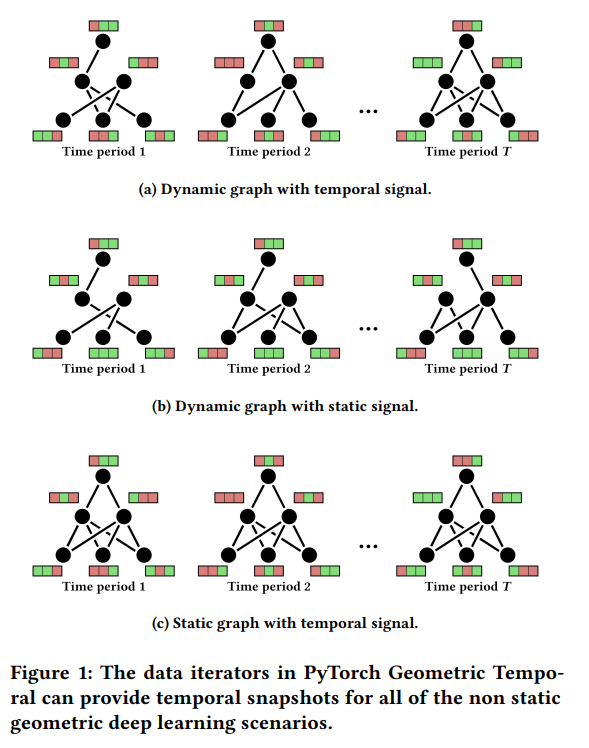

# Thursday, May 11, 2023

## GraphSAGE

- original paper
  - Hamilton, W.L., Ying, R., Leskovec, J. (2018)[^1]
- Code and Dataset
  -William L. Hamilton, Rex Ying, Jure Leskovec, NeurIPS 2017, [codes](https://paperswithcode.com/paper/inductive-representation-learning-on-large#code)
  - Protein-Protein Interactions (PPI)
    - Introduced by Hamilton et al. in Inductive Representation Learning on Large Graphs protein roles—in terms of their cellular functions from gene ontology—in various protein-protein interaction (PPI) graphs, with each graph corresponding to a different human tissue [41]. 
    - positional gene sets are used, motif gene sets and immunological signatures as features and **gene ontology sets** as labels (121 in total), collected from the Molecular Signatures Database [^34]. 
    - The average graph contains 2373 nodes, with an average degree of 28.8.

### Githubs

#### Stanford and official

- [SNAP](https://snap.stanford.edu/graphsage/)
- GraphSAGE is implemented in TensorFlow and can be easily integrated into other machine learning pipelines. Code and implementation details can be found on GitHub：[williamleif/GraphSAGE(2018)](https://github.com/williamleif/GraphSAGE)
  - note: python==**2.7** with **futures**==3.2.0
  - use local installation to reduce the usage of /opt

```bash
cd  ~/MyPrograms/
git clone https://github.com/williamleif/GraphSAGE.git
cd GraphSAGE
conda create -y -p ~/.conda/envs/GraphSAGE python=2.7
conda activate /home/kuang/.conda/envs/GraphSAGE
pip install --user -r requirements.txt
cd ~/MyPrograms/GraphSAGE/example_data
for i in $(ls toy*);do j=${i/toy-/}; echo ln -s $i $j;done
cd ../
./example_unsupervised.sh
./example_supervised.sh
```  

#### twjiang/graphSAGE-pytorch

A PyTorch implementation of GraphSAGE. This package contains a PyTorch implementation of GraphSAGE.
  - [Tianwen Jiang, Tong Zhao, Daheng Wang (2021)](https://github.com/twjiang/graphSAGE-pytorch)
    - python==3.6.8
    - pytorch==1.0.0
  - using
    - pubmed-data
    -  Cora dataset (www.research.whizbang.com/data).
  - University of Notre Dame

#### part of Stellar Graphics

[stellargraph(2021)](https://github.com/stellargraph/stellargraph)
  - Contributors 32
  - by Dr Pantelis Elinas and colegues, The University of Sydney · Centre for Waves and Complex Systems

### Sayeed CMAS ppt

- Sayeed CMAS [2020 ppt](https://www.cmascenter.org/conference/2020/slides/yunsoo_choi_uh_novel-cmaq-cnn-2020.pdf)

  
  
  
  
  

### Youtube explain of graphSAGE
- [Aleksa Gordić - The AI Epiphany(2021)](https://www.youtube.com/watch?v=vinQCnizqDA)

### Articles

1. GraphSAGE for Classification in Python
  - GraphSAGE is an inductive graph neural network capable of representing and classifying previously unseen nodes with high accuracy
   - [Anton Ruberts@Well Enough(2021)](https://antonsruberts.github.io/graph/graphsage/)

2. GraphSAGE: Scaling up Graph Neural Networks, Introduction to GraphSAGE with PyTorch Geometric, by Maxime Labonne(2022)
Towards Data Science, Published in Towards Data Science, Apr 21, [2022](https://towardsdatascience.com/introduction-to-graphsage-in-python-a9e7f9ecf9d7)


3. neo4j docs graphSAGE
  - [ beta tier](https://neo4j.com/docs/graph-data-science/current/machine-learning/node-embeddings/graph-sage/)

4. **An Intuitive Explanation of GraphSAGE** by 
[Rıza Özçelik(2019)](https://towardsdatascience.com/an-intuitive-explanation-of-graphsage-6df9437ee64f)
  - DeepWalk is a transductive algorithm, meaning that, it needs the whole graph to be available to learn the embedding of a node. Thus, when a new node is added to existing ones, it needs to be rerun to generate an embedding for the newcomer.


5. OhMyGraphs: GraphSAGE and inductive representation learning, by [Nabila Abraham(2020)](https://medium.com/analytics-vidhya/ohmygraphs-graphsage-and-inductive-representation-learning-ea26d2835331)


6. 

## networkx

all data into SAGE must be networkx json files.
[network@github](https://github.com/networkx/networkx)
  - [tutorial](https://networkx.org/documentation/latest/tutorial.html)
  - [Delaunay graphs from geographic points](https://networkx.org/documentation/latest/auto_examples/geospatial/plot_delaunay.html#sphx-glr-auto-examples-geospatial-plot-delaunay-py)


### json output for d3.js

- auto-matrix 
  - [Les Misérables Co-occurrence](https://bost.ocks.org/mike/miserables/)
  - [vaga: Reorderable Matrix](https://vega.github.io/vega/examples/reorderable-matrix/)
- [dependencies tree](https://cs.stanford.edu/people/mbostock/iv/dependency-tree.html)
  - [mbostock(2010)](https://github.com/mbostock/dependency-tree)
  
- [Radial Tree](https://vega.github.io/vega/examples/radial-tree-layout/)

[^1]: Hamilton, W.L., Ying, R., Leskovec, J. (2018). Inductive Representation Learning on Large Graphs. [doi](https://doi.org/10.48550/arXiv.1706.02216)

### muitiple graph

[Making dynamic graphs in python's Networkx](https://stackoverflow.com/questions/34646956/making-dynamic-graphs-in-pythons-networkx)

### 2d array

Convert 2d array to a graph with nodes and edges
How to create a networkx Graph using 2D np array as input：[stackoverflow](https://stackoverflow.com/questions/61280483/how-to-create-a-networkx-graph-using-2d-np-array-as-input)
- [from_numpy_array](https://networkx.org/documentation/stable/reference/generated/networkx.convert_matrix.from_numpy_array.html)(A, **parallel_edges**=False, **create_using**=None)
  - Returns a graph from a 2D NumPy array.
  - The 2D NumPy array is interpreted as an *adjacency* matrix for the graph.
  - A：a 2D numpy.ndarray, An *adjacency* matrix representation of a graph
  - **parallel_edges**: Boolean
    - If this is True, create_using is a *multigraph*, and A is an integer array, then entry (i, j) in the array is interpreted as the number of parallel edges joining vertices i and j in the graph.
    - If it is False, then the entries in the array are interpreted as the weight of a single edge joining the vertices.
    - create_using
      - NetworkX graph constructor, optional (default=nx.Graph)
      - Graph type to create. If graph instance, then cleared before populated.

## Spatio-Temporal Graph

### BGGRU

Bayesian GraphSAGE for the spatial dimension, BGraphGRU(gated recurrent unit[^5]) for the temporal dimension, BGGRU combine both.
Jin, X.-B., Wang, Z.-Y., Kong, J.-L., Bai, Y.-T., Su, T.-L., Ma, H.-J., Chakrabarti, P. (2023). Deep Spatio-Temporal Graph Network with Self-Optimization for Air Quality Prediction. Entropy 25, 247. [doi](https://doi.org/10.3390/e25020247)


### Paris Streets

(Costes et al., 2015)[^2]

S/T nodes

S/T edges


### gernal survey

Zahraa Al Sahili and Mariette Awad(2023)[^3]


(Ren et al., 2020)[^4]


[^2]: Costes, B., Perret, J., Bucher, B., Maurizio, G. (2015). **An aggregated graph to qualify historical spatial networks using temporal patterns detection.**
[^3]: Zahraa Al Sahili, Mariette Awad (2023). **Spatio-Temporal Graph Neural Networks: A Survey.** arxiv 2301/2301.10569.
[^4]: Ren, X., Li, X., Ren, K., Song, J., Xu, Z., Deng, K., Wang, X. (2020). **Deep Learning-Based Weather Prediction: A Survey.** Big Data Research 23, 100178. [doi](https://doi.org/10.1016/j.bdr.2020.100178)
[^5]: Pan, C., Tan, J., Feng, D. (2021). **Prediction intervals estimation of solar generation based on gated recurrent unit and kernel density estimation.** Neurocomputing 453, 552–562. [doi](https://doi.org/10.1016/j.neucom.2020.10.027)

## pytorch_geometric_temporal

 Stars: 2070
 Forks: 299
 Open issues: 31
 Open PRs: 1
  Released: Sep 5, 2022
  benedekrozemberczki
Benedek Rozemberczki
Machine Learning Research Scientist at @isomorphiclabs | PhD from The University of Edinburgh.

### typical Iterations



### py39/py37

- torch-geometric-temporal 0.54.0 ([pypi](https://pypi.org/project/torch-geometric-temporal/))
- [github](https://github.com/benedekrozemberczki/pytorch_geometric_temporal)
- 
- py39 is NG

```bash
xarray 2023.4.2 requires pandas>=1.4, 
torch-geometric-temporal 0.54.0 requires pandas<=1.3.5
```

- py37.12 is OK

### exam_Loaders

dataset|type
-|-
ChickenpoxDatasetLoader|StaticGraphTemporalSignal
MTMDatasetLoader|StaticGraphTemporalSignal
PedalMeDatasetLoader|StaticGraphTemporalSignal
wikimath,windmillsmall/medium/large|StaticGraphTemporalSignal
DynamicGraphTemporalSignal|DynamicGraphTemporalSignal
TwitterTennisDatasetLoader|DynamicGraphTemporalSignal

```bash
        import networkx as nx
        G = nx.Graph()

        self.lags = lags
        self._get_edges()
        self._get_edge_weights()
        self._get_targets_and_features()
        dataset = StaticGraphTemporalSignal(
            self._edges, self._edge_weights, self.features, self.targets
        )
        n=dataset.snapshot_count
        G.add_nodes_from([i for i in range(n)])
        G.add_edges_from(self._edges)
        G.add_weighted_edges_from(self._edge_weights)
        return dataset
```

### MontevideoBusDataset

```python
def test_montevideobus():
    loader = MontevideoBusDatasetLoader()
    dataset = loader.get_dataset()
    for epoch in range(1):
        for snapshot in dataset: #total 740 frames for each hr in a month
            assert snapshot.edge_index.shape == (2, 690) # num. of edges
            assert snapshot.edge_attr.shape == (690,)
            assert snapshot.x.shape == (675, 4) #spatial units, features, and lags of 4
            assert snapshot.y.shape == (675,) #targets`:w
```

item|meaning|MontevideoBusDatasetLoader case
-|-|-
snapshot_count|number of time frame|740
t|maybe start time|0
targets|y in model|total 740(hr)X675(stop)
features|x in model|total 740(hr)X675(stop)X4(lags)
edge_index|start and stop #|2(str/stp)X690(connects)
len(set(dataset.edge_index[:][0/1]))|number of distict stops|666~668
edge_weight|from 23.8 to 1991.3, maybe distance between|690(connections)
additional_feature_keys|(empty)|(empty)

### StaticGraphTemporalSignal

class **StaticGraphTemporalSignal**(
  edge_index: Optional[numpy.ndarray], 
  edge_weight: Optional[numpy.ndarray], 
  features: Sequence[Optional[numpy.ndarray], 
  targets: Sequence[Optional[numpy.ndarray], 
  **kwargs: Sequence[numpy.ndarray])[source](https://pytorch-geometric-temporal.readthedocs.io/en/latest/_modules/torch_geometric_temporal/signal/static_graph_temporal_signal.html#StaticGraphTemporalSignal)

- A data iterator object to contain a static graph with a dynamically changing constant time difference temporal feature set (multiple signals).
  - The node labels (target) are also temporal. 
  - The iterator returns a single constant time difference temporal snapshot for a time period (e.g. day or week). 
  - This single temporal snapshot is a [Pytorch Geometric]() Data object. 
  - Between two temporal snapshots the features and optionally passed attributes might change. However, the underlying graph is the same.
Parameters
  - edge_index (Numpy array) – Index tensor of edges.
  - edge_weight (Numpy array) – Edge weight tensor.
  - features (Sequence of Numpy arrays) – Sequence of node feature tensors.
  - targets (Sequence of Numpy arrays) – Sequence of node label (target) tensors.
  - **kwargs (optional Sequence of Numpy arrays) – Sequence of additional attributes.

## torch-geometric 2.3.1

Graph Neural Network Library for PyTorch ([PyG](https://pypi.org/project/torch-geometric/))
 Stars: 17629
 Forks: 3226 
 till 2023
Contributors 403@standford

## Gap_Filling

[satellite-image-deep-learning/techniques](https://github.com/satellite-image-deep-learning/techniques)

### zindi solutions

[zindi](https://zindi.medium.com/zindi-solutions-a-useful-open-source-model-of-urban-air-quality-for-africa-709a5b15f107)