# Thursday, May 11, 2023

## GraphSAGE

- original paper
  - Hamilton, W.L., Ying, R., Leskovec, J. (2018)[^1]
- Code and Dataset
  -William L. Hamilton, Rex Ying, Jure Leskovec, NeurIPS 2017, [codes](https://paperswithcode.com/paper/inductive-representation-learning-on-large#code)
  - Protein-Protein Interactions (PPI)
    - Introduced by Hamilton et al. in Inductive Representation Learning on Large Graphs protein roles—in terms of their cellular functions from gene ontology—in various protein-protein interaction (PPI) graphs, with each graph corresponding to a different human tissue [41]. 
    - positional gene sets are used, motif gene sets and immunological signatures as features and **gene ontology sets** as labels (121 in total), collected from the Molecular Signatures Database [^34]. 
    - The average graph contains 2373 nodes, with an average degree of 28.8.

### Githubs

#### Stanford and official

- [SNAP](https://snap.stanford.edu/graphsage/)
- GraphSAGE is implemented in TensorFlow and can be easily integrated into other machine learning pipelines. Code and implementation details can be found on GitHub：[williamleif/GraphSAGE(2018)](https://github.com/williamleif/GraphSAGE)
  - note: python==**2.7** with **futures**==3.2.0
  - use local installation to reduce the usage of /opt

```bash
cd  ~/MyPrograms/
git clone https://github.com/williamleif/GraphSAGE.git
cd GraphSAGE
conda create -y -p ~/.conda/envs/GraphSAGE python=2.7
conda activate /home/kuang/.conda/envs/GraphSAGE
pip install --user -r requirements.txt
cd ~/MyPrograms/GraphSAGE/example_data
for i in $(ls toy*);do j=${i/toy-/}; echo ln -s $i $j;done
cd ../
./example_unsupervised.sh
./example_supervised.sh
```  

#### twjiang/graphSAGE-pytorch

A PyTorch implementation of GraphSAGE. This package contains a PyTorch implementation of GraphSAGE.
  - [Tianwen Jiang, Tong Zhao, Daheng Wang (2021)](https://github.com/twjiang/graphSAGE-pytorch)
    - python==3.6.8
    - pytorch==1.0.0
  - using
    - pubmed-data
    -  Cora dataset (www.research.whizbang.com/data).
  - University of Notre Dame

#### part of Stellar Graphics

[stellargraph(2021)](https://github.com/stellargraph/stellargraph)
  - Contributors 32
  - by Dr Pantelis Elinas and colegues, The University of Sydney · Centre for Waves and Complex Systems

### Sayeed CMAS ppt

- Sayeed CMAS [2020 ppt](https://www.cmascenter.org/conference/2020/slides/yunsoo_choi_uh_novel-cmaq-cnn-2020.pdf)

  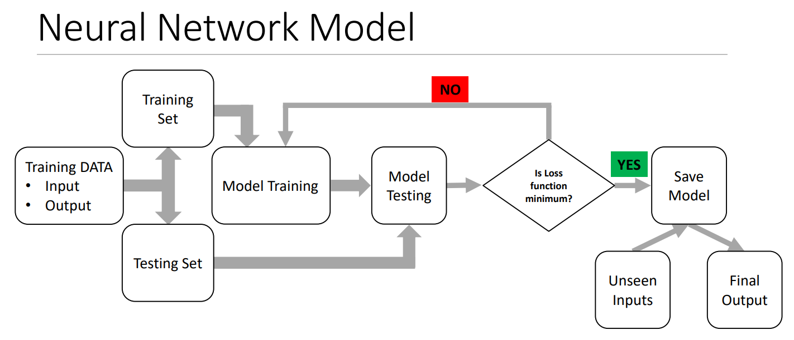
  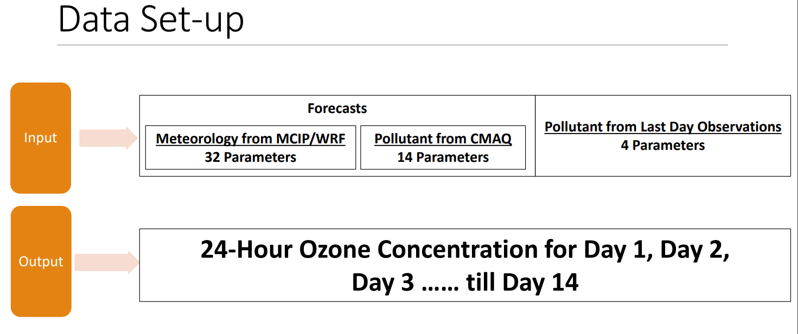
  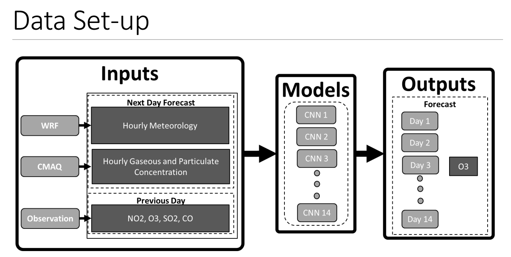
  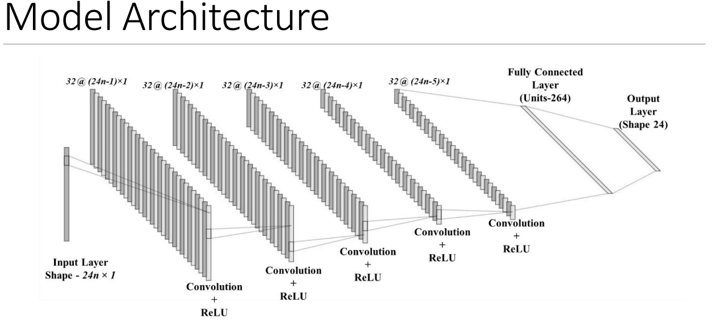
  

### Youtube explain of graphSAGE
- [Aleksa Gordić - The AI Epiphany(2021)](https://www.youtube.com/watch?v=vinQCnizqDA)

### Articles

1. GraphSAGE for Classification in Python
  - GraphSAGE is an inductive graph neural network capable of representing and classifying previously unseen nodes with high accuracy
   - [Anton Ruberts@Well Enough(2021)](https://antonsruberts.github.io/graph/graphsage/)
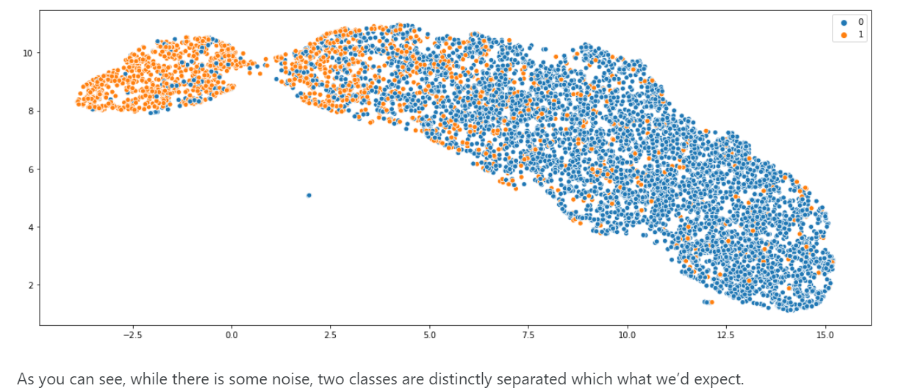
2. GraphSAGE: Scaling up Graph Neural Networks, Introduction to GraphSAGE with PyTorch Geometric, by Maxime Labonne(2022)
Towards Data Science, Published in Towards Data Science, Apr 21, [2022](https://towardsdatascience.com/introduction-to-graphsage-in-python-a9e7f9ecf9d7)


3. neo4j docs graphSAGE
  - [ beta tier](https://neo4j.com/docs/graph-data-science/current/machine-learning/node-embeddings/graph-sage/)

4. **An Intuitive Explanation of GraphSAGE** by 
[Rıza Özçelik(2019)](https://towardsdatascience.com/an-intuitive-explanation-of-graphsage-6df9437ee64f)
  - DeepWalk is a transductive algorithm, meaning that, it needs the whole graph to be available to learn the embedding of a node. Thus, when a new node is added to existing ones, it needs to be rerun to generate an embedding for the newcomer.


5. OhMyGraphs: GraphSAGE and inductive representation learning, by [Nabila Abraham(2020)](https://medium.com/analytics-vidhya/ohmygraphs-graphsage-and-inductive-representation-learning-ea26d2835331)


6. 

## networkx

all data into SAGE must be networkx json files.
[network@github](https://github.com/networkx/networkx)
  - [tutorial](https://networkx.org/documentation/latest/tutorial.html)
  - [Delaunay graphs from geographic points](https://networkx.org/documentation/latest/auto_examples/geospatial/plot_delaunay.html#sphx-glr-auto-examples-geospatial-plot-delaunay-py)


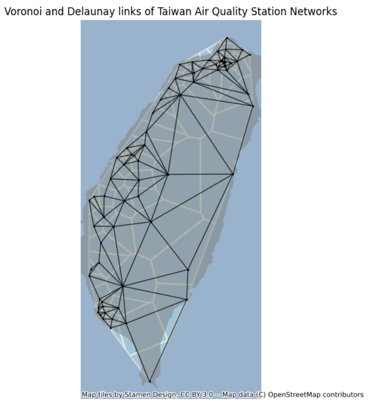

### json output for d3.js

- auto-matrix 
  - [Les Misérables Co-occurrence](https://bost.ocks.org/mike/miserables/)
  - [vaga: Reorderable Matrix](https://vega.github.io/vega/examples/reorderable-matrix/)
- [dependencies tree](https://cs.stanford.edu/people/mbostock/iv/dependency-tree.html)
  - [mbostock(2010)](https://github.com/mbostock/dependency-tree)
  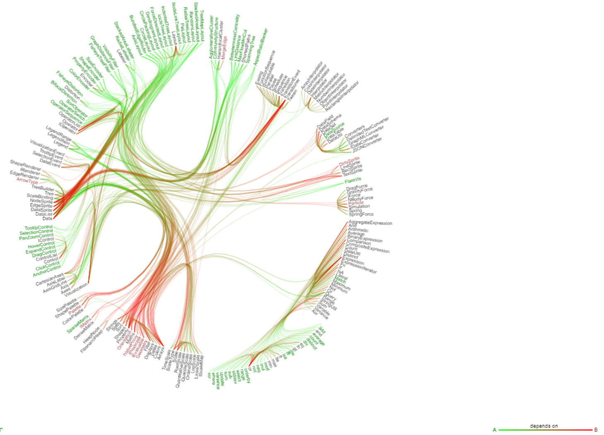
- [Radial Tree](https://vega.github.io/vega/examples/radial-tree-layout/)

[^1]: Hamilton, W.L., Ying, R., Leskovec, J. (2018). Inductive Representation Learning on Large Graphs. [doi](https://doi.org/10.48550/arXiv.1706.02216)

## Spatio-Temporal Graph

### BGGRU

Bayesian GraphSAGE for the spatial dimension, BGraphGRU(gated recurrent unit[^5]) for the temporal dimension, BGGRU combine both.
Jin, X.-B., Wang, Z.-Y., Kong, J.-L., Bai, Y.-T., Su, T.-L., Ma, H.-J., Chakrabarti, P. (2023). Deep Spatio-Temporal Graph Network with Self-Optimization for Air Quality Prediction. Entropy 25, 247. [doi](https://doi.org/10.3390/e25020247)


### Paris Streets

(Costes et al., 2015)[^2]

S/T nodes
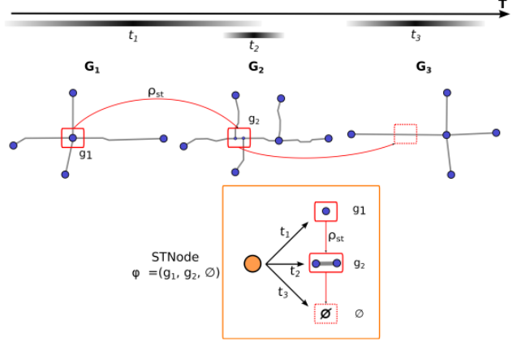
S/T edges
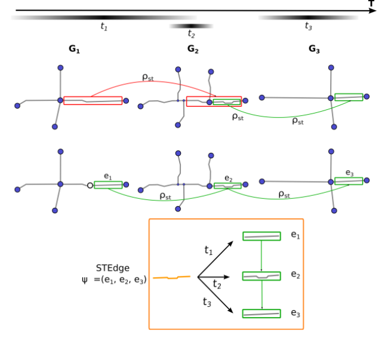

### gernal survey

Zahraa Al Sahili and Mariette Awad(2023)[^3]

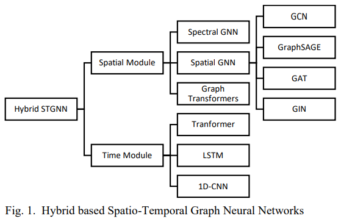

(Ren et al., 2020)[^4]

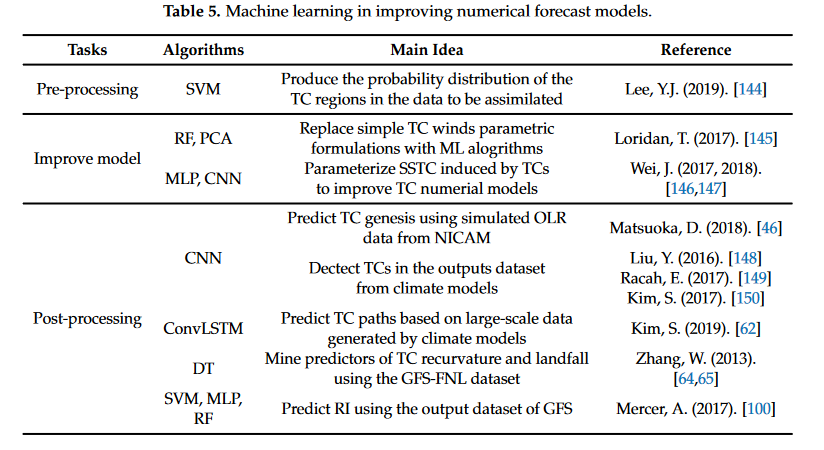

[^2]: Costes, B., Perret, J., Bucher, B., Maurizio, G. (2015). **An aggregated graph to qualify historical spatial networks using temporal patterns detection.**
[^3]: Zahraa Al Sahili, Mariette Awad (2023). **Spatio-Temporal Graph Neural Networks: A Survey.** arxiv 2301/2301.10569.
[^4]: Ren, X., Li, X., Ren, K., Song, J., Xu, Z., Deng, K., Wang, X. (2020). **Deep Learning-Based Weather Prediction: A Survey.** Big Data Research 23, 100178. [doi](https://doi.org/10.1016/j.bdr.2020.100178)
[^5]: Pan, C., Tan, J., Feng, D. (2021). **Prediction intervals estimation of solar generation based on gated recurrent unit and kernel density estimation.** Neurocomputing 453, 552–562. [doi](https://doi.org/10.1016/j.neucom.2020.10.027)
