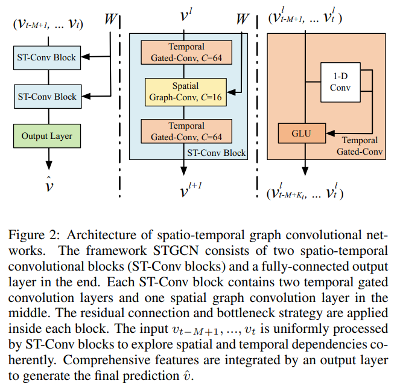

# Tuesday, May 16, 2023

## Extremely Randomized Trees

- Geurts, P., Ernst, D., & Wehenkel, L. (2006). Extremely randomized trees. Machine learning, 63(1), 3–42.

### Jurnal papers

1. Huang C., Chen B., Ma C., Wang T. (2018). WRF-CMAQ-MOS studies based on extremely randomized trees. qxxb 76, 779–789. [doi](https://doi.org/10.11676/qxxb2018.036)
  > 为了提高CMAQ空气质量模型的预报精度，基于多元线性回归方法，引入了结合WRF气象要素的CMAQ-MOS模型，通过试验发现其优化效果一般，主要原因是多元线性回归方法限制了结合WRF气象要素的CMAQ-MOS模型的发挥。为了提升模型优化效果，选取极端随机树方法和梯度提升回归树方法，对结合WRF气象要素的CMAQ-MOS模型进行改进，通过试验发现，**相对梯度提升回归树**方法，极**端随机树**方法的改进效果更为显著。

  > 采用极端随机树方法，并结合WRF预报气象要素的CMAQ-MOS模型在徐州地区进行2016年1-3月的模拟应用试验。结果表明，针对空气质量指数及六大污染物逐时预报，与未经优化的CMAQ模型相比，采用**极端随机树**方法并结合WRF预报气象要素的CMAQ-MOS模型在相关系数、均方根误差、平均相对误差、平均相对偏差方面都有较为明显的优化效果，NO2及O3两种污染物优化效果最为明显，其原因可能是O3、NO2与MOS模型引入的温度气象要素的相关性较高，这是因为温度的变化往往与太阳辐射的变化相关，而太阳辐射的变化会导致O3光化学反应速率的变化。与此同时，NO2和O3的化学耦合较强，O3浓度的变化会导致NO2浓度也发生变化，因此MOS模型针对NO2及O3两种污染物优化效果最为明显。

  > 综上所述，采用极端随机树方法并结合WRF预报气象要素的CMAQ-MOS模型预报准确度得到较大的提升，未来可以投入实际业务应用。

  > 此外，采用极端随机树方法并结合WRF预报气象要素的CMAQ-MOS模型仍存在有一定的局限性，有待进一步改进，主要包括以下两个方面：
    (1)本方法优化的仅为**点位数据**，并不能完成对整个预报场的优化；
    (2)本方法针对空气质量模型预报较差时优化效果较好，但针对空气质量模型预报较好时优化效果并不明显。

### Articles

#### Random Forest vs. Extremely Randomized Trees

by [Emmanuella Budu(2023)](https://www.baeldung.com/cs/random-forest-vs-extremely-randomized-trees)

#### 極限隨機樹分類

by 劉智皓 (Chih-Hao Liu, tomohiroliu22) May 20, [2021](https://tomohiroliu22.medium.com/機器學習-學習筆記系列-38-極限隨機樹分類-extremely-randomized-trees-classifier-1fd3d8e31634)
> 我們可以看到運用Ensemble Learning的方式，其訓練集和測試集的表現都比使用單一個Decision Tree來得好。而我們可以特別注意Extra Tree的執行時間，因為其式隨機挑選分割線，所以其執行時間比Random Forest的一半還要少。

[tomohiroliu22/Machine-Learning-Algorithm](https://github.com/tomohiroliu22/Machine-Learning-Algorithm/tree/main)
極限隨機樹分類(Extremely Randomized Trees Classifier).[ipynb]()

## STGNN/STGCN

### Spatio-Temporal Graph Training Network

forecast the traffic by Spatio-temporal Graph Convolutional Networks, by [MindSpore 2022](https://www.mindspore.cn/graphlearning/docs/en/master/spatio_temporal_graph_training_STGCN.html)
paper: Yu, B., Yin, H., Zhu, Z. (2018). **Spatio-Temporal Graph Convolutional Networks: A Deep Learning Framework for Traffic Forecasting**, in: Proceedings of the Twenty-Seventh International Joint Conference on Artificial Intelligence, pp. 3634–3640. [doi](https://doi.org/10.24963/ijcai.2018/505)

( gated linear units (GLU))

> There are several recent deep learning studies that are also motivated by the graph convolution in spatio-temporal tasks.
 
> Seo et al. [2016][^1] introduced graph convolutional recurrent network (**GCRN**) to identify jointly spatial structures and dynamic variation from structured sequences of data. The key challenge of this study is to determine the optimal combinations of recurrent networks and graph convolution under specific settings. 

> Based on principles above, Li et al. [2018] [^2]successfully employed the gated recurrent units (**GRU**) with graph convolution for long-term traffic forecasting. In contrast to these works, we build up our model completely from convolutional structures; The ST-Conv block is specially designed to uniformly process structured data with residual connection and bottleneck strategy inside; More efficient graph convolution kernels are employed in our model as well.

### Cambridge Unv. Book

Applying Graph Theory in Ecological Research, [10 - Spatio-temporal Graphs](https://www.cambridge.org/core/books/abs/applying-graph-theory-in-ecological-research/spatiotemporal-graphs/ED048111EDD5E344DC897C7D305069A5), Published online by Cambridge University Press:  31 October 2017.

### GCN youtube

- Graph Neural Networks - a perspective from the ground up by [Alex Foo(2022)](https://www.youtube.com/watch?v=GXhBEj1ZtE8)

[^1]: This paper introduces Graph Convolutional Recurrent Network (**GCRN**), a deep learning model able to predict structured sequences of data. Precisely, **GCRN** is a generalization of classical recurrent neural networks (RNN) to data structured by an arbitrary graph. The structured sequences can represent series of frames in videos, spatio-temporal measurements on a network of sensors, or random walks on a vocabulary graph for natural language modeling. The proposed model combines convolutional neural networks (CNN) on graphs to identify spatial structures and RNN to find dynamic patterns. We study two possible architectures of **GCRN**, and apply the models to two practical problems: predicting moving MNIST data, and modeling natural language with the Penn Treebank dataset. Experiments show that exploiting simultaneously graph spatial and dynamic information about data can improve both precision and learning speed. *Seo, Y., Defferrard, M., Vandergheynst, P., Bresson, X.* (2018). **Structured Sequence Modeling with Graph Convolutional Recurrent Networks**, in: Cheng, L., Leung, A.C.S., Ozawa, S. (Eds.), Neural Information Processing, Springer International Publishing, Cham, pp. 362–373. [doi](https://doi.org/10.1007/978-3-030-04167-0_33)

[^2]: Spatiotemporal forecasting has various applications in neuroscience, climate and transportation domain. Traffic forecasting is one canonical example of such learning task. The task is challenging due to (1) complex spatial dependency on road networks, (2) non-linear temporal dynamics with changing road conditions and (3) inherent difficulty of long-term forecasting. To address these challenges, we propose to model the traffic flow as a *diffusion process* on a directed graph and introduce Diffusion Convolutional Recurrent Neural Network (**DCRNN**), a deep learning framework for traffic forecasting that incorporates both spatial and temporal dependency in the traffic flow. Specifically, DCRNN captures the spatial dependency using bidirectional random walks on the graph, and the temporal dependency using the encoder-decoder architecture with scheduled sampling. We evaluate the framework on two real-world large scale road network traffic datasets and observe consistent improvement of 12% - 15% over state-of-the-art baselines. *Li, Y., Yu, R., Shahabi, C., Liu, Y.* (2018). **Diffusion Convolutional Recurrent Neural Network: Data-Driven Traffic Forecasting.** [doi](https://doi.org/10.48550/arXiv.1707.01926)

