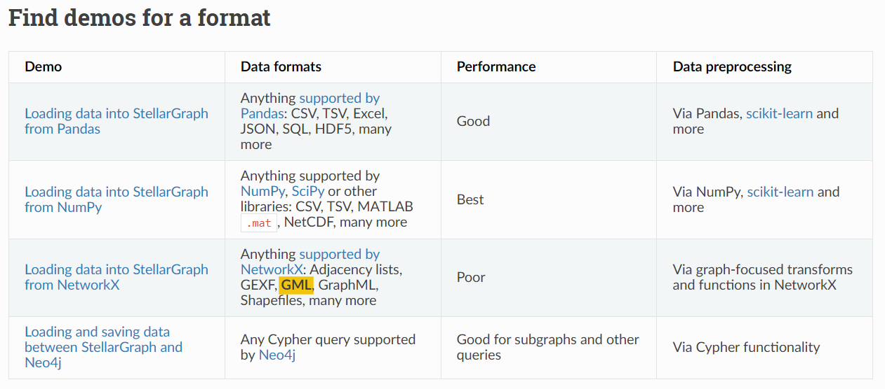

# Thursday, May 18, 2023

## Forecasting using spatio-temporal data with combined Graph Convolution + LSTM model

[stellargraph.readthedocs.io](https://stellargraph.readthedocs.io/en/stable/demos/time-series/gcn-lstm-time-series.html)

To address these challenges, here we explore a neural network architecture that learns from both the **spatial road network data** and **time-series of historical speed changes** to forecast speeds on road segments at a future time. 
In the following we demo how to forecast speeds on road segments through a graph convolution and LSTM hybrid model. 
  - The spatial dependency of the road networks are learnt through **multiple graph convolution layers** stacked over **multiple LSTM**, sequence to sequence model, 
  - layers that leverage the historical speeds on top of the network structure to predicts speeds in the future for each entity.

## beginner’s guide

Published on January 26, 2022
In Mystery Vault
A beginner’s guide to Spatio-Temporal graph neural networks, [ Yugesh Verma(2022)](https://analyticsindiamag.com/a-beginners-guide-to-spatio-temporal-graph-neural-networks/)

## stallar jobs

### Node representation learning with Deep Graph Infomax

[cora with regression](https://stellargraph.readthedocs.io/en/stable/demos/embeddings/deep-graph-infomax-embeddings.html?highlight=REGRESSION)

```python
dir(dataset)='base_directory', 'data_directory', 'data_subdirectory_name', 'description', 'directory_name',
 'download', 'expected_files', 'load', 'name', 'source', 'url', 'url_archive_contains_directory', 'url_archive_format']

Gfcn=['check_graph_for_ml', 'connected_components', 'create_graph_schema', 'edge_arrays',
 'edge_feature_shapes', 'edge_feature_sizes', 'edge_features', 'edge_type_ilocs_to_names',
 'edge_type_names_to_ilocs', 'edge_types', 'edges', 'from_networkx', 'has_node',
 'in_node_arrays', 'in_nodes', 'info', 'is_directed', 'neighbor_arrays', 'neighbors',
 'node_degrees', 'node_feature_shapes', 'node_feature_sizes', 'node_features', 'node_ids_to_ilocs',
 'node_ilocs_to_ids', 'node_type', 'node_type_ilocs_to_names', 'node_type_names_to_ilocs',
 'node_types', 'nodes', 'nodes_of_type', 'number_of_edges', 'number_of_nodes', 'out_node_arrays',
 'out_nodes', 'subgraph', 'to_adjacency_matrix', 'to_networkx', 'unique_edge_type',
 'unique_node_type']
```

**stellargraph Graph not compatable with networkx**



[lstm_layer_sizes](https://stackoverflow.com/questions/54903999/understanding-lstms-layers-data-dimensions)
  - 23 timeframe
  - 178 features(nodes)
  - batch size is simple the number of samples (out of the 2900) that will be used for a training / test / prediction run.


```python
from keras.models import Sequential
from keras.layers import Dense, LSTM


model = Sequential()
model.add(LSTM(64, input_shape=(23,178)))
model.compile(loss='mse', optimizer='sgd')
model.summary()

print model.input
```

This is just a simplistic model that outputs a single **64**-wide vector for each sample. You will see that the expected model.input is:

```
Tensor("lstm_3_input:0", shape=(?, 23, 178), dtype=float32)
The batch_size is unset in the input shape which means that the model can be used to train / predict batches of different sizes.
```

[Source code for stellargraph.layer.gcn_lstm
]((https://stellargraph.readthedocs.io/en/latest/_modules/stellargraph/layer/gcn_lstm.html))
- gc_layer_sizes (list of int): Output sizes of Graph Convolution  layers in the stack.
  - seq_len=10, pred_len=12 -> gc_layer_sizes=[16,10]
- lstm_layer_sizes (list of int): Output sizes of LSTM layers in the stack.

### CGN 之層數

> 在設計卷積神經網絡（CNN）時，關於卷積層的數量和配置，有一些基本的設定原則可以參考。以下是一些常見的指導原則：

> 深度逐漸增加：一般而言，隨著網絡向前傳遞，卷積神經網絡的深度應該逐漸增加。這是因為在深層網絡中，每一層都可以學習到更高層次的特徵表示。然而，深度增加也會增加計算成本和訓練時間，因此需要在深度和性能之間找到平衡。

> 金字塔結構：通常，在設計CNN時，可以使用金字塔結構，即從較大的特徵圖開始，逐漸遞減到較小的特徵圖。這種設計可以幫助網絡在不同尺度上捕獲圖像的特徵，從而提高對不同尺度物體的識別能力。

> 深度可變性：CNN的深度可以根據任務的複雜性和數據集的特徵來進行調整。對於較簡單的任務或較小的數據集，較少的卷積層可能已經足夠；而對於更複雜的任務或更大的數據集，可能需要更深的網絡來提取更高級的特徵。

> 資源限制：在設計CNN時，還需要考慮可用的計算資源。較深的網絡通常需要更多的計算資源（例如GPU記憶體和計算能力），因此在資源有限的情況下，需要根據實際情況來決定網絡的深度。

> 經驗和調參：設計CNN的過程也涉及一些經驗和參數調整。根據先前的研究和相關任務的經驗，可以參考一些成功的CNN架構（例如VGG、ResNet、Inception等），並根據實際情況進行調整和改進。

> 需要注意的是，CNN的架構設計是一個具有挑戰性的任務

### GCN 層數

> 在設定Graph Convolutional Network（GCN）的層數時，有幾個原則可以考慮：

> 網絡複雜度和資料集大小：較簡單的問題和小型資料集通常只需要較少的層數，而複雜的問題和大型資料集可能需要更深的網絡。這是為了捕捉更高階的特徵和更複雜的關係。

> 避免過度擬合：添加過多的層可能會導致模型過度擬合訓練數據，使其在新數據上的泛化能力下降。因此，需要在設定層數時注意避免過度擬合的問題。

> 資料集的圖形結構：考慮資料集的圖形結構以及問題的複雜性。如果圖形結構較簡單且問題相對簡單，較少的層數可能已經足夠。但如果圖形結構較複雜且問題需要更深入的特徵抽取，則可能需要更多的層數。

> 網絡層的反饋：設計GCN時，可以使用交叉驗證或其他評估方法來評估不同層數的性能。觀察模型在驗證集或測試集上的表現，並根據表現選擇最適合的層數。這可以通過遞增或減少層數，觀察性能的變化來實現。

> 總體而言，設置GCN的層數需要綜合考慮資料集的特性、問題的複雜性、**過度擬合**的風險以及模型的性能。這通常需要通過實驗和評估來找到最適合的層數設定。

### LSTM的層數設定原則

> LSTM（Long Short-Term Memory）是一種循環神經網絡（RNN）的變體，用於處理序列數據和時間序列問題。關於LSTM的層數設定，以下是一些常見的原則：

> 複雜性與資料量：層數的設定應該考慮到數據的複雜性和可用的訓練資料量。較簡單的問題和小數據集通常可以使用較少的層數，而較複雜的問題和大數據集可能需要更多的層數來擁有更強的建模能力。

> 避免過度擬合：過多的層數可能導致模型過度擬合訓練數據，而無法很好地泛化到新的數據。因此，在設定層數時需要注意適當的模型容量，避免過度擬合的情況發生。

> 堆疊多個LSTM層：LSTM模型可以由多個LSTM層堆疊而成，每一層都可以擁有自己的隱藏狀態和記憶單元。增加層數可以增加模型的表示能力和學習能力，但同時也增加了計算成本和過度擬合的風險。

> 梯度消失和梯度爆炸：LSTM模型在訓練過程中容易遇到梯度消失和梯度爆炸的問題，這對於較深的模型尤為突出。因此，在設定層數時需要注意這些問題，可以通過使用適當的初始化方法、激活函數和正規化技術來緩解這些問題。

> 總的來說，LSTM的層數設定需要考慮到數據的複雜性、可用的訓練資料量、過度擬合的風險、計算成本和梯度問題等因素。通常需要通過實驗和驗證集的評估來找到最適合的層數配置，以獲得良好的模型性能和泛化能力。

### 如何确定神经网络的层数和隐藏层神经元数量  

[呦呦鹿鸣](https://zhuanlan.zhihu.com/p/100419971)

```python
from pandas import *
df=read_csv('gridLL.csv')
import netCDF4
nc = netCDF4.Dataset("2019.nc",'r')
V=[list(filter(lambda x:nc[x].ndim==j, [i for i in nc.variables])) for j in [1,2,3,4]]
nt,nlay,nrow,ncol=nc.variables[V[3][0]].shape
V[3]
import numpy as np
for v in V[3]:
    if v in ['PM25_NH4','PM25_NO3','PM25_SO4',]:continue
    exec(v+'=np.array(nc["'+v+'"][:,0,:,:])')
pwd
from dtconvertor import dt2jul, jul2dt
ls *.py
pwd
from dtconvertor import dt2jul, jul2dt
ls *py
ls *py
from dtconvertor import dt2jul, jul2dt
dts=[jul2dt(nc.variables[v][t,0,:] for t in range(nt))]
dts=[jul2dt(nc.variables[v][t,0,:]) for t in range(nt)]
t
v='TFLAG'
dts=[jul2dt(nc.variables[v][t,0,:]) for t in range(nt)]
dts[:5]
flags=[dts[t].strftime("%Y%m%d%H") for t in range(nt)]
df.head()
dfvar=DataFrame()
[v for v in V[3] if v not in ['PM25_NH4','PM25_NO3','PM25_SO4',]]
col=[v for v in V[3] if v not in ['PM25_NH4','PM25_NO3','PM25_SO4',]]
var=[]
for v in col:
    exec('var.append('+v+')')
var={}
for v in col:
    exec('var.update({"'+v+'":'+v+'})')
for t in range(nt):
    df0=DataFrame({v:var[v][t,:,:].flatten() for v in col})
    df0['tflag']=tflags
    dfvar.append(df0,inplace=True,ignore_index=True)
for t in range(nt):
    df0=DataFrame({v:var[v][t,:,:].flatten() for v in col})
    df0['tflag']=flags
    dfvar=dfvar.append(df0,ignore_index=True)
t
for t in range(nt):
    df0=DataFrame({v:var[v][t,:,:].flatten() for v in col})
    df0['tflag']=flags[t]
    dfvar=dfvar.append(df0,ignore_index=True)
df.head()
dfvar=DataFrame()
for t in range(5):
    for v in col:
      df[v]=var[v][t,:,:].flatten()
    df['tflag']=flags[t]
    df0=pivot_table(df,index='TOWNCODE',values=['tflag']+col,aggfunc=np.mean).reset_index()
    dfvar=dfvar.append(df0,ignore_index=True)
dfvar=DataFrame()
for t in range(5):
    for v in col:
      df[v]=var[v][t,:,:].flatten()
    df['tflag']=flags[t]
    df0=pivot_table(df,index='TOWNCODE',values=['tflag']+col,aggfunc=np.mean).reset_index()
    dfvar=dfvar.append(df0,ignore_index=True)
t
len(df)
v
var[v][0,:,:].shape
df=read_csv('gridLL.csv')
len(df)
dfvar=DataFrame()
for t in range(5):
    for v in col:
      df[v]=var[v][t,:,:].flatten()
    df['tflag']=flags[t]
    df0=pivot_table(df,index='TOWNCODE',values=['tflag']+col,aggfunc=np.mean).reset_index()
    dfvar=dfvar.append(df0,ignore_index=True)
dfvar.head()
dfvar.tail()
df.head()
dfvar.tail()
dfvar=DataFrame()
for t in range(nt):
    for v in col:
      df[v]=var[v][t,:,:].flatten()
    df['tflag']=int(flags[t])
    df0=pivot_table(df,index='TOWNCODE',values=['tflag']+col,aggfunc=np.mean).reset_index()
    dfvar=dfvar.append(df0,ignore_index=True)
len(dfvar)
dfvar.tail()
n=3739
from scipy.io import FortranFile
fname=str(n)+'x'+str(n)+'.bin'
with FortranFile(fname, 'r') as f:
    d=f.read_record(dtype=np.float64)
d=d.reshape(n,n)
import geopandas as gpd
root='/nas2/cmaqruns/2022fcst/fusion/Voronoi/'
boundary=gpd.read_file(root+'boundary_shape.shp')
boundary_shape = boundary.geometry[0]
from shapely.geometry import Point
df.head()
pnts=[Point(lon,lat) for lon,lat in zip(df.LON,df.LAT)]
pnts[:5]
df.columns
df['ix']=np.array([[i for i in range(ncol)] for j in range(nrow)]).flatten()
df['iy']=np.array([[j for i in range(ncol)] for j in range(nrow)]).flatten()
c=['ix','iy']
df[c].tail()
df[c].head
name_inside=df.loc[df.geometry.map(lambda p:p.within(boundary_shape))]
df['geometry']=pnts
name_inside=df.loc[df.geometry.map(lambda p:p.within(boundary_shape))]
len(name_inside)
n
x1d=[nc.XORIG+nc.XCELL*(i+0.5) for i in range(ncol)]
y1d=[nc.YORIG+nc.YCELL*(i+0.5) for i in range(nrow)]
X,Y=np.meshgrid(x1d,y1d)
lons, lats= pnyc(X,Y, inverse=True)
from pyproj import Proj
pnyc = Proj(proj='lcc', datum='NAD83', lat_1=nc.P_ALP, lat_2=nc.P_BET,lat_0=nc.YCENT, lon_0=nc.XCENT, x_0=0, y_0=0.0)
x1d=[nc.XORIG+nc.XCELL*(i+0.5) for i in range(ncol)]
y1d=[nc.YORIG+nc.YCELL*(i+0.5) for i in range(nrow)]
X,Y=np.meshgrid(x1d,y1d)
lons, lats= pnyc(X,Y, inverse=True)
df.LAT=lats.flatten()
df.LON=lons.flatten()
pnts=[Point(lon,lat) for lon,lat in zip(df.LON,df.LAT)]
df['geometry']=pnts
name_inside=df.loc[df.geometry.map(lambda p:p.within(boundary_shape))]
len(name_inside)
n
name_inside.head()
d[:5,:5]
d.shape
df['IYIX']=[j*100+i for i,j in zip(df.ix,df.iy)]
name_inside['IYIX']=[j*100+i for i,j in zip(name_inside.ix,name_inside.iy)]
name_inside=name_inside.reset_index(drop=True)
name_inside['IYIX']=[j*100+i for i,j in zip(name_inside.ix,name_inside.iy)]
name_inside.head()
df.columns
'0' in set(name_inside.TOWNCODE)
df.TOWNCODE[:5]
df.TOWNCODE[-5:]
df.TOWNCODE.max()
0 in set(name_inside.TOWNCODE)
68000130 in set(name_inside.TOWNCODE)
len(set(name_inside.TOWNCODE))
len(set(df.TOWNCODE))
%history -f py.txt
```

