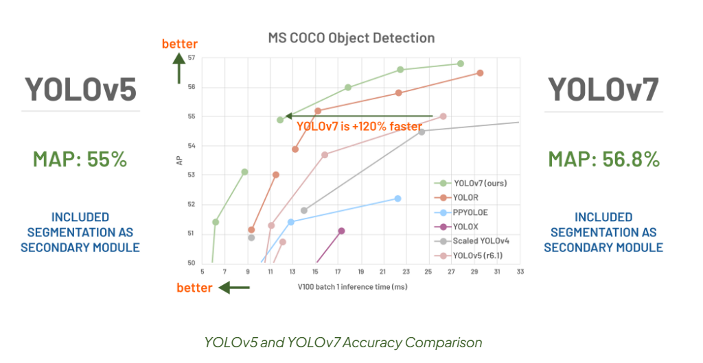
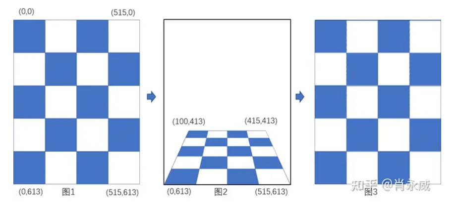
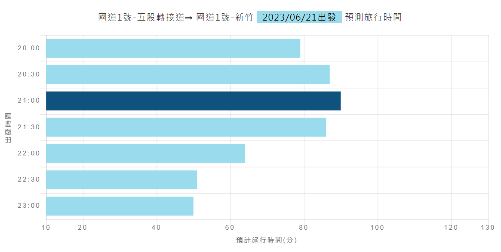
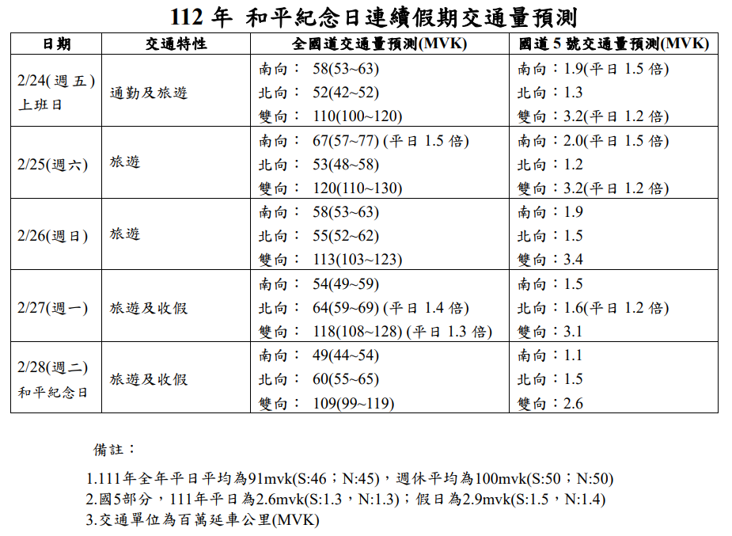

# Monday, June 5, 2023

## which version

### v8 (2023)

A Guide to the YOLO Family of Computer Vision Models, by [Dmitry Spodarets(2023)](https://dataphoenix.info/a-guide-to-the-yolo-family-of-computer-vision-models/)

### v5n6 (2022)

Performance Comparison of YOLO Object Detection Models – An Intensive Study, by [Sovit Rath and Vikas Gupta(2022)](https://learnopencv.com/performance-comparison-of-yolo-models)

- Performance comparison of YOLO models on the CPU.


### YOLOv7 permotion(2021)

YOLOv7 and YOLOv5 Comparison on Embedded Devices and Computer Systems, by [Muhammad Rizwan Munawar(2021)](https://www.cameralyze.co/blog/yolov7-and-yolov5-comparison-on-embedded-devices-and-computer-systems)



> The above results are with pre-trained models on the COCO dataset. So, you can see, YOLOv5 is faster than YOLOv7 in terms of speed on CPU and normal GPUs (I.e., Quadro P2200, Nvidia GTX 1650). But in general, YOLOv7 is faster than YOLOv5 on high-processing GPUs like (Tesla A100, Nvidia RTX 3090), etc.

```python

line = (cls, *xywh, conf) if save_conf else (cls, *xywh)
(tensorflow) [chouyc@DEVP 10:28 yolov7]$ for i in {0..9};do echo $i $(grep ^$i ./runs/detect/exp8/labels/test_1.txt|wc -l);done
0 3
1 1
2 13
3 1
4 0
5 4
6 0
7 6
8 0
9 0
names: ['person', 'bicycle', 'car', 'motorcycle', 'airplane', 'bus', 'train', 'truck', 'boat', 'traffic light',
        'fire hydrant', 'stop sign', 'parking meter', 'bench', 'bird', 'cat', 'dog', 'horse', 'sheep', 'cow',
        'elephant', 'bear', 'zebra', 'giraffe', 'backpack', 'umbrella', 'handbag', 'tie', 'suitcase', 'frisbee',
        'skis', 'snowboard', 'sports ball', 'kite', 'baseball bat', 'baseball glove', 'skateboard', 'surfboard',
        'tennis racket', 'bottle', 'wine glass', 'cup', 'fork', 'knife', 'spoon', 'bowl', 'banana', 'apple',
        'sandwich', 'orange', 'broccoli', 'carrot', 'hot dog', 'pizza', 'donut', 'cake', 'chair', 'couch',
        'potted plant', 'bed', 'dining table', 'toilet', 'tv', 'laptop', 'mouse', 'remote', 'keyboard', 'cell phone',
        'microwave', 'oven', 'toaster', 'sink', 'refrigerator', 'book', 'clock', 'vase', 'scissors', 'teddy bear',
        'hair drier', 'toothbrush'] 
```

- YOLOv7 Training on Custom Data? by [Muhammad Rizwan Munawar(2022)](https://medium.com/augmented-startups/yolov7-training-on-custom-data-b86d23e6623)

## MOT

### articals

- 初探物件追蹤 Multiple Object Tracking(MOT), by [CW Lin(2020)](https://peaceful0907.medium.com/初探物件追蹤-multiple-object-tracking-mot-4f1b42e959f9)

### fastMOT

FastMOT by [Yukai Yang(2022)](https://github.com/GeekAlexis/FastMOT)

### YOLOv8

- Real-time multi-object, segmentation and pose tracking using Yolov8 | Yolo-NAS | YOLOX with DeepOCSORT and LightMBN, by [Mikel Brostrom(2023)](https://github.com/mikel-brostrom/yolo_tracking)

```bash
kuang@DEVP /nas2/kuang/yolo_tracking
$ python examples/track.py --source $mp4 --yolo-model yolov8s.pt --classes 0 1 2 3 5 7 --save-txt --save
```

## moving speed

### YOLOv3

- vehicle-counting-and-speed-estimation-yolo-sort-python, by [Shubham Wani(2022)](https://github.com/bamwani/car-counting-and-speed-estimation-yolo-sort-python)

### 座標轉換

現YOLO得到物件不同時間的位置(xy,左上角原點)之後，再由openCV函數轉成正交平面，就可計算距離及速度了。轉換函數用法詳 <使用OpenCV透视变换实现坐标变换实践> [肖永威(2023)](https://zhuanlan.zhihu.com/p/599615858)



## Forecasting of Traffic volume

### Forecasting APP

高速公路局<高速公路1968>[行車時間預測-依最短路徑-請選擇起迄點](https://1968.freeway.gov.tw/tp_future)



call FWBase.js

### 預報單

[112 年 和平紀念日連續假期交通量預測(國道全日交通量預估)](https://www.freeway.gov.tw/Upload/Html/2023113288/inf/volume.pdf)



[112 年和平連假重點易壅塞路段](https://www.freeway.gov.tw/Upload/Html/2023113288/inf/jam.pdf)

約1個月前會公告連假車輛疏導計畫
> 2023-05-30 11:40:06 [112年端午節連假國道交通疏導措施](https://1968.freeway.gov.tw/n_whatsup/10533?order=2)

### pickup elements

- 日期、小時

```html
<div class="sel_block sel_block_50 sel_tp_node_row">
      <span class="mark_sec">時間</span>
      <div class="myselect sel_plan_date">
          <input type="text" id="tripFuturePickDate">
          <i class="fa fa-calendar"></i> 
          <!-- value="2023/06/07" -->
          <div class="caret"></div>
      </div>
      <div class="myselect sel_plan_gotime">
          <select id="tripFuturePickTime"><option value="">預計出發時間</option>
            <option value="00:00">00:00</option>
            <option value="00:30">00:30</option>
            <option value="23:30">23:30</option>
          </select>
          <i class="fa fa-clock-o"></i>
          <div class="caret"></div>
      </div>
  </div>
```
- 起點/終點

```html
<div class="sel_block sel_block_50 sel_tp_node_row">
<span class="mark_sec mark_sec_start">起點</span>
<div class="myselect sel_plan_highway">
<select id="freeway_from" onchange="onFreewaySelectorChange('from')"><option value="">請選擇國道</option><option value="1_0">國道1號</option><option value="N1H_0">國1高架</option><option value="2_0">國道2號</option><option value="3_0">國道3號</option><option value="N3A_0">國道3甲</option><option value="4_0">國道4號</option><option value="5_0">國道5號</option><option value="6_0">國道6號</option><option value="8_0">國道8號</option><option value="10_0">國道10號</option></select>
<div class="caret"></div>
</div>
<div class="myselect sel_plan_sec">
<select id="section_from" onchange="onLocationSelectorChange('from')"><option value="0001">基隆端</option><option value="0002">基隆</option><option value="0003">八堵</option><option value="0221">大華系統</option><option value="0004">五堵</option><option value="0006">汐止</option><option value="0007">汐止系統</option><option value="0008">高架汐止端</option><option value="0009">東湖</option><option value="0010">內湖</option><option value="0011">圓山</option><option value="0012">台北</option><option value="0013">三重</option><option value="0014">五股轉接道</option><option value="0015">五股</option><option value="0236">高公局</option><option value="0223">泰山轉接道</option><option value="0017">林口</option><option value="0018">桃園</option><option value="0019">機場系統</option><option value="0020">中壢服務區</option><option value="0021">內壢</option><option value="0224">中壢轉接一</option><option value="0226">中壢轉接二</option><option value="0022">中壢</option><option value="0023">平鎮系統</option><option value="0024">幼獅</option><option value="0025">楊梅</option><option value="0225">高架楊梅端</option><option value="0027">湖口</option><option value="0028">湖口服務區</option><option value="0030">竹北</option><option value="0031">新竹</option><option value="0032">新竹系統</option><option value="0033">頭份</option><option value="0234">頭屋</option><option value="0035">苗栗</option><option value="0233">銅鑼</option><option value="0036">三義</option><option value="0037">泰安服務區</option><option value="0038">后里</option><option value="0040">台中系統</option><option value="0041">豐原</option><option value="0042">大雅</option><option value="0043">台中</option><option value="0044">南屯</option><option value="0045">王田</option><option value="0046">彰化系統</option><option value="0047">彰化</option><option value="0048">埔鹽系統</option><option value="0049">員林</option><option value="0051">北斗</option><option value="0052">西螺服務區</option><option value="0053">西螺</option><option value="0231">虎尾</option><option value="0054">斗南</option><option value="0055">雲林系統</option><option value="0057">大林</option><option value="0222">民雄</option><option value="0058">嘉義</option><option value="0059">水上</option><option value="0060">嘉義系統</option><option value="0062">新營服務區</option><option value="0063">新營</option><option value="0219">下營系統</option><option value="0064">麻豆</option><option value="0065">安定</option><option value="0067">台南系統</option><option value="0068">永康</option><option value="0248">大灣</option><option value="0069">仁德</option><option value="0070">仁德系統</option><option value="0071">仁德服務區</option><option value="0072">路竹</option><option value="0218">高科</option><option value="0074">岡山</option><option value="0075">楠梓</option><option value="0076">鼎金系統</option><option value="0077">高雄</option><option value="0078">瑞隆路</option><option value="0079">五甲系統</option><option value="0080">五甲</option><option value="0081">中山四路</option><option value="0241">漁港路</option><option value="0242">高雄端</option></select>
<div class="caret"></div>
</div>
<button class="tp_node_btn button_primary btn_func_reverse" onclick="swapFromEndPanel('from', 'end')"></button>
</div>
```

- 立即規劃行程

```html
<button class="button_primary tripplan_btn" onclick="plan()">
  立即規劃行程
  <i class="fa fa-angle-double-right"></i>
</button>
```

- 路徑與時間(規劃結果)

```html
<div id="road_message" style="">
<div class="toggle_header _event_toggle_content">
<h1 class="normal use_plan_icon plan_icon_rst">路徑與時間</h1>
</div>
<div class="toggle_content">
<div class="plan_rst_box">
<div class="plan_rst_row" id="api_road"><span class="mark_sec mark_sec_start">起點</span><div class="plan_rst_col">    <div class="sec_double_wrapper">        <span class="mark mark_10010"></span>國道 1 號<br>        <span class="prst_sec">圓山</span>    </div></div><div class="plan_rst_col"><span class="dir_i dir_i_right"></span></div><span class="mark_sec mark_sec_end">終點</span><div class="plan_rst_col">    <div class="sec_double_wrapper">        <span class="mark mark_10010"></span>國道 1 號<br>        <span class="prst_sec">機場系統</span>    </div></div></div>
<div class="plan_rst_row">
<div class="prst_future_summary">
<span id="start_travel_date"></span><span>抵達</span>
</div>
</div>
<div class="plan_rst_row">
<div class="prst_summary_double">
<div class="prst_summary">
<span class="mark icon_prst_time"></span>預計旅行時間約：<span id="api_travel"><span class="prst_num">33</span>分</span>
</div>
<div class="prst_summary">
<span class="mark icon_prst_route"></span>預計經過交流道個數：<span class="prst_num" id="total_changes">8</span>個
</div>
<div class="prst_summary">
<span class="mark icon_prst_mile"></span>行程總里程：<span class="prst_num" id="total_km">29.3</span>km
</div>
</div>
<div class="prst_summary_double">
<div class="prst_summary mid-node-summary" style="display: none;">
查詢條件不包含中間點時，系統提供行程出發時間建議。
</div>
<div class="prst_summary node-summary">
<span class="mark icon_prst_time"></span>當日<b>最佳</b>出發時間：<span class="ps_time" id="best_time">2023-06-07 06:00:00</span>
</div>
<div class="prst_summary node-summary">
<span class="mark icon_prst_time"></span>當日<b>不建議</b>出發時間：<span class="ps_time" id="worst_time">2023-06-07 09:30:00</span>
</div>
<div class="prst_summary">
<span class="mark icon_prst_reload"></span>資料時間：<span id="time_road">2023-06-06 16:20:29</span>
</div>
</div>
</div>
</div>
</div>
<div class="toggle_header _event_toggle_content">
<h1 class="normal use_plan_icon plan_icon_time">各旅行時間預測</h1>
</div>
<div class="toggle_content">
<div class="future_time_table">
  <div class="ftt_block ftt_header">    
    <div class="ftt_th_item">        
      <span class="mark_sec mark_sec_start">起點</span>
      <span class="ftt_th_txt">預計出發時間</span>
    </div>
    <div class="ftt_th_item">        
      <span class="mark_sec mark_for_travel">
        <span class="ftt_dir_icon"></span></span>        
      <span class="ftt_th_txt">預測旅行時間</span>    
    </div>    
    <div class="ftt_th_item">        
      <span class="mark_sec mark_sec_end">終點</span>        <span class="ftt_th_txt">預測到達時間</span>    
    </div>
  </div>
  <div class="ftt_block ftt_body ">    
    <div class="ftt_td_item">07:00</div>    
    <div class="ftt_td_item"><span>約27分</span></div>    
    <div class="ftt_td_item">07:27</div></div>
  <div class="ftt_block ftt_body ">    
    <div class="ftt_td_item">07:30</div>    
    <div class="ftt_td_item"><span>約32分</span></div>    
    <div class="ftt_td_item">08:02</div></div>
  <div class="ftt_block ftt_body user_sel_time">    
    <div class="ftt_td_item">08:00</div>    
    <div class="ftt_td_item"><span>約33分</span></div>    
    <div class="ftt_td_item">08:33</div></div>
  <div class="ftt_block ftt_body ">    
    <div class="ftt_td_item">08:30</div>    
    <div class="ftt_td_item"><span>約32分</span></div>    
    <div class="ftt_td_item">09:02</div></div>
  <div class="ftt_block ftt_body ">    
    <div class="ftt_td_item">09:00</div>    
    <div class="ftt_td_item"><span>約31分</span></div>    
    <div class="ftt_td_item">09:31</div></div>
  <div class="ftt_block ftt_body ">    
      <div class="ftt_td_item">09:30</div>    
  <div class="ftt_td_item"><span>約35分</span></div>    
    <div class="ftt_td_item">10:05</div></div>
  <div class="ftt_block ftt_body ">    
    <div class="ftt_td_item">10:00</div>    
    <div class="ftt_td_item"><span>約35分</span></div>    
    <div class="ftt_td_item">10:35</div></div></div>
</div>
```

### 高速公路即時路況

[opendata](https://data.gov.tw/dataset/161170)
本平臺提供涵蓋全國尺度之路況設備資料，包含VD、CMS、CCTV、AVI等資料服務API，歡迎各產政學單位介接使用。CCTV資料因內含影像連結網址，較不適合直接對外開放，僅提供會員使用。
[](https://tdx.transportdata.tw/api-service/swagger/basic/7f07d940-91a4-495d-9465-1c9df89d709c#/FreewayTraffic/Live_Freeway)

### 所有即時資訊

[TDX基礎資料供應現況表(2023/04/17)](https://drive.google.com/file/d/17TYXRt6qBRIXLHQZUV7vXZQ_DNEwQu-1/view)


## 電力預測

### 未來1週逐日

台灣電力公司_未來一週電力供需預測[台灣電力股份有限公司](https://data.gov.tw/dataset/33462)

日期(年/月/日)|預估淨尖峰供電能力(萬瓩)|預估瞬時尖峰負載(萬瓩)|預估尖峰備轉容量率(%)|預估尖峰備轉容量(萬瓩)
:-:|:-:|:-:|:-:|:-:
2023/06/07|4200|3750|11.99|450
2023/06/08|4276|3780|13.12|496
2023/06/09|4209|3780|11.35|429
2023/06/10|3863|3180|21.49|683
2023/06/11|3414|3060|11.56|354
2023/06/12|4071|3550|14.66|521
2023/06/13|4074|3560|14.43|514
2023/06/14|4075|3600|13.18|475

### 2個月逐旬

近期電力資訊_未來二個月電力供需預測 [台灣電力股份有限公司](https://data.gov.tw/dataset/103262)
每10日更新

1.未來二個月電力供需預測係依據本公司負載預測及發電機組狀況，並參考中央氣象局長期天氣預測資料修正產生。
2.尖峰負載為每旬預估之最高瞬時尖峰負載。
3.資料更新時間以每旬第1天(1日、11日、21日)為原則。
4.資料計算方式及說明請參考台電公司官網首頁(https://www.taipower.com.tw/) > 資訊揭露 > 電力供需資訊 > 近期電力資訊 > 未來二個月電力供需預測

日期(年/月/旬)|預估淨尖峰供電能力(萬瓩)|預估瞬時尖峰負載(萬瓩)|預估尖峰備轉容量(萬瓩)|預估尖峰備轉容量率(%)
:-:|:-:|:-:|:-:|:-:
112/6/中|4322.9|3918.3|404.6|10.33
112/6/下|4322.9|3954.7|368.2|9.31
112/7/上|4431.2|4060|371.2|9.14
112/7/中|4474.9|4130|344.9|8.35
112/7/下|4474.9|4130|344.9|8.35
112/8/上|4537|4130|407|9.85

## 空品預報

### AQI

> 根據環保署最新氣象及空氣品質模式模擬資料研判，每日**3次**預報本島及離島隔日空氣品質。本署每日**10:30、16:30及22:00**發布空氣品質預報。惟本署視預報作業調整內容，**每半小時**進行更新。

content|publishtime|area|majorpollutant|forecastdate|aqi|minorpollutant|minorpollutantaqi
:-:|:-:|:-:|:-:|:-:|:-:|:-:|:-:
"..."|2023/6/6 10:30|澎湖||2023/6/6|50||


> 今（6）日環境風場為東南風至偏南風，迎風面擴散條件佳，北部空品區位於下風處，稍易累積污染物。依9時監測結果，竹苗、中部、高屏、宜蘭、花東空品區及金門、澎湖為「良好」等級；北部、雲嘉南空品區及馬祖為「普通」等級。
依監測資料及氣象局6日9時氣象資料顯示：6日環境風場為東南風至偏南風，北部位於下風處，擴散條件稍差，稍易累積污染物，午後受光化作用影響，臭氧濃度易上升。高屏、宜蘭、花東空品區及澎湖、金門為「良好」等級；北部、竹苗、中部、雲嘉南空品區及馬祖為「普通」等級，北部空品區零星地區可能達橘色提醒等級。
7日環境風場為偏南風至西南風，南部位於迎風面擴散條件較佳，竹苗以北位於下風處，擴散條件較差，須留意污染物易累積。高屏、宜蘭及花東空品區為「良好」等級；北部、竹苗、中部及雲嘉南空品區為「普通」等級，北部空品區零星地區可能達橘色提醒等級。
8日環境風場轉為西南風，南部位於迎風面擴散條件較佳，竹苗以北位於下風處，擴散條件較差，須留意污染物易累積。高屏、宜蘭及花東空品區為「良好」等級；北部、竹苗、中部及雲嘉南空品區為「普通」等級。
未來一週，6日環境風場為東南風至偏南風，西半部位於背風側，擴散條件差，污染物易累積；7日至11日環境風場為偏南風至西南風，南部位於迎風面且降雨機率上升，擴散條件較佳，北部位於下風處，污染物稍易累積。空氣品質受氣象條件影響大，有其不確定性，請隨時留意最新空氣品質資訊。

### 沙塵暴

> 為研判沙塵是否會影響到我國空氣品質，環保署根據過去沙塵侵台的路徑歸納相關資料，包括透過沙塵暴發生及大氣環流資訊蒐集、空氣品質監測資料分析等，建立沙塵影響空氣品質預報研判，環保署於每年11月~隔年5月沙塵來臨季節提供最新沙塵資訊

publishtime|subject|content
:-:|-|-
2023/5/31 08:00|112年6月1日10時前沙塵對臺灣無顯著影響。|112年6月1日10時前沙塵對臺灣無顯著影響。
2023/5/30 07:00|112年5月31日10時前沙塵對臺灣無顯著影響。|112年5月31日10時前沙塵對臺灣無顯著影響。
2022/3/6 10:00|6日受東北季風影響，挾帶微量境外沙塵影響臺灣|根據最新氣象及空品資料分析，微量沙塵將隨東北季風南下影響臺灣，晚起轉為有雨天型態，空氣品質將逐漸好轉。
2022/3/5 08:00|6日東北季風影響，可能挾帶微量境外沙塵影響臺灣|根據最新氣象資料分析，111年3月6日清晨可能挾帶微量沙塵影響臺灣空氣品質，其影響程度視上游累積程度和降雨情形有所變化。
2021/12/13 10:00|境外污染物受降雨洗除，空氣品質多為良好等級。|今(13)日東北季風影響，中部以北擴散條件佳，且基隆北海岸、新北市（山區及汐止區）、宜蘭地區及臺北市山區有大雨以上發生的機率，境外污染物受降雨洗除，空氣品質多為良好等級。
2021/12/12 10:00|東北季風增強挾帶境外污染物 請留意空氣品質變化|中國上海一帶過去24小時細懸浮微粒（PM2.5）小時濃度約70~110微克/立方公尺，預估今(12)日晚間起將隨東北季風增強影響臺灣空氣品質，北部地區PM2.5小時濃度將達40~60微克/立方公尺，隨著境外污染物往南移動，全臺空氣品質多為橘色提醒等級，西半部局部地區短時間達紅色警示等級。預計14日白天起，中部以北地區逐漸緩和，南部地區風速較弱，污染物可能停滯造成累積，空氣品質多為橘色提醒等級。

