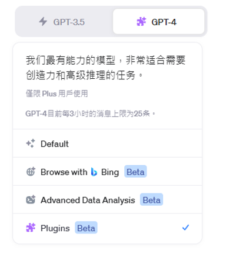

# Thursday, October 12, 2023

## 政府資訊服務採購作業指引 

### 甚麼是 OAS 標準格式

### ChatGTP plus

- ChatGPT vs ChatGPT Plus 有什麼差別，我應該付費升級嗎？[Rocky 2023 年 06 月 26 日 in 網路與軟體應用@電腦王](https://www.kocpc.com.tw/archives/497614)
  - 1. 更快的回應速度
  - 2. 可搶先體驗最新模型
  - 3. 可使用最新「瀏覽網頁」和「Plugins」等功能

### 比較chatGPT3.5 turbo and chatGPT4

- icons

|||
|:-:|:-:|
|chatGPT3.5 turbo|chatGPT4|

- 比較

項目|chatGPT3.5 turbo|chatGPT4
|:-:|:-:|:-:|
任務|快速|高級推理、創造性|

## ChatGPT+Plugins

將游標移到GPT-4上，就會出現外掛的選項。需要勾選啟動外掛，才能到外掛商店選用。

- 如果還沒有選用外掛，可以點選Plugin store前往各項外掛之介紹。
- 如果已有外掛，可以勾選是否啟用、也可以前往Plugin store點選其他外掛。

### PDF readers

- Ai PDF：Super-fast, interactive chats with PDFs of any size, complete with page references for fact checking.()
- [AskYourPDF](https://askyourpdf.com/terms)：Unlock the power of your PDFs!, dive into your documents, find answers, and bring information to your fingertips.(Pro版19.9 USD/Mo)
- [ChatWithPDF](https://plugins.sdan.io/pdf)：Chat with everything from entire PDF **books** to **Google Drive** documents just by providing a link.

### programer code kits

- [AskTheCode](https://docs.askthecode.ai/samples/)：Provide a GitHub repository URL and ask about any aspect of the code.(從既有專案開發新專案)
- [CoderPad](https://coderpad.io/)：Run code in more than **30** different programming languages, and let us worry about setting up the environment!(職訓)

### browsers

- [esor推薦](https://www.playpcesor.com/2023/09/chatgpt-plugins.html)
  - [webpilot](https://webreader.webpilotai.com/legal_info.html)：Browse Webpage/PDF/Data. Chat & Write with one/many/none URLs. WebPilot.ai Powered.
  - [VoxScript]()：(fail)
- [BrowserOp](https://m.dailyadvent.com/)：Browse dozens of webpages in one query. Fetch information more efficiently.(綜合新聞)
- [MixerBox WebSearchG]()：Search and summarize the web with our customized search engine powered by Google Search API!
- [Browser]() ：Pilot your research with real-time Google search results. Scrape & extract content from webpages by providing a URL.
- [BrowserPilot]()：Deliver real-time search results, fetch and analyze info in multiple URLs.
- [Aaron Browser]()：I'll scrape data from multiple website URLs. Built for Internet crawling, content aggregation, and monitoring.
- [Responsive]()：Take screenshots of any website running on all devices and browsers you want !
- [Web Requests]()：Goodbye Knowledge Cutoff, Hello World! This is your AI assistant's web browser. Just enter a URL. Google, Wiki, GitHub.

### 繪圖

- [Diagrams: Show Me]()：Schemes, Diagrams, Architecture Visualisations, Flow-Charts, Mind Maps. Export and Edit for free!
- [Earth]()：Generates a map image based on provided location, tilt and style.(mapbox)



很抱歉，我無法直接繪製流程圖，但我可以為您提供一個文字描述的流程，以便您可以根據這些資訊自行繪製或轉化為圖形表示。

---

**ChatGPT 網路服務資訊流程描述**：

1. **使用者互動**:
    - 使用者透過前端界面或應用程式與服務互動。
    - 輸入的請求被發送到伺服器。

2. **API應用**:
    - 這是前端界面和伺服器之間的中間層。
    - API 負責接收使用者請求並將其轉發給適當的伺服器或資料庫。

3. **推論伺服器**:
    - 當請求被發送到這裡，它會負責模型的實際運行和推論。
    - 使用 ChatGPT AI 模型進行計算，並生成回應。

4. **AI模型**:
    - 這是伺服器中的核心部分。
    - 負責根據輸入數據生成回應。

5. **使用者資料庫**:
    - 儲存使用者相關的所有資訊，如歷史對話、偏好設置等。
    - 若需要，推論伺服器可以查詢這些資料以提供更個人化的回應。

6. **外掛功能**:
    - 可以是任何增強功能或與第三方應用的集成。
    - 例如：圖像處理、語言翻譯、外部知識庫查詢等。

---

您可以根據上述描述使用流程圖工具（如 Visio、Lucidchart、draw.io 等）進行繪製。希望這可以幫助您建立一個清晰的網路服務流程圖！