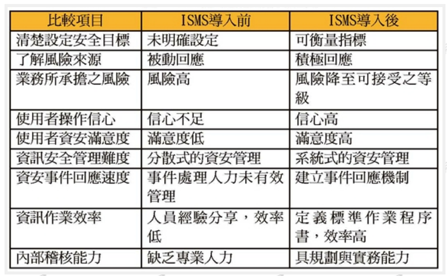

# Friday, October 20, 2023

## 資訊(服務)採購資通安全

[行政院公共工程委員會 函(20230925)](https://planpe.pcc.gov.tw/prms/explainLetter/readPrmsExplainLetterContentDetail?pkPrmsRuleContent=75001760&_csrf=41c91031-1b1a-45e1-8814-ff2f59c93227)

### 政府資訊服務採購作業指引

- 預算編列
  - 按比例編列資安預算並單獨列項
  - 必要時先行辦理系統整體規劃
  - 依個案特性編列預備費、物價調整費及檢測費
  - 依法得洽廠商提供意見
- 廠商資格
  - 評估是否允許陸資廠商參與
  - 必要時限制廠商資金來源比例
- 需求文件
  - 詳列機關招標需求(資訊服務採購需求確認之對策與作法)
  - 載明服務水準及資安要求
  - 使用政府資料傳輸平臺及納入**零信任**架構
  - 要求廠商投標時載明執行規劃
  - 妥適訂定招標文件所載之**主要部分**(不得分包)
- 招、決標作業
  - 載明**固定價格**決標者議價時不議減價格(112年5月16日工程企字第11200030081號函)
  - 評選項目考量廠商資安實績及作為(配分比例如10%)
  - 評選項目不得列「回饋」項目(創新卻不加減價)
- 契約執行
  - 依契約約定內容協助履約及落實管理、交付成果(包含原始碼)
  - 強化履約使用產品及履約人員之管理(陸牌、陸胞)
  - 反覆檢視需求訪談結果，確認後始進行開發
  - 開發過程設定查核點，反覆檢視執行成果
  - 機關新增需求應合理增加經費及期程
  - 機關以取得授權利用(轉授權或再製權)為原則
  - 履約及驗收得請具資訊、資安專業人員協助確認(外部專家優先)
- 爭議處理
  - 善用契約雙方約定之處理機制(具資安專業專家學任小組委員)
  - 機關成立採購工作及審查小組提供意見(same)

### 常用資訊服務等級協議(SLA)之參考項目

- 系統及服務可用性
  - 環境面
  - 服務面：服務可用性、正常運行時間百分比、平均故障間隔時間、平均修復時間、系統穩定度、反應時間、批次作業時間、檔案傳輸時間、滿意度調查
  - 永續維運與管理：營運異地備份/備援、備份/恢復作業時間、最大回溯落差、最大可忍受中斷時間、備品供應、設備切換演練、
  - 資通安全品質：風險評鑑與風險管理計畫、實體及遠端登錄管制與稽核、漏洞修補、資通安全政策執行品質、資安測試之改善、安全防護計畫執行、資安事件之通報及應變、調查及處理資安事件之時效、外部稽核
- 廠商之服務品質
  - 設計與開發階段：未依機關同意之流程或設計準則開發之比率、未依限回應問題之次數、
  - 測試驗證階段：單元測試流程通過比率、整合測試通過比率、效能調教次數、
  - 上線前準備階段：壓力測試、資料移轉時間及正確率、上線演練作業之次數與所需時間、客服準備情形、人員之教育訓練
  - 建置及維運階段：
- 使用者體驗

### 各類資訊(服務)採購之共通性資通安全基本要求參考一覽表(112年9月25日)

1. 雲端微服務（SaaS）**套裝型**
2. 雲端微服務（SaaS）辦公室**生產力工具**(含郵件、行事曆、雲端硬碟、即時通訊等)
3. 既有雲端微服務（SaaS）**客製化需求更版**
4. **雲端平台**(PaaS或IaaS)
5. 資訊安全類**規劃服務**
6. 應用軟體或系統**開發服務**
7. 既有系統功能**後續擴充**
8. 應用軟體或系統**維運服務**

## 資通安全管理法含子法

[資通安全管理法及子法彙編(2018/06/06)](https://www-api.moda.gov.tw/File/Get/acs/zh-tw/o39rMcG3VRjfhWz)

## 創泓科技

- 在台灣，有許多民間機構和公司已經通過了ISO27001的認證。例如，創泓科技已於2023年8月29日成功通過國際級資訊安全標準ISO 27001的驗證，驗證範圍包括資訊安全技術服務部門的售前業務、專案服務和資訊基礎設施管理²。這使得創泓科技成為2023年全台**首家**通過ISO 27001驗證的**資訊安全產品代理商**。

來源: 與 Bing 的交談， 2023/10/20 創泓科技通過國際級資安標準ISO27001驗證 | iThome. https://www.ithome.com.tw/pr/159266.

## 台大經驗

### 驗證之路

- 漫長嚴苛的ISO 27001驗證之路！[陳淑萍(2021)](https://www.cc.ntu.edu.tw/chinese/epaper/0059/20211220_5901.html)
- 行政院國家資通安全會報訂定「各政府機關（構）資訊安全責任等級分級作業施行計畫」，在此計畫中資通安全等級分為ABCDE等五個級，被歸屬於A與 B級者，必須導入完整資訊安全管理系統(ISMS Information Security Management System)，並取得第三方機構驗證通過，且持續維持其有效性。

### 改版秘辛

ISO/IEC 27001：2022改版秘辛[吳恭漢(2023)](https://www.cc.ntu.edu.tw/chinese/epaper/home/20230320_006407.html)
- 由Information technology-Security technique-資訊技術-安全技術變成Information security,cybersecurity and privacy protection-資訊安全-網路安全與隱私保護，也符合現代的個資與資安議題重視
- DLP(Data loss prevention,DLP)我們常看到DLP從三大面向推出解決方案，1.端點（Endpoint）常見的就是透過防毒軟體整合模組達成，2.網路（Network）常見的透過設備部署於骨幹網路，用來查看網路封包是否夾帶機敏資訊等，3.最後就是資料庫與郵件防護伺服器，利用安裝模組來達到資料庫與郵件的DLP防護，這次ISO/IEC 27001：2022改版，企業可提早規劃部屬適當的DLP工具，進而符合ISO規範要求。

## 各政府機關（構）資訊/資通安全責任等級分級作業施行計畫

- 原來93年訂定的「政府機關（構）資訊安全責任等級分級作業施行計畫」、108年3月5日停止適用，適用「資通」安全責任等級分級作業規定
- source [資通安全署2019-03-05](https://moda.gov.tw/ACS/laws/guide/not-applicable/1343)
- 政府機關（構）除遵循行政院及所屬各機關資安管理規範外，依其資安等級，應辦理之工作事項如附表。
  - 資訊系統分類分級：1.完成資訊系統分級(104 年底前)2.完成資訊系統資安防護基準要求(105年底前) 
  - ISMS推動作業：1.全部核心資訊系統完成ISMS 導入(105 年底前)2.全部核心資訊系統通過第三方驗證(106 年底前)
  - 資安專責人力：指派資安專責人力 2人
  - 稽核方式：每年至少 2 次內稽
  - 業務持續運作演練：每年至少辦理 1次核心資訊系統持續運作演練
  - 防護縱深：1.防毒、防火牆、郵件過濾裝置2.[IDS Intrusion-detection system](https://zh.wikipedia.org/wiki/IDS)/[IPS Intrusion Prevention System](https://zh.wikipedia.org/zh-tw/入侵预防系统)、Web 應用程式防火牆、3.[APT Advanced Persistent Threat](https://zh.wikipedia.org/wiki/高级长期威胁)攻擊防禦
  - 監控管理：SOC 監控(104 年底前)
  - 安全性檢測：1.每年至少辦理2次網站安全弱點檢測2.每年至少辦理1次系統滲透測試3.每年至少辦理1次資安健診
  - 資安教育訓練(一般主管、資訊人員/資安人員、一般使用者)：1.每年資安人員(資訊人員)至少2人次須接受12小時以上資安專業課程訓練或資安職能訓練2.每年一般使用者與主管至少須接受3小時資安宣導課程並通過課程評量。
  - 專業證照：每年維持至少2張**國際資安專業證照**與2張**資安職能訓練證書**之有效性
- 國際資安專業證照：指由國外獨立認驗證機構所核發之資安專業證照（非針對特定廠牌產品之證照），例如資安管理類之 ISO27001 主導稽核員（Lead Auditor, LA）、資安經理人（Certified Information Security Manager, CISM）、系統安全從業人員（Systems Security Certified Practitioner, SSCP）、資安管理師（Certification for Information System Security Professional, CISSP）等，及資安技術類之道德駭客（Certified Ethical Hacker, CEH）、 全方位資安專家（Global Information Assurance Certification, GIAC）等。
- 資安職能訓練證書：指資訊人員、資安人員需根據機關業務所需，參加**資安職能訓練**並通過評量取得證書。資安職能訓練科目包括：資訊安全通識、資訊系統風險管理、政府資訊作業委外安全、資安事故處理、電子資料保護、電子郵件安全、WEB 應用程式安全、個人資料保護管理及政府資安管理評鑑等。

## ISO 27001 CIA

## ISO 27001 Why and Benifits

- 組織具有對外提供資訊服務、軟體開發、維護等營業項目。
- 志願性加入
- 法律或合約要求

