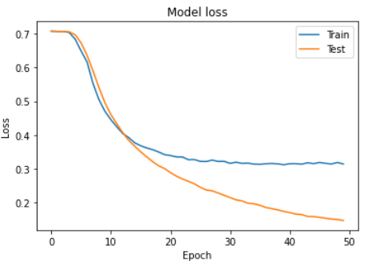

## 背景

- IIH(翻譯為“獵捕意圖入侵者”)是一項非常寡眾的市場。如果網路攻擊有網路警察系統的話，IIH可以說就是網路犯罪的偵探。

## among companies



"Intention Intrusion Hunting"服務是一種專業的資訊安全服務，主要由專業的資訊安全公司提供。這種服務主要是利用先進的技術和方法來預測和防止網路入侵的威脅。目前，全球有一些公司提供這種服務，例如台灣的**中芯數據 Cyber Defense Center**¹。他們的"意圖威脅即時鑑識服務"（IPaaS, Intention Prediction as a Service）採用機器學習和自動化技術，將鑑識分析人工智慧化，能夠預測行為動向、攔截安全威脅路徑、持續自我演進和自我學習¹。然而，具體的服務內容和提供的公司可能會因地區和需求而有所不同。如果您需要更多的資訊，建議您直接聯繫這些公司以獲得最準確的資訊。¹

來源: 與 Bing 的交談， 2023/11/25
(1) 中芯數據 [Cyber Defense Center](https://www.corecloud.com.tw/corecloud/pages/IPaaS.html).

(2) Protecting Against Cyber Threats to Managed Service Providers and their Customers | [CISA](https://www.cisa.gov/news-events/cybersecurity-advisories/aa22-131a).

(3) 中芯數據發現 APT41 駭客春節期間出手蓄謀已久的新一波攻擊 | [iThome](https://www.ithome.com.tw/pr/155433).



在亞太地區，提供"Intention Intrusion Hunting"服務的公司包括台灣的**中芯數據 Cyber Defense Center**¹。他們的"意圖威脅即時鑑識服務"（IPaaS, Intention Prediction as a Service）採用機器學習和自動化技術，將鑑識分析人工智慧化，能夠預測行為動向、攔截安全威脅路徑、持續自我演進和自我學習¹。此外，**TeamT5**也提供相關的資訊安全服務，包括威脅情資平台ThreatVision，該平台由資深專業分析師團隊提供亞太地區威脅情資報告³。然而，具體的服務內容和提供的公司可能會因地區和需求而有所不同。如果您需要更多的資訊，建議您直接聯繫這些公司以獲得最準確的資訊。¹³

來源: 與 Bing 的交談， 2023/11/25

(1) 中芯數據 意圖威脅即時鑑識服務 IPaaS - [NETFOS](https://www.netfos.com.tw/Projects/netfos/pages/product/IPaaS.html).

(2) 威脅情資: 企業面對資安威脅的關鍵 - [TeamT5](https://teamt5.org/tw/posts/threat-intelligence-as-the-key-for-enterprise-cybersecurity/).

(3) 中芯數據 [Cyber Defense Center](https://www.corecloud.com.tw/corecloud/pages/home.html).

(4) [undefined](https://www.corecloud.com.tw).

(5) [undefined](https://teamt5.org/tw/request-information/).

(6) [undefined](https://teamt5.org/tw/request-information/?utm_source=blog&utm_medium=website%29).

(7) [undefined](https://www.youtube.com/embed/1HtlXXm1vvM).

## 意圖威脅即時鑑定服務

"意圖威脅即時鑑定服務" 這個術語似乎是指一種服務或系統，用於檢測和分析可能具有威脅性的意圖或行為。 這類服務通常用於網路安全領域，旨在監測和識別網路流量、使用者行為或系統操作中的任何異常或威脅性行為。 這些服務可以幫助組織及時發現潛在的安全威脅，以便採取適當的措施來保護其資訊和資產。

這些服務通常包括以下功能：

1. **行為分析：** 監控使用者和裝置的行為，識別異常或可疑的活動，如異常的登入嘗試、存取不尋常的文件或系統資源等。

2. **流量分析：** 分析網路流量，偵測可能的網路攻擊、惡意軟體傳播或資料外洩事件。

3. **威脅情報整合：** 整合威脅情報，以便及時偵測新的威脅並採取措施。

4. **即時警報：** 在發現異常或潛在威脅時產生即時警報，以通知安全團隊採取行動。

5. **自動化回應：** 可能包括自動化的威脅回應機制，以降低迴應時間並減輕潛在威脅的影響。

6. **日誌和事件記錄：** 記錄所有安全相關事件和活動，以進行後續分析和稽核。

7. **使用者身份驗證和存取控制：** 確保只有經過身份驗證的使用者可以存取受保護的資源。

8. **持續監控和評估：** 定期評估和改進威脅偵測和回應策略，以適應不斷變化的威脅景觀。

這種類型的服務在保護組織的資訊和資料安全方面起著關鍵作用，可以幫助及時識別和緩解潛在的安全風險和威脅。 它們通常在網路安全營運中扮演關鍵角色，有助於提高安全性和減輕潛在威脅的風險。

## 杜浦數位安全

> TeamT5 杜浦數位安全為威脅情資領導品牌，獲國際頂尖顧問公司 Frost & Sullivan 評選為台灣最佳威脅情資公司，可協助金融機構從威脅情資角度，評估供應鏈廠商的資安風險。

## 133K model results

|||
|:-:|:-:|
|||
|||

## TZPP improvements

TS=94C
VEL=14.9(?)
SO2_C=6.18 ppm
NOX_C=17.62 ppm
VOL_C=1306931 NM3/min

2019 TEDS L0200473 P701
[('TSP_EMI', 128.123),
 ('PM_EMI', 80.22399999999999),
 ('PM25_EMI', 64.723),
 ('SOX_EMI', 1216.259),
 ('NOX_EMI', 1292.872),
 ('THC_EMI', 0.0),
 ('NMHC_EMI', 0.0),
 ('CO_EMI', 0.175),
 ('PB_EMI', 0.083)]